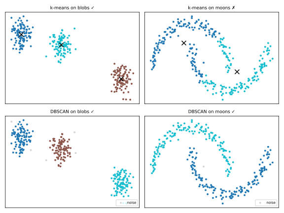

# Clustering

Clustering is the flagship **unsupervised** task: group observations so that points in the same group are similar and points in different groups are dissimilar — with **no labels** to guide or evaluate the grouping. Typical uses: customer segmentation, anomaly detection, image compression, organizing documents (the road to [topic modeling](../topic-modeling-bertopic/index.md)).

Because there is no ground truth, every clustering result is a **hypothesis about structure**, and the algorithm's assumptions determine what kind of structure it can find.

## k-means

The classical algorithm (Lloyd, 1957/1982). Choose \(k\); find centroids \(\mu_1, \dots, \mu_k\) minimizing the **within-cluster sum of squares** (inertia):

\[
\min_{\mu_1,\dots,\mu_k} \; \sum_{i=1}^{n} \min_{j} \; \lVert x_i - \mu_j \rVert^2
\]

**Lloyd's algorithm** alternates two steps until assignments stop changing:

1. **Assign**: each point joins its nearest centroid;
2. **Update**: each centroid moves to the mean of its assigned points.

```python
from sklearn.cluster import KMeans

km = KMeans(n_clusters=3, n_init=10, random_state=0)   # n_init: restarts
labels = km.fit_predict(X_scaled)
km.inertia_          # within-cluster sum of squares
km.cluster_centers_
```

Properties and pitfalls:

- **You must choose \(k\)** in advance;
- Converges to a **local** optimum — hence multiple restarts (`n_init`);
- Assumes clusters are **convex, roughly spherical, similar in size** (it partitions space into Voronoi cells around centroids);
- Distance-based → **scale your features** ([Preprocessing](../preprocessing/index.md));
- Every point is assigned to a cluster — k-means has no concept of noise or outliers.

Run Lloyd's algorithm yourself — the data has 3 real blobs; watch what happens with k = 2 or k = 5, and how different random starts converge to different local optima:

<div id="sim-kmeans"></div>

### Choosing k

- **Elbow method**: plot inertia vs \(k\); inertia always decreases, so look for the "elbow" where gains flatten. Heuristic and often ambiguous.
- **Silhouette score**: for each point, with \(a\) = mean distance to its own cluster and \(b\) = mean distance to the nearest other cluster,

\[
s = \frac{b - a}{\max(a, b)} \in [-1, 1].
\]

Average \(s\) near 1 → compact, well-separated clusters; near 0 → overlapping; negative → likely misassigned. Choose the \(k\) that maximizes the mean silhouette.

```python
from sklearn.metrics import silhouette_score
silhouette_score(X_scaled, labels)
```

## Hierarchical clustering

Agglomerative clustering builds a **dendrogram**: start with every point as its own cluster, repeatedly merge the two closest clusters until one remains, then cut the tree at the desired level. No need to fix \(k\) beforehand — you choose it by cutting.

The definition of "closest clusters" is the **linkage**:

| Linkage | Distance between clusters | Behavior |
|---------|--------------------------|----------|
| single | closest pair of points | finds elongated chains, sensitive to noise |
| complete | farthest pair | compact clusters |
| average | mean pairwise distance | compromise |
| Ward | merge minimizing inertia increase | k-means-like, most common default |

```python
from sklearn.cluster import AgglomerativeClustering
labels = AgglomerativeClustering(n_clusters=3, linkage='ward').fit_predict(X_scaled)
```

Cost is \(O(n^2)\) memory/time — fine for thousands of points, prohibitive for millions.

## DBSCAN and HDBSCAN: density-based clustering

**DBSCAN** (Ester et al., 1996) defines clusters as **dense regions separated by sparse regions**, using two parameters: `eps` (neighborhood radius) and `min_samples` (points required to call a neighborhood dense).

- **Core point**: has ≥ `min_samples` neighbors within `eps`;
- **Border point**: within `eps` of a core point, but not core itself;
- **Noise**: neither — DBSCAN **labels outliers** (label −1) instead of forcing them into clusters.

Strengths: finds **arbitrarily shaped** clusters, no \(k\) to choose, built-in noise detection. Weaknesses: a single global `eps` fails when clusters have different densities; `eps` is not intuitive to tune.

**HDBSCAN** (Campello, Moulavi & Sander, 2013) removes the global `eps`: it builds a hierarchy over all density levels and extracts the most stable clusters, handling **variable-density** data with essentially one intuitive parameter (`min_cluster_size`). This robustness is why [BERTopic](../topic-modeling-bertopic/index.md) uses HDBSCAN to cluster document embeddings — documents that fit no topic simply become noise instead of polluting topics.

```python
from sklearn.cluster import HDBSCAN   # scikit-learn ≥ 1.3
labels = HDBSCAN(min_cluster_size=10).fit_predict(X_scaled)
```

## Assumptions matter: k-means vs DBSCAN



On convex blobs both succeed. On the two moons, k-means fails *by construction* — it can only draw Voronoi boundaries between centroids — while DBSCAN follows the density and recovers the crescents, marking stray points as noise.

## Choosing an algorithm

| Situation | Reach for |
|-----------|-----------|
| Convex, similar-size clusters; large n; need speed | k-means (or MiniBatchKMeans) |
| Want a dendrogram / taxonomy; small n | hierarchical (Ward) |
| Arbitrary shapes, noise/outliers expected | DBSCAN |
| Arbitrary shapes with varying density (e.g. embeddings) | HDBSCAN |

!!! tip "Validate like a skeptic"
    With no labels, always inspect clusters: silhouette scores, 2D projections ([PCA/UMAP](../dimensionality-reduction/index.md)), and — most importantly — whether the clusters *mean* something in the domain. A clustering nobody can name is rarely useful.

## Class materials

!!! example "Class notebook (in Portuguese)"
    Hands-on notebook used in class — **Aula 07 — Clustering**:
    [:simple-googlecolab: open in Colab](https://colab.research.google.com/drive/1kB8dwyLmM8ON2YQ2QkG_UGKow8-Ju2cv){:target="_blank"}

---

## Quiz

<div id="quiz-clustering"></div>
<script>
buildQuiz('clustering', 'Clustering', [
  {
    q: "What objective does k-means minimize?",
    opts: [
      "The number of clusters",
      "The sum of squared distances from each point to its nearest centroid (inertia)",
      "The silhouette score",
      "The maximum distance between any two points in a cluster"
    ],
    ans: 1,
    exp: "k-means minimizes within-cluster sum of squares via Lloyd's alternation: assign points to nearest centroid, move centroids to the mean. It finds a local optimum, hence multiple restarts."
  },
  {
    q: "Why does k-means fail on the 'two moons' dataset?",
    opts: [
      "The dataset is too small",
      "k-means partitions space into convex Voronoi cells around centroids and cannot represent crescent-shaped clusters",
      "The moons have missing values",
      "k was set too high"
    ],
    ans: 1,
    exp: "Each k-means cluster is the set of points nearest to one centroid — a convex region. Interlocking crescents cannot be separated by such boundaries; density-based methods can."
  },
  {
    q: "A point gets label -1 from DBSCAN. This means...",
    opts: [
      "it belongs to cluster number -1",
      "the algorithm crashed",
      "it was classified as noise: not dense enough to be core, not close enough to any core point",
      "it is the centroid of a cluster"
    ],
    ans: 2,
    exp: "Unlike k-means, DBSCAN does not force every point into a cluster. Points in sparse regions are labeled noise — often exactly the outliers you want to detect."
  },
  {
    q: "The mean silhouette score for k=4 is 0.71 and for k=8 is 0.34. What does this suggest?",
    opts: [
      "k=8 is better because more clusters explain more",
      "k=4 yields more compact, better-separated clusters than k=8",
      "The data has no clusters",
      "Silhouette cannot compare different k values"
    ],
    ans: 1,
    exp: "Silhouette compares each point's cohesion (distance to own cluster) with separation (distance to nearest other cluster). Higher mean silhouette = better-defined clustering; comparing across k is exactly its use case."
  },
  {
    q: "What advantage does HDBSCAN have over DBSCAN?",
    opts: [
      "It requires choosing k in advance",
      "It handles clusters of varying density by exploring all density levels, instead of one global eps",
      "It never labels points as noise",
      "It only works on text data"
    ],
    ans: 1,
    exp: "DBSCAN's single eps assumes all clusters have similar density. HDBSCAN builds a density hierarchy and extracts the most stable clusters — the reason BERTopic uses it on embedding spaces."
  },
  {
    q: "Why is feature scaling important before k-means?",
    opts: [
      "k-means only accepts values in [0,1]",
      "Centroids cannot be computed on unscaled data",
      "Cluster assignments are based on Euclidean distance, which is dominated by large-scale features",
      "It is not important for k-means"
    ],
    ans: 2,
    exp: "Like every distance-based method, k-means inherits the distance distortion of unscaled features: income in thousands will dictate the clusters while age in tens is ignored."
  }
]);
</script>
