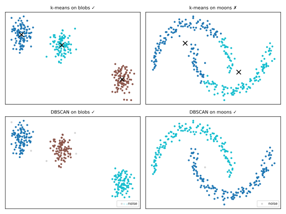

# Agrupamento

O agrupamento (*clustering*) é a tarefa **não supervisionada** por excelência: agrupar observações de modo que pontos no mesmo grupo sejam semelhantes e pontos em grupos diferentes sejam dissimilares — **sem rótulos** para guiar ou avaliar o agrupamento. Usos típicos: segmentação de clientes, detecção de anomalias, compressão de imagens, organização de documentos (o caminho para a [modelagem de tópicos](../topic-modeling-bertopic/index.md)).

Como não há verdade de referência, todo resultado de agrupamento é uma **hipótese sobre estrutura**, e as suposições do algoritmo determinam que tipo de estrutura ele consegue encontrar.

## k-means

O algoritmo clássico (Lloyd, 1957/1982). Escolha \(k\); encontre os centroides \(\mu_1, \dots, \mu_k\) que minimizam a **soma dos quadrados intra-cluster** (inércia):

\[
\min_{\mu_1,\dots,\mu_k} \; \sum_{i=1}^{n} \min_{j} \; \lVert x_i - \mu_j \rVert^2
\]

O **algoritmo de Lloyd** alterna dois passos até as atribuições pararem de mudar:

1. **Atribuir**: cada ponto se junta ao centroide mais próximo;
2. **Atualizar**: cada centroide se move para a média dos pontos atribuídos a ele.

```python
from sklearn.cluster import KMeans

km = KMeans(n_clusters=3, n_init=10, random_state=0)   # n_init: reinícios
labels = km.fit_predict(X_scaled)
km.inertia_          # soma dos quadrados intra-cluster
km.cluster_centers_
```

Propriedades e armadilhas:

- **Você precisa escolher \(k\)** de antemão;
- Converge para um ótimo **local** — daí os múltiplos reinícios (`n_init`);
- Assume que os agrupamentos são **convexos, aproximadamente esféricos, de tamanho semelhante** (particiona o espaço em células de Voronoi em torno dos centroides);
- Baseado em distância → **escalone seus atributos** ([Pré-processamento](../preprocessing/index.md));
- Todo ponto é atribuído a um agrupamento — o k-means não tem conceito de ruído ou outliers.

Rode você mesmo o algoritmo de Lloyd — os dados têm 3 blobs reais; observe o que acontece com k = 2 ou k = 5 e como diferentes inícios aleatórios convergem para diferentes ótimos locais:

<div id="sim-kmeans"></div>

### Escolhendo k

- **Método do cotovelo**: plote a inércia vs \(k\); a inércia sempre diminui, então procure o "cotovelo" onde os ganhos achatam. Heurístico e muitas vezes ambíguo.
- **Escore de silhueta**: para cada ponto, com \(a\) = distância média ao seu próprio agrupamento e \(b\) = distância média ao agrupamento vizinho mais próximo,

\[
s = \frac{b - a}{\max(a, b)} \in [-1, 1].
\]

\(s\) médio perto de 1 → agrupamentos compactos e bem separados; perto de 0 → sobrepostos; negativo → provavelmente mal atribuídos. Escolha o \(k\) que maximiza a silhueta média.

```python
from sklearn.metrics import silhouette_score
silhouette_score(X_scaled, labels)
```

## Agrupamento hierárquico

O agrupamento aglomerativo constrói um **dendrograma**: começa com cada ponto como seu próprio agrupamento, funde repetidamente os dois agrupamentos mais próximos até restar um só e então corta a árvore no nível desejado. Não é preciso fixar \(k\) de antemão — você o escolhe pelo corte.

A definição de "agrupamentos mais próximos" é o **linkage** (encadeamento):

| Linkage | Distância entre agrupamentos | Comportamento |
|---------|------------------------------|---------------|
| single | par de pontos mais próximo | encontra cadeias alongadas, sensível a ruído |
| complete | par mais distante | agrupamentos compactos |
| average | distância média par a par | meio-termo |
| Ward | funde minimizando o aumento de inércia | semelhante ao k-means, padrão mais comum |

```python
from sklearn.cluster import AgglomerativeClustering
labels = AgglomerativeClustering(n_clusters=3, linkage='ward').fit_predict(X_scaled)
```

O custo é \(O(n^2)\) de memória/tempo — tranquilo para milhares de pontos, proibitivo para milhões.

## DBSCAN e HDBSCAN: agrupamento por densidade

O **DBSCAN** (Ester et al., 1996) define agrupamentos como **regiões densas separadas por regiões esparsas**, usando dois parâmetros: `eps` (raio da vizinhança) e `min_samples` (pontos necessários para chamar uma vizinhança de densa).

- **Ponto central (core)**: tem ≥ `min_samples` vizinhos dentro de `eps`;
- **Ponto de borda**: está dentro de `eps` de um ponto central, mas não é central;
- **Ruído**: nenhum dos dois — o DBSCAN **rotula outliers** (rótulo −1) em vez de forçá-los para dentro de agrupamentos.

Pontos fortes: encontra agrupamentos de **forma arbitrária**, sem \(k\) para escolher, detecção de ruído embutida. Fraquezas: um único `eps` global falha quando os agrupamentos têm densidades diferentes; `eps` não é intuitivo de ajustar.

O **HDBSCAN** (Campello, Moulavi & Sander, 2013) elimina o `eps` global: constrói uma hierarquia sobre todos os níveis de densidade e extrai os agrupamentos mais estáveis, lidando com dados de **densidade variável** com essencialmente um parâmetro intuitivo (`min_cluster_size`). Essa robustez é o motivo de o [BERTopic](../topic-modeling-bertopic/index.md) usar HDBSCAN para agrupar embeddings de documentos — documentos que não se encaixam em nenhum tópico simplesmente viram ruído em vez de poluir os tópicos.

```python
from sklearn.cluster import HDBSCAN   # scikit-learn ≥ 1.3
labels = HDBSCAN(min_cluster_size=10).fit_predict(X_scaled)
```

## As suposições importam: k-means vs DBSCAN



Em blobs convexos ambos têm sucesso. Nas duas luas, o k-means falha *por construção* — só consegue traçar fronteiras de Voronoi entre centroides — enquanto o DBSCAN acompanha a densidade e recupera os crescentes, marcando pontos avulsos como ruído.

## Escolhendo um algoritmo

| Situação | Recorra a |
|----------|-----------|
| Agrupamentos convexos e de tamanho semelhante; n grande; precisa de velocidade | k-means (ou MiniBatchKMeans) |
| Quer um dendrograma / taxonomia; n pequeno | hierárquico (Ward) |
| Formas arbitrárias, ruído/outliers esperados | DBSCAN |
| Formas arbitrárias com densidade variável (ex.: embeddings) | HDBSCAN |

!!! tip "Valide como um cético"
    Sem rótulos, sempre inspecione os agrupamentos: escores de silhueta, projeções 2D ([PCA/UMAP](../dimensionality-reduction/index.md)) e — o mais importante — se os agrupamentos *significam* algo no domínio. Um agrupamento que ninguém consegue nomear raramente é útil.

## Material de aula

!!! example "Notebook da aula (em português)"
    Notebook prático usado em sala — **Aula 07 — Clustering**:
    [:simple-googlecolab: abrir no Colab](https://colab.research.google.com/drive/1kB8dwyLmM8ON2YQ2QkG_UGKow8-Ju2cv){:target="_blank"}

### Vídeo

[{ .rounded-corners width="480" }](https://youtu.be/njRYKzRKBPY){:target="_blank"}

:simple-youtube: [Algoritmo k-means (k-médias)](https://youtu.be/njRYKzRKBPY){:target="_blank"} — em português

---

## Quiz

<div id="quiz-clustering"></div>
<script>
buildQuiz('clustering', 'Agrupamento', [
  {
    q: "Que objetivo o k-means minimiza?",
    opts: [
      "O número de agrupamentos",
      "A soma das distâncias ao quadrado de cada ponto ao seu centroide mais próximo (inércia)",
      "O escore de silhueta",
      "A distância máxima entre quaisquer dois pontos de um agrupamento"
    ],
    ans: 1,
    exp: "O k-means minimiza a soma dos quadrados intra-cluster pela alternância de Lloyd: atribuir pontos ao centroide mais próximo, mover os centroides para a média. Ele encontra um ótimo local, daí os múltiplos reinícios."
  },
  {
    q: "Por que o k-means falha no conjunto de dados 'duas luas'?",
    opts: [
      "O conjunto de dados é pequeno demais",
      "O k-means particiona o espaço em células de Voronoi convexas em torno dos centroides e não consegue representar agrupamentos em forma de crescente",
      "As luas têm valores faltantes",
      "k foi definido alto demais"
    ],
    ans: 1,
    exp: "Cada agrupamento do k-means é o conjunto de pontos mais próximos de um centroide — uma região convexa. Crescentes entrelaçados não podem ser separados por tais fronteiras; métodos por densidade conseguem."
  },
  {
    q: "Um ponto recebe o rótulo -1 do DBSCAN. Isso significa...",
    opts: [
      "que ele pertence ao agrupamento número -1",
      "que o algoritmo travou",
      "que ele foi classificado como ruído: não denso o suficiente para ser central, nem próximo o suficiente de qualquer ponto central",
      "que ele é o centroide de um agrupamento"
    ],
    ans: 2,
    exp: "Ao contrário do k-means, o DBSCAN não força todo ponto para dentro de um agrupamento. Pontos em regiões esparsas são rotulados como ruído — muitas vezes exatamente os outliers que você quer detectar."
  },
  {
    q: "O escore médio de silhueta para k=4 é 0,71 e para k=8 é 0,34. O que isso sugere?",
    opts: [
      "k=8 é melhor porque mais agrupamentos explicam mais",
      "k=4 gera agrupamentos mais compactos e melhor separados que k=8",
      "Os dados não têm agrupamentos",
      "A silhueta não pode comparar valores diferentes de k"
    ],
    ans: 1,
    exp: "A silhueta compara a coesão de cada ponto (distância ao próprio agrupamento) com a separação (distância ao agrupamento vizinho mais próximo). Silhueta média maior = agrupamento melhor definido; comparar entre valores de k é exatamente seu caso de uso."
  },
  {
    q: "Que vantagem o HDBSCAN tem sobre o DBSCAN?",
    opts: [
      "Exige escolher k de antemão",
      "Lida com agrupamentos de densidade variável ao explorar todos os níveis de densidade, em vez de um único eps global",
      "Nunca rotula pontos como ruído",
      "Só funciona com dados de texto"
    ],
    ans: 1,
    exp: "O único eps do DBSCAN assume que todos os agrupamentos têm densidade semelhante. O HDBSCAN constrói uma hierarquia de densidade e extrai os agrupamentos mais estáveis — o motivo de o BERTopic usá-lo em espaços de embedding."
  },
  {
    q: "Por que o escalonamento de atributos é importante antes do k-means?",
    opts: [
      "O k-means só aceita valores em [0,1]",
      "Centroides não podem ser calculados em dados não escalonados",
      "As atribuições de agrupamento se baseiam na distância euclidiana, dominada por atributos de grande escala",
      "Não é importante para o k-means"
    ],
    ans: 2,
    exp: "Como todo método baseado em distância, o k-means herda a distorção de distância de atributos não escalonados: a renda na casa dos milhares ditará os agrupamentos enquanto a idade na casa das dezenas é ignorada."
  }
]);
</script>
