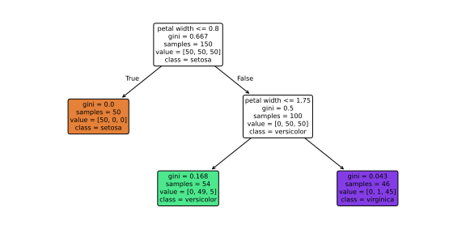
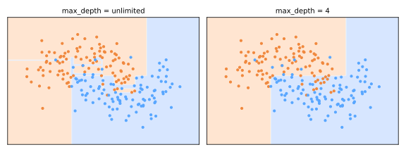

# Árvores de Decisão

Uma árvore de decisão classifica fazendo uma sequência de perguntas simples — *comprimento da pétala ≤ 2,45? renda > 5.000?* — caminhando da raiz até a folha. Formalizadas nos anos 1980 (CART: Breiman et al., 1984; ID3/C4.5: Quinlan, 1986/1993), as árvores se leem como fluxogramas que um especialista de domínio pode auditar, lidam com tipos de atributos mistos sem escalonamento e são o **bloco de construção dos ensembles** ([random forests](../random-forest/index.md), [gradient boosting](../gradient-boosting/index.md)) que dominam o ML tabular hoje.



Uma árvore de profundidade 2 na iris: dois limiares nas medidas de pétala já separam as espécies quase perfeitamente — e você lê *por quê* diretamente da figura.

## Como uma árvore é crescida

As árvores são construídas de forma **gananciosa (greedy), de cima para baixo** (CART): em cada nó, testa-se todo atributo e todo limiar e escolhe-se a divisão que torna os dois filhos **mais puros**; recursivamente até uma regra de parada disparar.

### Medindo a impureza

Para um nó com proporções de classe \(p_1, \dots, p_k\):

**Impureza de Gini** (padrão do CART) — a probabilidade de que dois sorteios aleatórios do nó discordem:

\[
G = 1 - \sum_{c=1}^{k} p_c^2
\]

**Entropia** (família ID3) — incerteza da teoria da informação:

\[
H = -\sum_{c=1}^{k} p_c \log_2 p_c
\]

Ambas são 0 para um nó puro e máximas para uma mistura 50/50; na prática elas escolhem divisões quase idênticas (o Gini é um pouco mais barato — sem logaritmo).

Uma divisão candidata \(S\) do nó \(N\) em filhos \(L, R\) é pontuada pela **redução de impureza** (com entropia, chamada de *ganho de informação*):

\[
\Delta = I(N) - \frac{n_L}{n} I(L) - \frac{n_R}{n} I(R)
\]

Para **árvores de regressão**, a impureza é simplesmente a variância (MSE) do alvo no nó, e cada folha prevê a média de suas amostras.

```text
CRESCER(nó):
    se regra de parada (profundidade, mín amostras, pureza): faça folha
    para cada atributo j, cada limiar t:
        pontue a divisão x_j ≤ t pela redução de impureza Δ
    aplique a melhor divisão; CRESCER(esquerda); CRESCER(direita)
```

Ganancioso significa **sem antevisão**: a árvore nunca reconsidera uma divisão que compensaria dois níveis depois (padrões tipo XOR podem derrotá-la). Os ensembles compensam.

## Sobreajuste: a doença crônica da árvore

Crescida sem limites, uma árvore continua dividindo até as folhas ficarem puras — isolando alegremente cada ponto ruidoso em sua própria folha. As árvores são aprendizes de **baixo viés e alta variância**: pequenas mudanças nos dados podem produzir uma árvore completamente diferente.



A árvore ilimitada (esquerda) esculpe ilhas retangulares em torno de pontos de ruído individuais; `max_depth=4` (direita) captura a estrutura real. Note as fronteiras alinhadas aos eixos, em "escada" — as árvores dividem um atributo de cada vez.

**Controlando a complexidade** (todos são [botões de viés–variância](../model-selection/index.md#o-trade-off-viesvariancia) para [validação cruzada](../validation/index.md#validacao-cruzada)):

- *Pré-poda (pre-pruning)*: `max_depth`, `min_samples_split`, `min_samples_leaf`, `min_impurity_decrease`;
- *Pós-poda (post-pruning)*: crescer totalmente e depois cortar ramos que não justificam sua complexidade — a **poda por custo-complexidade** minimiza \(\text{erro} + \alpha \cdot \#\text{folhas}\) (`ccp_alpha`), a versão em árvore da [regularização](../gradient-descent-regularization/index.md#regularizacao).

```python
from sklearn.tree import DecisionTreeClassifier

tree = DecisionTreeClassifier(max_depth=4, min_samples_leaf=5, random_state=0)
tree.fit(X_train, y_train)          # sem necessidade de escalonamento!
tree.feature_importances_           # importâncias baseadas em impureza (somam 1)
```

## Perfil prático

| | |
|---|---|
| **Pontos fortes** | interpretável/auditável; sem necessidade de escalonamento ou one-hot para ordinais; tipos de atributos mistos; captura interações e não linearidade nativamente; previsão rápida |
| **Fraquezas** | alta variância (instável); miopia gananciosa; viés de alinhamento aos eixos; extrapolação ruim (a regressão prevê constantes fora da faixa de treino) |
| **Recorra a ela quando** | a interpretabilidade for o requisito — caso contrário, use seus descendentes em ensemble |

!!! tip "Uma árvore, raramente; muitas árvores, o tempo todo"
    Uma única árvore troca acurácia demais por legibilidade. Sua verdadeira importância é como o **aprendiz fraco** dentro das random forests e do gradient boosting — as duas próximas aulas. Entenda divisões, impureza e poda aqui, e ambos os ensembles ficam transparentes.

## Material de aula

!!! example "Notebook da aula (em português)"
    Notebook prático usado em sala — **Aula 19 — Decision Tree**:
    [:simple-googlecolab: abrir no Colab](https://colab.research.google.com/drive/11g3czKNFbXBQYTuF2k_ThkYteAuQLUEa){:target="_blank"}

---

## Quiz

<div id="quiz-decision-trees"></div>
<script>
buildQuiz('decision-trees', 'Árvores de Decisão', [
  {
    q: "Em cada nó, o CART escolhe a divisão que...",
    opts: [
      "maximiza a profundidade da árvore",
      "maximiza a redução de impureza (ganho de pureza ponderado dos filhos)",
      "separa os dois pontos mais distantes",
      "minimiza o número de atributos usados"
    ],
    ans: 1,
    exp: "Todo candidato (atributo, limiar) é pontuado por Δ = I(pai) − I(filhos) ponderada, usando Gini ou entropia. O melhor é aplicado e o processo recursa — gananciosamente, sem antevisão."
  },
  {
    q: "Um nó contém 50% da classe A e 50% da classe B. Sua impureza de Gini é...",
    opts: [
      "0 — o nó está balanceado",
      "0,5 — o máximo para duas classes",
      "1,0",
      "0,25"
    ],
    ans: 1,
    exp: "G = 1 − (0,5² + 0,5²) = 0,5, o pior caso para binário: dois sorteios aleatórios discordam metade das vezes. Um nó puro tem G = 0."
  },
  {
    q: "Por que árvores de decisão sem poda sobreajustam tão facilmente?",
    opts: [
      "Elas subajustam, não sobreajustam",
      "Crescidas até a pureza, continuam dividindo até cada ponto ruidoso ganhar sua própria folha — memorizando a amostra (viés baixo, variância alta)",
      "Porque exigem escalonamento de atributos",
      "Porque o Gini é um estimador enviesado"
    ],
    ans: 1,
    exp: "Nada interrompe a recursão gananciosa antes de folhas puras. O modelo resultante tem erro de treino quase zero e estrutura instável, guiada por ruído. Limites de profundidade, mínimos de folha ou poda por custo-complexidade restauram o equilíbrio."
  },
  {
    q: "Qual afirmação sobre escalonamento de atributos para árvores de decisão está correta?",
    opts: [
      "A padronização é obrigatória, como no k-NN",
      "O escalonamento é desnecessário: as divisões são limiares sobre um atributo de cada vez, não afetadas por transformações monotônicas",
      "Só a normalização min-max funciona com árvores",
      "Árvores exigem todos os atributos em [0, 1]"
    ],
    ans: 1,
    exp: "A pergunta 'renda ≤ 5000?' particiona os dados de forma idêntica esteja a renda em reais ou em unidades padronizadas. Essa é uma grande conveniência prática dos modelos baseados em árvores."
  },
  {
    q: "A poda por custo-complexidade (ccp_alpha) minimiza erro + α·(número de folhas). Aumentar α...",
    opts: [
      "cresce uma árvore mais profunda",
      "poda mais agressivamente, trocando o ajuste ao treino por simplicidade — o análogo em árvore da regularização",
      "muda a medida de impureza",
      "só afeta a velocidade de previsão"
    ],
    ans: 1,
    exp: "α precifica cada folha. α maior torna árvores complexas caras, cortando ramos cuja redução de erro não justifica o custo — diretamente análogo ao λ no Ridge/Lasso."
  },
  {
    q: "Um regressor de árvore de decisão treinado em casas de 40–200 m² precisa prever para uma mansão de 400 m². Ele vai...",
    opts: [
      "extrapolar a tendência de preço linearmente",
      "prever o valor constante da folha onde 400 m² cai — árvores não conseguem extrapolar além da faixa de treino",
      "recusar-se a prever",
      "prever exatamente a média de treino"
    ],
    ans: 1,
    exp: "As folhas preveem constantes (a média de suas amostras de treino). Além da faixa observada, toda entrada cai em uma folha de borda: a previsão estabiliza num platô. Modelos lineares extrapolam; árvores não."
  }
]);
</script>
