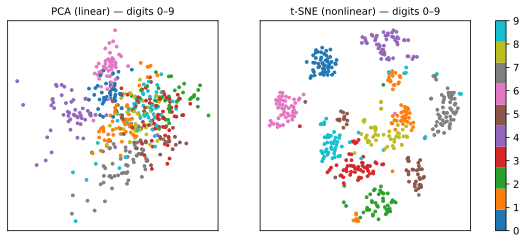

# Dimensionality Reduction

Real datasets often have dozens, hundreds, or — for text and images — thousands of features. **Dimensionality reduction** compresses them into a few informative dimensions, for three reasons:

1. **Visualization** — humans see in 2D/3D; projecting data reveals clusters, gradients, and outliers;
2. **Noise and redundancy removal** — correlated features (remember the [iris petal measurements](../eda/index.md)) carry duplicated information;
3. **The curse of dimensionality** — in high dimensions, data becomes sparse and distances lose meaning, degrading distance-based methods like [k-NN](../knn/index.md) and [clustering](../clustering/index.md).

## PCA — Principal Component Analysis

PCA (Pearson, 1901; Hotelling, 1933) is the classical, *linear* method: find the orthogonal directions of **maximum variance** and project onto the top few.

### The math

Given centered data \(X \in \mathbb{R}^{n \times d}\) (each column has zero mean), the sample covariance matrix is

\[
C = \frac{1}{n-1} X^\top X \in \mathbb{R}^{d \times d}.
\]

The first principal component is the unit vector \(w\) maximizing the variance of the projection:

\[
w_1 = \arg\max_{\|w\|=1} \; w^\top C\, w.
\]

The solution is the eigenvector of \(C\) with the largest eigenvalue \(\lambda_1\); the second component is the next eigenvector, orthogonal to the first, and so on. The eigenvalue \(\lambda_k\) *is* the variance captured by component \(k\), which gives the **explained variance ratio**:

\[
\text{EVR}_k = \frac{\lambda_k}{\sum_{j=1}^{d} \lambda_j}.
\]

```python
from sklearn.decomposition import PCA
from sklearn.preprocessing import StandardScaler

X_scaled = StandardScaler().fit_transform(X)   # scale first — PCA chases variance!
pca = PCA(n_components=0.95)                   # keep 95% of the variance
Z = pca.fit_transform(X_scaled)
pca.explained_variance_ratio_                  # variance captured per component
```

!!! warning "Scale before PCA"
    PCA finds directions of maximum variance. If one feature is measured in thousands and another in tens, the first component simply points at the large-scale feature. Standardize first ([Preprocessing](../preprocessing/index.md)).

Practical notes:

- Components are **linear combinations** of original features — inspect `pca.components_` to interpret them;
- The scree plot (explained variance per component) guides how many components to keep — look for the "elbow";
- PCA is also a **compression/denoising** tool: reconstruct with few components to filter noise.

Find PC1 by hand — rotate the axis until the projected variance peaks, then check yourself with the snap button:

<div id="sim-pca"></div>

## Nonlinear methods: t-SNE and UMAP

Linear projections cannot unfold curved structures (the classic "Swiss roll"). Two modern nonlinear methods dominate visualization practice:

### t-SNE (van der Maaten & Hinton, 2008)

t-SNE converts pairwise distances into **neighbor probabilities** in high dimension, then finds a 2D layout whose neighbor probabilities match (minimizing KL divergence). It excels at revealing **local** cluster structure.

Caveats you must know:

- **Perplexity** (≈ effective number of neighbors, typical 5–50) changes the picture substantially;
- **Cluster sizes and inter-cluster distances in a t-SNE plot are not meaningful** — the algorithm preserves neighborhoods, not global geometry;
- It is stochastic: different seeds give different layouts;
- There is no `transform` for new points (in the standard formulation) — it is a visualization tool, not a general feature extractor.

### UMAP (McInnes, Healy & Melville, 2018)

UMAP builds a k-nearest-neighbor graph of the data, models its fuzzy topological structure, and optimizes a low-dimensional layout preserving it. Compared with t-SNE it:

- is usually **faster** and scales better;
- preserves **more global structure** (relative positions of clusters mean *somewhat* more);
- supports `transform` for new points, so it can feed downstream models — this is exactly its role inside [BERTopic](../topic-modeling-bertopic/index.md), where it reduces text embeddings before clustering.

```python
# pip install umap-learn
import umap
Z = umap.UMAP(n_neighbors=15, min_dist=0.1, n_components=2).fit_transform(X_scaled)
```

## PCA vs t-SNE, side by side

Handwritten digits (64 dimensions → 2), same data, two projections:



PCA — the best *linear* view — overlaps several digit classes: two directions of maximum variance are not enough. t-SNE separates the ten classes almost perfectly by preserving local neighborhoods. The price: axes, cluster sizes and inter-cluster distances in the t-SNE panel have no interpretable meaning.

## Choosing a method

| Goal | Method |
|------|--------|
| Preprocess features for a downstream model | PCA (fast, deterministic, has `transform`) |
| Understand/interpret directions of variation | PCA (components are linear combinations) |
| Visualize cluster structure | t-SNE or UMAP |
| Reduce before density clustering (e.g. HDBSCAN, BERTopic) | UMAP |
| Compress/denoise images or signals | PCA |

---

## Quiz

<div id="quiz-dimensionality-reduction"></div>
<script>
buildQuiz('dimensionality-reduction', 'Dimensionality Reduction', [
  {
    q: "What does the first principal component of PCA represent?",
    opts: [
      "The feature with the largest values",
      "The unit direction along which the projected data has maximum variance",
      "The direction that best separates the classes",
      "A randomly chosen orthogonal axis"
    ],
    ans: 1,
    exp: "PC1 is the eigenvector of the covariance matrix with the largest eigenvalue — the direction of maximum variance. Note PCA is unsupervised: it knows nothing about class labels."
  },
  {
    q: "Why must features be standardized before PCA?",
    opts: [
      "PCA fails to run on unscaled data",
      "Because PCA maximizes variance, a feature with large scale dominates the components regardless of its informativeness",
      "Standardizing makes PCA nonlinear",
      "To remove missing values"
    ],
    ans: 1,
    exp: "Variance is scale-dependent. Income in R$ (variance in millions) will own PC1 even if age is more informative. Standardization puts features on equal footing."
  },
  {
    q: "In a t-SNE plot, two clusters appear far apart and one looks much larger. What can you safely conclude?",
    opts: [
      "The far clusters are very dissimilar and the big cluster has more variance",
      "Only that the points within each cluster are mutual neighbors — inter-cluster distances and cluster sizes are not meaningful in t-SNE",
      "The large cluster contains outliers",
      "The embedding failed"
    ],
    ans: 1,
    exp: "t-SNE preserves local neighborhoods, not global geometry. Distances between clusters and apparent cluster sizes are artifacts of the optimization and of perplexity choice."
  },
  {
    q: "Which property makes UMAP (unlike standard t-SNE) suitable as a step inside a production pipeline such as BERTopic?",
    opts: [
      "It is written in C",
      "It supports transforming new, unseen points with a fitted model",
      "It requires no hyperparameters",
      "It always produces the same layout as PCA"
    ],
    ans: 1,
    exp: "UMAP learns a reusable mapping (fit/transform), is fast, and preserves enough structure for downstream density clustering — exactly how BERTopic uses it before HDBSCAN."
  },
  {
    q: "pca.explained_variance_ratio_ returns [0.72, 0.18, 0.06, ...]. What does 0.72 mean?",
    opts: [
      "72% of the samples are well represented",
      "The first component captures 72% of the total variance in the data",
      "The reconstruction error is 72%",
      "72% of features were discarded"
    ],
    ans: 1,
    exp: "Each eigenvalue measures the variance along its component; dividing by the total gives the fraction captured. Here two components already summarize 90% of the variance."
  },
  {
    q: "The curse of dimensionality refers to the fact that in very high-dimensional spaces...",
    opts: [
      "computers run out of memory",
      "data becomes sparse and distances between points become less discriminative, hurting distance-based methods",
      "features always become correlated",
      "PCA stops being linear"
    ],
    ans: 1,
    exp: "As dimensions grow, the volume grows exponentially and all pairwise distances concentrate around the same value — 'nearest' neighbors are barely nearer than average. Reducing dimensionality restores meaningful geometry."
  }
]);
</script>
