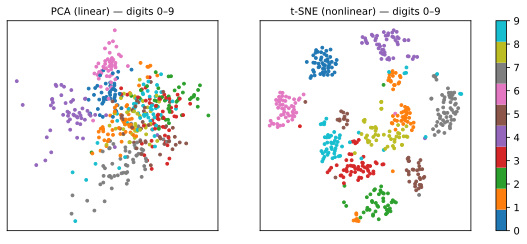

# Redução de Dimensionalidade

Conjuntos de dados reais costumam ter dezenas, centenas ou — para texto e imagens — milhares de atributos. A **redução de dimensionalidade** os comprime em poucas dimensões informativas, por três motivos:

1. **Visualização** — humanos enxergam em 2D/3D; projetar os dados revela agrupamentos, gradientes e outliers;
2. **Remoção de ruído e redundância** — atributos correlacionados (lembre-se das [medidas de pétala da iris](../eda/index.md)) carregam informação duplicada;
3. **A maldição da dimensionalidade** — em altas dimensões, os dados ficam esparsos e as distâncias perdem sentido, degradando métodos baseados em distância como [k-NN](../knn/index.md) e [agrupamento](../clustering/index.md).

## PCA — Análise de Componentes Principais

O PCA (Pearson, 1901; Hotelling, 1933) é o método clássico e *linear*: encontrar as direções ortogonais de **variância máxima** e projetar sobre as primeiras.

### A matemática

Dados centrados \(X \in \mathbb{R}^{n \times d}\) (cada coluna com média zero), a matriz de covariância amostral é

\[
C = \frac{1}{n-1} X^\top X \in \mathbb{R}^{d \times d}.
\]

O primeiro componente principal é o vetor unitário \(w\) que maximiza a variância da projeção:

\[
w_1 = \arg\max_{\|w\|=1} \; w^\top C\, w.
\]

A solução é o autovetor de \(C\) com o maior autovalor \(\lambda_1\); o segundo componente é o próximo autovetor, ortogonal ao primeiro, e assim por diante. O autovalor \(\lambda_k\) *é* a variância capturada pelo componente \(k\), o que dá a **razão de variância explicada**:

\[
\text{EVR}_k = \frac{\lambda_k}{\sum_{j=1}^{d} \lambda_j}.
\]

```python
from sklearn.decomposition import PCA
from sklearn.preprocessing import StandardScaler

X_scaled = StandardScaler().fit_transform(X)   # escalone primeiro — o PCA persegue variância!
pca = PCA(n_components=0.95)                    # manter 95% da variância
Z = pca.fit_transform(X_scaled)
pca.explained_variance_ratio_                  # variância capturada por componente
```

!!! warning "Escalone antes do PCA"
    O PCA encontra direções de variância máxima. Se um atributo é medido em milhares e outro em dezenas, o primeiro componente simplesmente aponta para o atributo de grande escala. Padronize primeiro ([Pré-processamento](../preprocessing/index.md)).

Notas práticas:

- Os componentes são **combinações lineares** dos atributos originais — inspecione `pca.components_` para interpretá-los;
- O scree plot (variância explicada por componente) orienta quantos componentes manter — procure o "cotovelo";
- O PCA também é uma ferramenta de **compressão/remoção de ruído**: reconstrua com poucos componentes para filtrar ruído.

Encontre o PC1 na mão — gire o eixo até a variância projetada atingir o pico e depois confira com o botão de encaixe:

<div id="sim-pca"></div>

## Métodos não lineares: t-SNE e UMAP

Projeções lineares não conseguem desenrolar estruturas curvas (o clássico "Swiss roll"). Dois métodos não lineares modernos dominam a prática de visualização:

### t-SNE (van der Maaten & Hinton, 2008)

O t-SNE converte distâncias par a par em **probabilidades de vizinhança** em alta dimensão e depois encontra um layout 2D cujas probabilidades de vizinhança coincidam (minimizando a divergência KL). Ele se destaca em revelar a estrutura **local** de agrupamentos.

Ressalvas que você precisa conhecer:

- A **perplexidade** (≈ número efetivo de vizinhos, típico 5–50) muda a figura substancialmente;
- **Os tamanhos dos agrupamentos e as distâncias entre agrupamentos em um gráfico t-SNE não têm significado** — o algoritmo preserva vizinhanças, não a geometria global;
- É estocástico: sementes diferentes geram layouts diferentes;
- Não há `transform` para novos pontos (na formulação padrão) — é uma ferramenta de visualização, não um extrator de atributos geral.

### UMAP (McInnes, Healy & Melville, 2018)

O UMAP constrói um grafo de k-vizinhos mais próximos dos dados, modela sua estrutura topológica difusa e otimiza um layout de baixa dimensão que a preserva. Comparado ao t-SNE, ele:

- costuma ser **mais rápido** e escala melhor;
- preserva **mais estrutura global** (as posições relativas dos agrupamentos significam *um pouco* mais);
- suporta `transform` para novos pontos, podendo alimentar modelos subsequentes — é exatamente esse seu papel dentro do [BERTopic](../topic-modeling-bertopic/index.md), onde reduz embeddings de texto antes do agrupamento.

```python
# pip install umap-learn
import umap
Z = umap.UMAP(n_neighbors=15, min_dist=0.1, n_components=2).fit_transform(X_scaled)
```

## PCA vs t-SNE, lado a lado

Dígitos manuscritos (64 dimensões → 2), os mesmos dados, duas projeções:



O PCA — a melhor visão *linear* — sobrepõe várias classes de dígitos: duas direções de variância máxima não bastam. O t-SNE separa as dez classes quase perfeitamente ao preservar vizinhanças locais. O preço: eixos, tamanhos de agrupamentos e distâncias entre agrupamentos no painel t-SNE não têm significado interpretável.

## Escolhendo um método

| Objetivo | Método |
|----------|--------|
| Pré-processar atributos para um modelo subsequente | PCA (rápido, determinístico, tem `transform`) |
| Entender/interpretar direções de variação | PCA (os componentes são combinações lineares) |
| Visualizar estrutura de agrupamentos | t-SNE ou UMAP |
| Reduzir antes de agrupamento por densidade (ex.: HDBSCAN, BERTopic) | UMAP |
| Comprimir/remover ruído de imagens ou sinais | PCA |

## Material de aula

!!! example "Notebook da aula (em português)"
    Notebook prático usado em sala — **Aula 06 — PCA, t-SNE e UMAP**:
    [:simple-googlecolab: abrir no Colab](https://colab.research.google.com/drive/1fM5ZDnnuxCSIYXV8oTDbO3Dz-X-B1Qzo){:target="_blank"}

### Vídeo

[{ .rounded-corners width="480" }](https://youtu.be/o_cAOa5fMhE){:target="_blank"}

:simple-youtube: [Latent Space Visualisation: PCA, t-SNE, UMAP](https://youtu.be/o_cAOa5fMhE){:target="_blank"}

---

## Quiz

<div id="quiz-dimensionality-reduction"></div>
<script>
buildQuiz('dimensionality-reduction', 'Redução de Dimensionalidade', [
  {
    q: "O que o primeiro componente principal do PCA representa?",
    opts: [
      "O atributo com os maiores valores",
      "A direção unitária ao longo da qual os dados projetados têm variância máxima",
      "A direção que melhor separa as classes",
      "Um eixo ortogonal escolhido aleatoriamente"
    ],
    ans: 1,
    exp: "O PC1 é o autovetor da matriz de covariância com o maior autovalor — a direção de variância máxima. Note que o PCA é não supervisionado: ele nada sabe sobre os rótulos das classes."
  },
  {
    q: "Por que os atributos precisam ser padronizados antes do PCA?",
    opts: [
      "O PCA não roda em dados não escalonados",
      "Como o PCA maximiza variância, um atributo de grande escala domina os componentes independentemente de quão informativo ele é",
      "Padronizar torna o PCA não linear",
      "Para remover valores faltantes"
    ],
    ans: 1,
    exp: "A variância depende da escala. Renda em R$ (variância na casa dos milhões) dominará o PC1 mesmo que a idade seja mais informativa. A padronização coloca os atributos em pé de igualdade."
  },
  {
    q: "Em um gráfico t-SNE, dois agrupamentos aparecem distantes e um parece muito maior. O que você pode concluir com segurança?",
    opts: [
      "Os agrupamentos distantes são muito dissimilares e o grande tem mais variância",
      "Apenas que os pontos dentro de cada agrupamento são vizinhos mútuos — distâncias entre agrupamentos e tamanhos de agrupamentos não têm significado no t-SNE",
      "O agrupamento grande contém outliers",
      "A projeção falhou"
    ],
    ans: 1,
    exp: "O t-SNE preserva vizinhanças locais, não a geometria global. Distâncias entre agrupamentos e tamanhos aparentes de agrupamentos são artefatos da otimização e da escolha de perplexidade."
  },
  {
    q: "Qual propriedade torna o UMAP (ao contrário do t-SNE padrão) adequado como passo dentro de um pipeline de produção como o BERTopic?",
    opts: [
      "É escrito em C",
      "Suporta transformar pontos novos e não vistos com um modelo ajustado",
      "Não requer hiperparâmetros",
      "Sempre produz o mesmo layout que o PCA"
    ],
    ans: 1,
    exp: "O UMAP aprende um mapeamento reutilizável (fit/transform), é rápido e preserva estrutura suficiente para o agrupamento por densidade subsequente — exatamente como o BERTopic o usa antes do HDBSCAN."
  },
  {
    q: "pca.explained_variance_ratio_ retorna [0.72, 0.18, 0.06, ...]. O que 0,72 significa?",
    opts: [
      "72% das amostras estão bem representadas",
      "O primeiro componente captura 72% da variância total dos dados",
      "O erro de reconstrução é de 72%",
      "72% dos atributos foram descartados"
    ],
    ans: 1,
    exp: "Cada autovalor mede a variância ao longo de seu componente; dividir pelo total dá a fração capturada. Aqui dois componentes já resumem 90% da variância."
  },
  {
    q: "A maldição da dimensionalidade se refere ao fato de que, em espaços de dimensão muito alta...",
    opts: [
      "os computadores ficam sem memória",
      "os dados ficam esparsos e as distâncias entre pontos tornam-se menos discriminativas, prejudicando métodos baseados em distância",
      "os atributos sempre ficam correlacionados",
      "o PCA deixa de ser linear"
    ],
    ans: 1,
    exp: "Conforme as dimensões crescem, o volume cresce exponencialmente e todas as distâncias par a par se concentram em torno do mesmo valor — os vizinhos 'mais próximos' mal são mais próximos que a média. Reduzir a dimensionalidade restaura uma geometria significativa."
  }
]);
</script>
