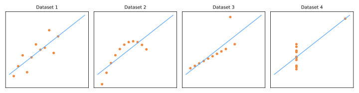
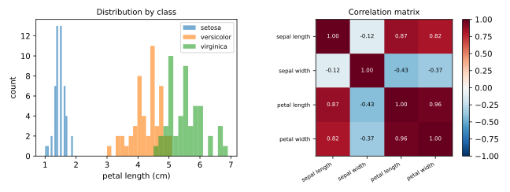

# Exploratory Data Analysis

Exploratory Data Analysis (EDA) is the disciplined practice of **looking at your data before modeling it**. The term was coined by John Tukey (1977), who argued that data analysis should begin with open-minded exploration — plots, summaries, anomalies — rather than jumping straight to hypothesis tests or models.

!!! quote "Tukey (1977)"
    The greatest value of a picture is when it forces us to notice what we never expected to see.

EDA is step 2 of the [ML workflow](../ml-landscape/index.md#the-ml-workflow), and skipping it is the most common source of silent failure: models trained on misunderstood data produce confident nonsense.

## What to look for

A practical EDA checklist:

1. **Shape and types** — how many rows and columns? Which are numeric, categorical, dates, text, identifiers?
2. **Missing values** — how many, in which columns, and *why* are they missing?
3. **Distributions** — center, spread, skewness, multimodality of each feature;
4. **Outliers** — legitimate extremes or data-entry errors?
5. **Relationships** — correlations between features, and between features and the target;
6. **Class balance** — for classification, how frequent is each class?
7. **Duplicates and leakage suspects** — repeated rows, columns that "know the future" (see [Validation & Data Leakage](../validation/index.md)).

## First contact with a dataset

```python
import pandas as pd
from sklearn.datasets import load_iris

iris = load_iris(as_frame=True)
df = iris.frame

df.shape          # (150, 5) — rows, columns
df.head()         # first rows: eyeball the values
df.info()         # dtypes and non-null counts
df.describe()     # count, mean, std, min, quartiles, max
df.isna().sum()   # missing values per column
df.duplicated().sum()
```

### Summary statistics

For a numeric feature \(x_1, \dots, x_n\):

- **Mean**: \(\bar{x} = \frac{1}{n}\sum_{i=1}^{n} x_i\) — sensitive to outliers;
- **Median**: the middle value — robust to outliers;
- **Standard deviation**: \(s = \sqrt{\frac{1}{n-1}\sum_{i=1}^{n}(x_i - \bar{x})^2}\) — typical distance from the mean;
- **Quartiles / IQR**: \( \text{IQR} = Q_3 - Q_1 \) — the range of the middle 50%, the basis of the boxplot.

A large gap between mean and median is a **skewness alarm** — think of income data, where a few large values drag the mean up.

## Why statistics are not enough

The four datasets below — **Anscombe's quartet** — have *identical* means, variances, correlations (\(r \approx 0.816\)), and least-squares lines. Only a plot reveals how different they are:



Dataset 2 is nonlinear, dataset 3 has one outlier distorting the line, dataset 4 has a single point creating the entire correlation. **Always plot.**

## Core visualizations

| Question | Plot |
|----------|------|
| How is one numeric feature distributed? | histogram, density plot, boxplot |
| How does a feature differ across classes? | overlaid histograms, side-by-side boxplots, violin plots |
| How do two numeric features relate? | scatter plot |
| How do all numeric features relate? | correlation heatmap, pair plot |
| How frequent is each category? | bar chart |

An example on the iris dataset — one distribution view and one correlation view:



The left panel already tells a modeling story: petal length alone almost separates the three species. The right panel warns that petal length and petal width are highly correlated (\(r = 0.96\)) — they carry nearly the same information, which will matter for [dimensionality reduction](../dimensionality-reduction/index.md) and for interpreting linear model coefficients.

### Correlation, carefully

The **Pearson correlation** between features \(x\) and \(y\):

\[
r_{xy} = \frac{\sum_{i=1}^{n}(x_i - \bar{x})(y_i - \bar{y})}{\sqrt{\sum_{i=1}^{n}(x_i - \bar{x})^2}\;\sqrt{\sum_{i=1}^{n}(y_i - \bar{y})^2}} \in [-1, 1]
\]

Three standard warnings:

- \(r\) measures **linear** association only — Anscombe's dataset 2 has strong structure and misleading \(r\);
- **correlation is not causation** — ice cream sales and drownings correlate through a confounder (summer);
- correlation on aggregated data can invert at the individual level (**Simpson's paradox**).

## Missing values: the why matters

| Mechanism | Meaning | Example | Safe fixes |
|-----------|---------|---------|------------|
| MCAR | missing completely at random | sensor drops packets randomly | drop or impute |
| MAR | missingness explained by other observed columns | younger users skip the income field | impute using those columns |
| MNAR | missingness depends on the missing value itself | high incomes deliberately not reported | dangerous — needs domain reasoning |

Deleting all rows with any missing value is only harmless under MCAR — otherwise it biases the dataset. Imputation strategies are covered in [Data Preprocessing](../preprocessing/index.md).

## Outliers

The classic boxplot rule flags points outside \([Q_1 - 1.5\,\text{IQR},\; Q_3 + 1.5\,\text{IQR}]\). But the rule only *flags* — the decision needs judgment:

- an `age = 190` is a data-entry error → fix or remove;
- a `purchase = R$ 500,000` may be your most important customer → keep, and choose robust models/metrics.

## Beyond Pearson: measuring any association

Pearson's \(r\) only covers pairs of continuous variables. The full toolkit for bivariate analysis:

| Pair of variables | Association measure | Visualization |
|---|---|---|
| continuous × continuous | Pearson / Spearman correlation | scatter plot |
| categorical × categorical | [Cramér's V](https://en.wikipedia.org/wiki/Cram%C3%A9r%27s_V) (from the χ² statistic) | contingency table / heatmap |
| continuous × categorical | [Kruskal–Wallis test](https://en.wikipedia.org/wiki/Kruskal%E2%80%93Wallis_test) | boxplots of the continuous variable per category |

When reading feature–target associations, keep two class rules of thumb in mind:

- features **strongly associated with each other** → likely redundancy (temperature in °C and °F; price in R$ and US$) — consider dropping one;
- a feature **suspiciously strongly associated with the target** → it may be *the target in disguise* — a leaked column (see [Data Leakage](../validation/index.md#data-leakage)). If your model is suddenly perfect, distrust it first.

## Don't snoop: split before you explore

One subtlety the class dataset drills in: **perform the train/test split *before* the exploratory analysis**, and run EDA on the training set only. Exploring the full dataset means "peeking" at the test set — *data snooping* — and what you learn (which features look promising, where the outliers are, which transformations to apply) silently influences decisions that the test set was supposed to judge from the outside.

!!! danger "The two principles"
    - **The training set can be used freely.**
    - **The test set is SACRED.** It exists for exactly one purpose: measuring the final model once. Don't look at it, don't get close to it, don't acknowledge its existence until the end.

## Hands-on: California Housing

The class notebook works through a full EDA on the **California Housing** dataset (Géron's *Hands-On ML*, chapter 2): 20,640 districts × 10 columns — 9 features (location, housing age, rooms, income, `ocean_proximity`...) and the regression target `median_house_value`.

```python
import pandas as pd

df = pd.read_csv('https://raw.githubusercontent.com/hsandmann/biblio/refs/heads/main/ml/aula02/housing.csv')

X = df.drop('median_house_value', axis=1).copy()   # features  (m × n)
y = df['median_house_value'].copy()                # target    (m,)
```

Guided exercises from the notebook:

1. How many examples and columns? What does each column mean — continuous or categorical?
2. Split train/test (80/20) **first**; explain the role of `random_state`;
3. Univariate analysis on the *training set*: descriptive statistics and plots per feature — hunt for anomalies (missing values in `total_bedrooms`, saturation at `median_house_value` = 500,001), skewed distributions, rare categories;
4. Bivariate analysis: which feature pairs are strongly associated? Which features associate most with the target?

!!! tip "EDA is iterative"
    You will return to EDA after modeling: prediction errors, surprising feature importances, and drift alerts all send you back to look at the data again.

## Class materials

!!! example "Class notebook (in Portuguese)"
    Hands-on notebook used in class — **Aula 02 — Análise Exploratória de Dados**:
    [:simple-googlecolab: open in Colab](https://colab.research.google.com/drive/1LeRg-XlFcVOBcp9UBtOI8Nn-b6QknSkC){:target="_blank"}

---

## Quiz

<div id="quiz-eda"></div>
<script>
buildQuiz('eda', 'Exploratory Data Analysis', [
  {
    q: "What is the main lesson of Anscombe's quartet?",
    opts: [
      "Correlation above 0.8 always indicates a strong linear relationship",
      "Datasets with identical summary statistics can have completely different structures — so always visualize",
      "Least squares should not be used on small datasets",
      "Outliers should always be removed before computing statistics"
    ],
    ans: 1,
    exp: "All four datasets share means, variances, correlation, and regression line, yet only one is a well-behaved linear relationship. Summary statistics compress away structure that plots reveal."
  },
  {
    q: "In a salary dataset, the mean is R$ 12,000 and the median is R$ 4,500. What does this suggest?",
    opts: [
      "The data is symmetric",
      "There is a data-entry error in the median",
      "The distribution is right-skewed: a few large salaries pull the mean up",
      "The standard deviation must be zero"
    ],
    ans: 2,
    exp: "The mean is sensitive to extreme values; the median is not. Mean far above median is the signature of right skew, typical of income data."
  },
  {
    q: "Young users systematically skip the 'income' field in a survey, but their age is recorded. This missingness mechanism is...",
    opts: [
      "MCAR — missing completely at random",
      "MAR — missing at random, explainable by observed columns",
      "MNAR — missing not at random",
      "a duplicate problem"
    ],
    ans: 1,
    exp: "Missingness depends on age, which is observed — that is MAR. Imputation using age is reasonable. It would be MNAR if missingness depended on the (unobserved) income itself."
  },
  {
    q: "Two features have Pearson correlation r = 0.02. Which conclusion is safe?",
    opts: [
      "The features are independent",
      "The features have no linear association — but could still be strongly related nonlinearly",
      "One of the features is useless for prediction",
      "The features are both normally distributed"
    ],
    ans: 1,
    exp: "Pearson r measures only linear association. A perfect parabola y = x² on symmetric x has r ≈ 0. Independence implies r = 0, but not the converse."
  },
  {
    q: "The boxplot rule flags a customer with a purchase 40× larger than Q3. What should you do first?",
    opts: [
      "Delete the row immediately — outliers harm models",
      "Cap the value at Q3 + 1.5 IQR automatically",
      "Investigate: decide whether it is an error or a legitimate extreme before acting",
      "Ignore outliers — they never matter"
    ],
    ans: 2,
    exp: "The 1.5-IQR rule only flags candidates. A legitimate extreme (a whale customer) may be the most important observation in the dataset; an entry error should be fixed. Judgment precedes action."
  },
  {
    q: "Petal length and petal width have r = 0.96 in the iris data. For modeling, this mainly warns that...",
    opts: [
      "one of them was measured incorrectly",
      "they are redundant: they carry nearly the same information, affecting coefficient interpretation and inviting dimensionality reduction",
      "the dataset is too small",
      "the species cannot be separated"
    ],
    ans: 1,
    exp: "Highly correlated features are (near-)redundant. In linear models this multicollinearity makes individual coefficients unstable and hard to interpret; PCA-style methods exploit exactly this redundancy."
  }
]);
</script>
