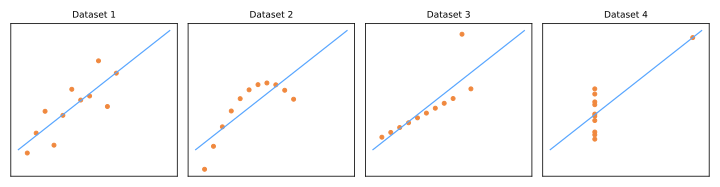
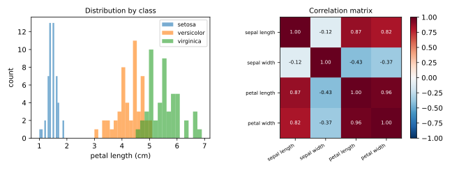

# Análise Exploratória de Dados

A Análise Exploratória de Dados (EDA, do inglês *Exploratory Data Analysis*) é a prática disciplinada de **olhar para os seus dados antes de modelá-los**. O termo foi cunhado por John Tukey (1977), que defendia que a análise de dados deveria começar com exploração sem preconceitos — gráficos, resumos, anomalias — em vez de saltar direto para testes de hipóteses ou modelos.

!!! quote "Tukey (1977)"
    O maior valor de uma figura é quando ela nos força a perceber o que nunca esperávamos ver.

A EDA é o passo 2 do [fluxo de trabalho de ML](../ml-landscape/index.md#o-fluxo-de-trabalho-de-ml), e pulá-la é a fonte mais comum de falha silenciosa: modelos treinados em dados mal compreendidos produzem absurdos com confiança.

## O que procurar

Um checklist prático de EDA:

1. **Formato e tipos** — quantas linhas e colunas? Quais são numéricas, categóricas, datas, texto, identificadores?
2. **Valores faltantes** — quantos, em quais colunas e *por que* estão faltando?
3. **Distribuições** — centro, dispersão, assimetria, multimodalidade de cada atributo;
4. **Outliers** — extremos legítimos ou erros de digitação?
5. **Relações** — correlações entre atributos e entre atributos e o alvo;
6. **Balanceamento de classes** — para classificação, quão frequente é cada classe?
7. **Duplicatas e suspeitas de vazamento** — linhas repetidas, colunas que "conhecem o futuro" (ver [Validação & Vazamento de Dados](../validation/index.md)).

## Primeiro contato com um conjunto de dados

```python
import pandas as pd
from sklearn.datasets import load_iris

iris = load_iris(as_frame=True)
df = iris.frame

df.shape          # (150, 5) — linhas, colunas
df.head()         # primeiras linhas: examine os valores
df.info()         # dtypes e contagem de não nulos
df.describe()     # contagem, média, desvio, mín, quartis, máx
df.isna().sum()   # valores faltantes por coluna
df.duplicated().sum()
```

### Estatísticas descritivas

Para um atributo numérico \(x_1, \dots, x_n\):

- **Média**: \(\bar{x} = \frac{1}{n}\sum_{i=1}^{n} x_i\) — sensível a outliers;
- **Mediana**: o valor central — robusta a outliers;
- **Desvio padrão**: \(s = \sqrt{\frac{1}{n-1}\sum_{i=1}^{n}(x_i - \bar{x})^2}\) — distância típica em relação à média;
- **Quartis / IQR**: \( \text{IQR} = Q_3 - Q_1 \) — a amplitude dos 50% centrais, base do boxplot.

Uma grande diferença entre média e mediana é um **alarme de assimetria** — pense em dados de renda, em que alguns valores altos puxam a média para cima.

## Por que estatísticas não bastam

Os quatro conjuntos de dados abaixo — o **quarteto de Anscombe** — têm médias, variâncias, correlações (\(r \approx 0.816\)) e retas de mínimos quadrados *idênticas*. Só um gráfico revela quão diferentes eles são:



O conjunto 2 é não linear, o conjunto 3 tem um outlier distorcendo a reta e o conjunto 4 tem um único ponto criando toda a correlação. **Sempre faça gráficos.**

## Visualizações essenciais

| Pergunta | Gráfico |
|----------|---------|
| Como um atributo numérico está distribuído? | histograma, gráfico de densidade, boxplot |
| Como um atributo difere entre classes? | histogramas sobrepostos, boxplots lado a lado, violin plots |
| Como dois atributos numéricos se relacionam? | gráfico de dispersão |
| Como todos os atributos numéricos se relacionam? | heatmap de correlação, pair plot |
| Quão frequente é cada categoria? | gráfico de barras |

Um exemplo no conjunto iris — uma visão de distribuição e uma de correlação:



O painel da esquerda já conta uma história de modelagem: o comprimento da pétala sozinho quase separa as três espécies. O painel da direita alerta que comprimento e largura da pétala são altamente correlacionados (\(r = 0.96\)) — carregam quase a mesma informação, o que importará para a [redução de dimensionalidade](../dimensionality-reduction/index.md) e para interpretar os coeficientes de modelos lineares.

### Correlação, com cuidado

A **correlação de Pearson** entre os atributos \(x\) e \(y\):

\[
r_{xy} = \frac{\sum_{i=1}^{n}(x_i - \bar{x})(y_i - \bar{y})}{\sqrt{\sum_{i=1}^{n}(x_i - \bar{x})^2}\;\sqrt{\sum_{i=1}^{n}(y_i - \bar{y})^2}} \in [-1, 1]
\]

Três avisos padrão:

- \(r\) mede apenas associação **linear** — o conjunto 2 de Anscombe tem estrutura forte e \(r\) enganoso;
- **correlação não é causalidade** — vendas de sorvete e afogamentos se correlacionam por meio de um confundidor (o verão);
- correlação em dados agregados pode se inverter no nível individual (**paradoxo de Simpson**).

## Valores faltantes: o porquê importa

| Mecanismo | Significado | Exemplo | Correções seguras |
|-----------|-------------|---------|-------------------|
| MCAR | faltando completamente ao acaso | o sensor perde pacotes aleatoriamente | descartar ou imputar |
| MAR | falta explicada por outras colunas observadas | usuários mais jovens pulam o campo de renda | imputar usando essas colunas |
| MNAR | a falta depende do próprio valor faltante | rendas altas deliberadamente não informadas | perigoso — exige raciocínio de domínio |

Excluir todas as linhas com qualquer valor faltante só é inofensivo sob MCAR — caso contrário, enviesa o conjunto de dados. Estratégias de imputação são cobertas em [Pré-processamento de Dados](../preprocessing/index.md).

## Outliers

A regra clássica do boxplot sinaliza pontos fora de \([Q_1 - 1.5\,\text{IQR},\; Q_3 + 1.5\,\text{IQR}]\). Mas a regra apenas *sinaliza* — a decisão exige julgamento:

- uma `idade = 190` é um erro de digitação → corrigir ou remover;
- uma `compra = R$ 500.000` pode ser seu cliente mais importante → manter, e escolher modelos/métricas robustos.

## Além de Pearson: medindo qualquer associação

O \(r\) de Pearson cobre apenas pares de variáveis contínuas. O kit completo para análise bivariada:

| Par de variáveis | Medida de associação | Visualização |
|---|---|---|
| contínua × contínua | correlação de Pearson / Spearman | gráfico de dispersão |
| categórica × categórica | [V de Cramér](https://en.wikipedia.org/wiki/Cram%C3%A9r%27s_V) (a partir da estatística χ²) | tabela de contingência / heatmap |
| contínua × categórica | [teste de Kruskal–Wallis](https://en.wikipedia.org/wiki/Kruskal%E2%80%93Wallis_test) | boxplots da variável contínua por categoria |

Ao ler associações atributo–alvo, tenha em mente duas regras práticas:

- atributos **fortemente associados entre si** → provável redundância (temperatura em °C e °F; preço em R$ e US$) — considere descartar um;
- um atributo **suspeitamente associado ao alvo** → pode ser *o alvo disfarçado* — uma coluna vazada (ver [Vazamento de Dados](../validation/index.md#vazamento-de-dados)). Se seu modelo ficar de repente perfeito, desconfie dele primeiro.

## Não bisbilhote: divida antes de explorar

Uma sutileza que o conjunto de dados da aula reforça: **faça a divisão treino/teste *antes* da análise exploratória** e rode a EDA apenas no conjunto de treino. Explorar o conjunto completo significa "espiar" o conjunto de teste — *data snooping* — e o que você aprende (quais atributos parecem promissores, onde estão os outliers, quais transformações aplicar) influencia silenciosamente decisões que o conjunto de teste deveria julgar de fora.

!!! danger "Os dois princípios"
    - **O conjunto de treino pode ser usado livremente.**
    - **O conjunto de teste é SAGRADO.** Ele existe para exatamente um propósito: medir o modelo final uma única vez. Não olhe para ele, não chegue perto, não reconheça sua existência até o fim.

## Prática: California Housing

O notebook da aula percorre uma EDA completa no conjunto **California Housing** (do *Hands-On ML* de Géron, capítulo 2): 20.640 distritos × 10 colunas — 9 atributos (localização, idade dos imóveis, cômodos, renda, `ocean_proximity`...) e o alvo de regressão `median_house_value`.

```python
import pandas as pd

df = pd.read_csv('https://raw.githubusercontent.com/hsandmann/biblio/refs/heads/main/ml/aula02/housing.csv')

X = df.drop('median_house_value', axis=1).copy()   # atributos (m × n)
y = df['median_house_value'].copy()                # alvo      (m,)
```

Exercícios guiados do notebook:

1. Quantos exemplos e colunas? O que cada coluna significa — contínua ou categórica?
2. Divida treino/teste (80/20) **primeiro**; explique o papel do `random_state`;
3. Análise univariada no *conjunto de treino*: estatísticas descritivas e gráficos por atributo — cace anomalias (valores faltantes em `total_bedrooms`, saturação em `median_house_value` = 500.001), distribuições assimétricas, categorias raras;
4. Análise bivariada: quais pares de atributos são fortemente associados? Quais atributos mais se associam ao alvo?

!!! tip "A EDA é iterativa"
    Você voltará à EDA depois de modelar: erros de previsão, importâncias de atributos surpreendentes e alertas de drift levam você de volta a olhar os dados novamente.

## Material de aula

!!! example "Notebook da aula (em português)"
    Notebook prático usado em sala — **Aula 02 — Análise Exploratória de Dados**:
    [:simple-googlecolab: abrir no Colab](https://colab.research.google.com/drive/1LeRg-XlFcVOBcp9UBtOI8Nn-b6QknSkC){:target="_blank"}

!!! abstract "Roteiro completo de EDA — California Housing (em português)"
    Material de referência de 3 h, com todos os gráficos renderizados a partir dos dados reais:
    grade de histogramas e de boxplots, univariada numérica e categórica, os três cruzamentos
    (numérica × numérica, categórica × numérica, categórica × categórica), análise multivariada e
    geoespacial, simulador interativo de assimetria e curtose, e 10 exercícios com solução.

    [:material-file-document-outline: abrir o roteiro](handout-eda-california-housing.html){:target="_blank"}

---

## Quiz

<div id="quiz-eda"></div>
<script>
buildQuiz('eda', 'Análise Exploratória de Dados', [
  {
    q: "Qual é a principal lição do quarteto de Anscombe?",
    opts: [
      "Correlação acima de 0,8 sempre indica uma forte relação linear",
      "Conjuntos de dados com estatísticas descritivas idênticas podem ter estruturas completamente diferentes — então sempre visualize",
      "Mínimos quadrados não devem ser usados em conjuntos pequenos",
      "Outliers devem sempre ser removidos antes de calcular estatísticas"
    ],
    ans: 1,
    exp: "Os quatro conjuntos compartilham médias, variâncias, correlação e reta de regressão, mas apenas um é uma relação linear bem comportada. Estatísticas descritivas comprimem e escondem a estrutura que os gráficos revelam."
  },
  {
    q: "Em um conjunto de salários, a média é R$ 12.000 e a mediana é R$ 4.500. O que isso sugere?",
    opts: [
      "Os dados são simétricos",
      "Há um erro de digitação na mediana",
      "A distribuição é assimétrica à direita: alguns salários altos puxam a média para cima",
      "O desvio padrão deve ser zero"
    ],
    ans: 2,
    exp: "A média é sensível a valores extremos; a mediana não. Média muito acima da mediana é a assinatura de assimetria à direita, típica de dados de renda."
  },
  {
    q: "Usuários jovens sistematicamente pulam o campo 'renda' em uma pesquisa, mas a idade deles é registrada. Esse mecanismo de falta é...",
    opts: [
      "MCAR — faltando completamente ao acaso",
      "MAR — faltando ao acaso, explicável por colunas observadas",
      "MNAR — faltando não ao acaso",
      "um problema de duplicatas"
    ],
    ans: 1,
    exp: "A falta depende da idade, que é observada — isso é MAR. Imputar usando a idade é razoável. Seria MNAR se a falta dependesse da própria renda (não observada)."
  },
  {
    q: "Dois atributos têm correlação de Pearson r = 0,02. Qual conclusão é segura?",
    opts: [
      "Os atributos são independentes",
      "Os atributos não têm associação linear — mas ainda podem ser fortemente relacionados de forma não linear",
      "Um dos atributos é inútil para previsão",
      "Ambos os atributos têm distribuição normal"
    ],
    ans: 1,
    exp: "O r de Pearson mede apenas associação linear. Uma parábola perfeita y = x² em x simétrico tem r ≈ 0. Independência implica r = 0, mas não o contrário."
  },
  {
    q: "A regra do boxplot sinaliza um cliente com uma compra 40× maior que o Q3. O que você deve fazer primeiro?",
    opts: [
      "Excluir a linha imediatamente — outliers prejudicam modelos",
      "Limitar o valor a Q3 + 1,5 IQR automaticamente",
      "Investigar: decidir se é um erro ou um extremo legítimo antes de agir",
      "Ignorar outliers — eles nunca importam"
    ],
    ans: 2,
    exp: "A regra de 1,5 IQR apenas sinaliza candidatos. Um extremo legítimo (um cliente 'baleia') pode ser a observação mais importante do conjunto; um erro de digitação deve ser corrigido. O julgamento precede a ação."
  },
  {
    q: "Comprimento e largura da pétala têm r = 0,96 nos dados iris. Para a modelagem, isso alerta principalmente que...",
    opts: [
      "um deles foi medido incorretamente",
      "são redundantes: carregam quase a mesma informação, afetando a interpretação dos coeficientes e convidando à redução de dimensionalidade",
      "o conjunto de dados é pequeno demais",
      "as espécies não podem ser separadas"
    ],
    ans: 1,
    exp: "Atributos altamente correlacionados são (quase) redundantes. Em modelos lineares, essa multicolinearidade torna os coeficientes individuais instáveis e difíceis de interpretar; métodos no estilo PCA exploram exatamente essa redundância."
  }
]);
</script>
