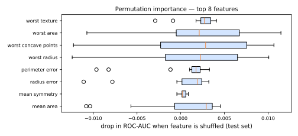

# Explainability

The models winning Parts V and VI — [forests](../random-forest/index.md), [boosters](../gradient-boosting/index.md), [networks](../neural-networks/index.md) — are **black boxes**: thousands of trees or millions of weights with no readable story. Yet the [ethics discussion](../ml-landscape/index.md#ethics-and-responsibility) set a hard requirement: decisions affecting people must be explainable. Regulations (GDPR, Brazil's LGPD), model debugging, and [leakage hunting](../validation/index.md#data-leakage) all demand the same capability. **Explainable ML (XAI)** provides it.

Two complementary questions:

- **Global**: how does the model behave overall — which features drive it?
- **Local**: why did the model make *this* prediction for *this* case?

## Interpretable by design

Before explaining a black box, ask if you need one. [Linear/logistic regression](../logistic-regression/index.md#odds-and-interpretability) (coefficients, odds ratios), small [decision trees](../decision-trees/index.md) (readable rules), Naive Bayes (per-feature evidence) are transparent natively. When their accuracy suffices — often, on tabular problems — the simplest explanation is the model itself. When the accuracy gap justifies a black box, use **post-hoc, model-agnostic** methods:

## Permutation importance (global)

Already met in [Random Forest](../random-forest/index.md#feature-importance): shuffle one feature's column in **held-out data** and measure the score drop. Breaking the feature–target link destroys exactly the information the model extracted from that feature.



Repeats give a distribution (boxes), separating real signal from shuffle noise. One caveat: with **strongly correlated features**, shuffling one leaves its twin available — both look unimportant even when the pair is critical. Check the [correlation matrix](../eda/index.md#correlation-carefully) alongside.

## SHAP (local + global)

**SHAP** (Lundberg & Lee, 2017) answers the local question with game-theoretic rigor. Treat features as **players** cooperating to produce the prediction; the **Shapley value** (Shapley, 1953) \(\phi_j\) is feature \(j\)'s fair share of the payout — its contribution averaged over all orders in which features could join:

\[
\hat{f}(x) = \underbrace{\mathbb{E}[\hat{f}]}_{\text{base value}} + \sum_{j=1}^{d} \phi_j(x)
\]

The only attribution scheme satisfying fairness axioms (efficiency — contributions sum exactly to the prediction minus the average; symmetry; additivity). Exact computation is exponential, but **TreeSHAP** computes it efficiently for tree ensembles — a perfect match for XGBoost-family models.

```python
# pip install shap
import shap

explainer = shap.TreeExplainer(model)          # for tree ensembles
shap_values = explainer(X_test)

shap.plots.waterfall(shap_values[0])   # LOCAL: this prediction, feature by feature
shap.plots.beeswarm(shap_values)       # GLOBAL: importance + direction of effects
shap.plots.scatter(shap_values[:, "age"])   # dependence: effect of age across data
```

- **Waterfall**: from the base value, each feature pushes the prediction up (red) or down (blue) — the exact sentence a credit analyst needs: *"denied mainly because: 3 overdue payments (+0.31), income below X (+0.12), tenure long (−0.05)"*;
- **Beeswarm**: one dot per sample per feature — global importance *with direction* (high values of feature X push predictions up?).

## LIME (local)

**LIME** (Ribeiro et al., 2016 — "Why Should I Trust You?") explains one prediction by **fitting a simple model in the neighborhood**: perturb the instance, get black-box predictions for the perturbed samples (weighted by proximity), and fit a small [linear model](../linear-regression/index.md) locally. The local surrogate's coefficients are the explanation.

Intuitive and works for any model and data type (its image/text variants toggle superpixels/words). Weaknesses: explanations depend on the perturbation scheme and neighborhood width, and can be unstable — run twice, get different stories. SHAP has largely become the default for tabular work; LIME remains conceptually important and useful beyond tables.

## Reading explanations responsibly

!!! danger "Explanation ≠ causation"
    SHAP/LIME describe **what the model uses**, not how the world works. "Zip code pushes the score down" is a fact about the model — and possibly evidence of **proxy discrimination** (zip code standing in for race/income), not a causal claim about zip codes. Use explanations to audit and debug; use causal inference to claim causes.

Explanations are also the everyday **debugging instrument**: an implausibly dominant feature in a SHAP beeswarm is the classic signature of [data leakage](../validation/index.md#data-leakage); a nonsense dependence plot reveals bad encoding; drift in explanation patterns flags [production trouble](../mlops/index.md).

---

## Quiz

<div id="quiz-explainability"></div>
<script>
buildQuiz('explainability', 'Explainability', [
  {
    q: "The difference between global and local explanations is...",
    opts: [
      "global methods work only for linear models",
      "global explains overall model behavior (which features matter); local explains one specific prediction",
      "local methods are always more accurate",
      "there is no difference"
    ],
    ans: 1,
    exp: "'Which features drive churn predictions in general?' is global (permutation importance, SHAP beeswarm). 'Why was THIS customer flagged?' is local (SHAP waterfall, LIME)."
  },
  {
    q: "Permutation importance measures a feature's value by...",
    opts: [
      "counting how often it appears in the model",
      "shuffling its column in held-out data and measuring how much the model's score drops",
      "removing it and retraining from scratch",
      "its correlation with the target"
    ],
    ans: 1,
    exp: "Shuffling severs the feature–target relationship while preserving the feature's distribution. The score drop quantifies how much the trained model relied on that feature — no retraining needed."
  },
  {
    q: "Two nearly duplicate features can both appear unimportant under permutation importance because...",
    opts: [
      "the algorithm ignores correlated columns",
      "when one is shuffled, the model still accesses the same information through its correlated twin",
      "shuffling fails on duplicated data",
      "importance is split alphabetically"
    ],
    ans: 1,
    exp: "The model can lean on either copy. Shuffle one and predictions barely change — for both. Inspect correlations (EDA!) or permute correlated groups together."
  },
  {
    q: "The SHAP efficiency property guarantees that...",
    opts: [
      "SHAP runs in linear time for any model",
      "the feature contributions sum exactly to the prediction minus the average prediction",
      "all features receive equal attribution",
      "SHAP values are always positive"
    ],
    ans: 1,
    exp: "f̂(x) = base value + Σφⱼ. The attribution fully accounts for the prediction — nothing left over — which is what makes waterfall plots an exact decomposition rather than a heuristic."
  },
  {
    q: "LIME explains a single prediction by...",
    opts: [
      "computing exact Shapley values",
      "fitting a simple (e.g., linear) surrogate model to the black box's behavior in a neighborhood of the instance",
      "visualizing the model's weights",
      "retraining the model without the instance"
    ],
    ans: 1,
    exp: "Perturb the instance, query the black box, weight samples by proximity, fit a small interpretable model locally. Its coefficients explain the vicinity — at the cost of sensitivity to the perturbation setup."
  },
  {
    q: "A SHAP beeswarm shows one feature towering over all others, and its values almost determine the prediction. Your first hypothesis should be...",
    opts: [
      "the model is excellent",
      "possible data leakage: a feature that 'knows the answer' usually got it from the future or the target",
      "the other features should be dropped",
      "SHAP is broken"
    ],
    ans: 1,
    exp: "Implausibly dominant features are the classic leakage signature (recall number_of_followup_visits). Explainability doubles as the leak-detection instrument — check how that feature is generated before celebrating."
  }
]);
</script>
