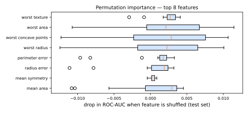

# Explicabilidade

Os modelos que vencem as Partes V e VI — [florestas](../random-forest/index.md), [boosters](../gradient-boosting/index.md), [redes](../neural-networks/index.md) — são **caixas-pretas**: milhares de árvores ou milhões de pesos sem uma história legível. Ainda assim, a [discussão de ética](../ml-landscape/index.md#etica-e-responsabilidade) impôs um requisito rígido: decisões que afetam pessoas precisam ser explicáveis. Regulações (GDPR, a LGPD brasileira), a depuração de modelos e a [caça a vazamentos](../validation/index.md#vazamento-de-dados) exigem todas a mesma capacidade. O **ML explicável (XAI)** a fornece.

Duas perguntas complementares:

- **Global**: como o modelo se comporta no geral — quais atributos o guiam?
- **Local**: por que o modelo fez *esta* previsão para *este* caso?

## Interpretável por design

Antes de explicar uma caixa-preta, pergunte se você precisa de uma. A [regressão linear/logística](../logistic-regression/index.md#chances-odds-e-interpretabilidade) (coeficientes, razões de chances) e as [árvores de decisão](../decision-trees/index.md) pequenas (regras legíveis) são transparentes nativamente. Quando sua acurácia basta — o que ocorre com frequência em problemas tabulares — a explicação mais simples é o próprio modelo. Quando a diferença de acurácia justifica uma caixa-preta, use métodos **post-hoc e agnósticos ao modelo**:

## Importância por permutação (global)

Já vista em [Random Forest](../random-forest/index.md#importancia-de-atributos): embaralhe a coluna de um atributo em **dados separados** e meça a queda no escore. Quebrar o vínculo atributo–alvo destrói exatamente a informação que o modelo extraiu daquele atributo.



As repetições geram uma distribuição (caixas), separando o sinal real do ruído do embaralhamento. Uma ressalva: com **atributos fortemente correlacionados**, embaralhar um deixa seu gêmeo disponível — ambos parecem sem importância mesmo quando o par é crítico. Confira a [matriz de correlação](../eda/index.md#correlacao-com-cuidado) em paralelo.

## SHAP (local + global)

O **SHAP** (Lundberg & Lee, 2017) responde à pergunta local com rigor da teoria dos jogos. Trate os atributos como **jogadores** cooperando para produzir a previsão; o **valor de Shapley** (Shapley, 1953) \(\phi_j\) é a parcela justa do atributo \(j\) no prêmio — sua contribuição, na média sobre todas as ordens em que os atributos poderiam entrar:

\[
\hat{f}(x) = \underbrace{\mathbb{E}[\hat{f}]}_{\text{valor base}} + \sum_{j=1}^{d} \phi_j(x)
\]

O único esquema de atribuição que satisfaz axiomas de justiça (eficiência — as contribuições somam exatamente a previsão menos a média; simetria; aditividade). O cálculo exato é exponencial, mas o **TreeSHAP** o computa eficientemente para ensembles de árvores — um par perfeito para modelos da família XGBoost.

```python
# pip install shap
import shap

explainer = shap.TreeExplainer(model)          # para ensembles de árvores
shap_values = explainer(X_test)

shap.plots.waterfall(shap_values[0])   # LOCAL: esta previsão, atributo por atributo
shap.plots.beeswarm(shap_values)       # GLOBAL: importância + direção dos efeitos
shap.plots.scatter(shap_values[:, "age"])   # dependência: efeito da idade nos dados
```

- **Waterfall**: a partir do valor base, cada atributo empurra a previsão para cima (vermelho) ou para baixo (azul) — a frase exata de que um analista de crédito precisa: *"negado principalmente por: 3 pagamentos atrasados (+0,31), renda abaixo de X (+0,12), tempo de relacionamento longo (−0,05)"*;
- **Beeswarm**: um ponto por amostra por atributo — importância global *com direção* (valores altos do atributo X empurram as previsões para cima?).

## LIME (local)

O **LIME** (Ribeiro et al., 2016 — "Why Should I Trust You?") explica uma previsão **ajustando um modelo simples na vizinhança**: perturbe a instância, obtenha as previsões da caixa-preta para as amostras perturbadas (ponderadas por proximidade) e ajuste um pequeno [modelo linear](../linear-regression/index.md) localmente. Os coeficientes do substituto local são a explicação.

Intuitivo e funciona para qualquer modelo e tipo de dado (suas variantes para imagem/texto alternam superpixels/palavras). Fraquezas: as explicações dependem do esquema de perturbação e da largura da vizinhança, e podem ser instáveis — rode duas vezes, obtenha histórias diferentes. O SHAP virou em grande parte o padrão para trabalho tabular; o LIME permanece conceitualmente importante e útil além de tabelas.

## Lendo explicações com responsabilidade

!!! danger "Explicação ≠ causalidade"
    SHAP/LIME descrevem **o que o modelo usa**, não como o mundo funciona. "O CEP empurra o escore para baixo" é um fato sobre o modelo — e possivelmente evidência de **discriminação por proxy** (o CEP fazendo as vezes de raça/renda), não uma afirmação causal sobre CEPs. Use explicações para auditar e depurar; use inferência causal para afirmar causas.

As explicações também são o **instrumento de depuração** do dia a dia: um atributo implausivelmente dominante em um beeswarm SHAP é a assinatura clássica de [vazamento de dados](../validation/index.md#vazamento-de-dados); um gráfico de dependência sem sentido revela codificação ruim; drift nos padrões de explicação sinaliza [problemas em produção](../mlops/index.md).

---

## Quiz

<div id="quiz-explainability"></div>
<script>
buildQuiz('explainability', 'Explicabilidade', [
  {
    q: "A diferença entre explicações globais e locais é...",
    opts: [
      "métodos globais só funcionam para modelos lineares",
      "a global explica o comportamento geral do modelo (quais atributos importam); a local explica uma previsão específica",
      "métodos locais são sempre mais acurados",
      "não há diferença"
    ],
    ans: 1,
    exp: "'Quais atributos guiam as previsões de churn em geral?' é global (importância por permutação, beeswarm SHAP). 'Por que ESTE cliente foi sinalizado?' é local (waterfall SHAP, LIME)."
  },
  {
    q: "A importância por permutação mede o valor de um atributo ao...",
    opts: [
      "contar quantas vezes ele aparece no modelo",
      "embaralhar sua coluna em dados separados e medir o quanto o escore do modelo cai",
      "removê-lo e retreinar do zero",
      "sua correlação com o alvo"
    ],
    ans: 1,
    exp: "Embaralhar rompe a relação atributo–alvo preservando a distribuição do atributo. A queda no escore quantifica o quanto o modelo treinado dependeu daquele atributo — sem necessidade de retreino."
  },
  {
    q: "Dois atributos quase duplicados podem ambos parecer sem importância sob a importância por permutação porque...",
    opts: [
      "o algoritmo ignora colunas correlacionadas",
      "quando um é embaralhado, o modelo ainda acessa a mesma informação por meio de seu gêmeo correlacionado",
      "o embaralhamento falha em dados duplicados",
      "a importância é dividida alfabeticamente"
    ],
    ans: 1,
    exp: "O modelo pode se apoiar em qualquer cópia. Embaralhe uma e as previsões mal mudam — para ambas. Inspecione correlações (EDA!) ou permute grupos correlacionados juntos."
  },
  {
    q: "A propriedade de eficiência do SHAP garante que...",
    opts: [
      "o SHAP roda em tempo linear para qualquer modelo",
      "as contribuições dos atributos somam exatamente a previsão menos a previsão média",
      "todos os atributos recebem atribuição igual",
      "os valores SHAP são sempre positivos"
    ],
    ans: 1,
    exp: "f̂(x) = valor base + Σφⱼ. A atribuição contabiliza integralmente a previsão — nada sobra — o que faz dos gráficos waterfall uma decomposição exata em vez de uma heurística."
  },
  {
    q: "O LIME explica uma única previsão ao...",
    opts: [
      "calcular os valores de Shapley exatos",
      "ajustar um modelo substituto simples (ex.: linear) ao comportamento da caixa-preta em uma vizinhança da instância",
      "visualizar os pesos do modelo",
      "retreinar o modelo sem a instância"
    ],
    ans: 1,
    exp: "Perturbe a instância, consulte a caixa-preta, pondere as amostras por proximidade, ajuste um pequeno modelo interpretável localmente. Seus coeficientes explicam a vizinhança — ao custo de sensibilidade à configuração da perturbação."
  },
  {
    q: "Um beeswarm SHAP mostra um atributo dominando todos os outros, e seus valores quase determinam a previsão. Sua primeira hipótese deve ser...",
    opts: [
      "o modelo é excelente",
      "possível vazamento de dados: um atributo que 'sabe a resposta' geralmente a obteve do futuro ou do alvo",
      "os outros atributos devem ser descartados",
      "o SHAP está quebrado"
    ],
    ans: 1,
    exp: "Atributos implausivelmente dominantes são a assinatura clássica de vazamento (lembre-se de number_of_followup_visits). A explicabilidade também serve como instrumento de detecção de vazamento — verifique como aquele atributo é gerado antes de comemorar."
  }
]);
</script>
