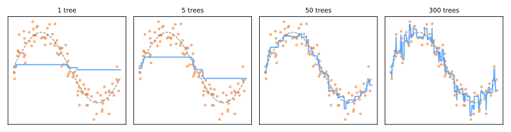

# Gradient Boosting

If [random forests](../random-forest/index.md) average independent trees to cut variance, **boosting** does the opposite: build trees **sequentially, each one correcting the errors of the ensemble so far**. The idea began with AdaBoost (Freund & Schapire, 1997 — reweight misclassified points); Friedman (2001) generalized it into **gradient boosting**, and its engineered descendants — **XGBoost** (2016), **LightGBM** (2017), **CatBoost** (2018) — have dominated tabular ML competitions and industry ever since.

## Boosting as gradient descent on functions

Fit a model in \(M\) additive stages:

\[
F_M(x) = F_0(x) + \nu \sum_{m=1}^{M} h_m(x)
\]

where each \(h_m\) is a small tree and \(\nu\) is the **learning rate**. The key insight: choose each \(h_m\) to point in the direction that most decreases the loss — exactly like [gradient descent](../gradient-descent-regularization/index.md#gradient-descent), but the "parameters" are the **model's predictions themselves**. Each stage fits the new tree to the **pseudo-residuals**:

\[
r_i^{(m)} = -\frac{\partial L\big(y_i, F(x_i)\big)}{\partial F(x_i)}\bigg|_{F = F_{m-1}}
\]

For squared error, \(r_i = y_i - F_{m-1}(x_i)\) — literally *the residuals*: each tree learns what the ensemble still gets wrong. Swapping the loss retargets the same machinery: log-loss → classification, quantile loss → quantile regression, ranking losses → search engines.

```text
F₀ = argmin_c Σ L(yᵢ, c)                      # e.g. the mean / log-odds
for m in 1..M:
    rᵢ = −∂L(yᵢ, F(xᵢ))/∂F(xᵢ)               # pseudo-residuals
    fit small tree h_m to (X, r)               # depth 2–6
    F_m = F_{m−1} + ν · h_m                    # small step
```

Watch the ensemble assemble a sine wave from depth-2 trees, stage by stage:



One tree is a crude staircase; 5 trees sketch the shape; 50 fit it well; 300 begin chasing individual noisy points. Boosting attacks **bias** stage by stage — but keeps going into the noise if unchecked, so unlike a random forest, **more trees CAN overfit**.

## The regularization toolkit

Boosting's power demands brakes — several, used together:

- **Learning rate \(\nu\)** (0.01–0.3): shrink each tree's contribution. Small \(\nu\) + many trees generalizes better than large \(\nu\) + few — the standard trade;
- **Tree size**: depth 2–6. Depth also caps the **interaction order** the model can express (depth-2 trees = pairwise interactions);
- **Early stopping**: monitor validation loss and stop adding trees when it stops improving — choosing \(M\) automatically;
- **Subsampling**: each tree sees a random fraction of rows (*stochastic* gradient boosting) and/or columns — borrowing the forest's decorrelation trick;
- **XGBoost's addition**: explicit penalty \(\Omega(h) = \gamma T + \frac{\lambda}{2}\lVert w \rVert^2\) on each tree's leaf count and leaf values, plus second-order (Newton) steps — [regularization](../gradient-descent-regularization/index.md#regularization) formalized inside the booster.

## The modern libraries

```python
# scikit-learn's fast implementation (LightGBM-style histograms)
from sklearn.ensemble import HistGradientBoostingClassifier
model = HistGradientBoostingClassifier(
    learning_rate=0.1, max_iter=500,
    early_stopping=True, validation_fraction=0.1,
)
model.fit(X_train, y_train)     # native missing-value support, no scaling
```

```python
# XGBoost
import xgboost as xgb
model = xgb.XGBClassifier(n_estimators=1000, learning_rate=0.05,
                          max_depth=5, subsample=0.8, colsample_bytree=0.8,
                          early_stopping_rounds=50)
model.fit(X_train, y_train, eval_set=[(X_val, y_val)])
```

| | Sells itself on |
|---|---|
| **XGBoost** | regularized objective, robustness, huge ecosystem |
| **LightGBM** | histogram binning + leaf-wise growth → fastest on large data |
| **CatBoost** | native categorical features (ordered target encoding), great defaults |

All handle missing values natively and need no feature scaling ([tree lineage](../decision-trees/index.md#practical-profile)). Tune with [randomized search](../model-selection/index.md#grid-search-with-cross-validation) or [Optuna](../automl/index.md) — key knobs: `learning_rate`, `n_estimators` (via early stopping), `max_depth`/`num_leaves`, `subsample`, `colsample_bytree`, `reg_lambda`.

## Forest or boosting?

| | Random Forest | Gradient Boosting |
|---|---|---|
| Trees built | independently, in parallel | sequentially, each fixing the rest |
| Attacks | variance | bias (variance via shrinkage/subsampling) |
| More trees | never hurts | overfits — use early stopping |
| Tuning effort | minimal | moderate — and it pays |
| Typical tabular accuracy | very good | **state of the art (tuned)** |

On tabular data, tuned gradient boosting still routinely beats deep learning (Grinsztajn et al., 2022) — the reigning champion where features are structured. When you hear "we use ML for credit scoring / churn / pricing", the model is very often an XGBoost-family booster. For images, audio, and text, [neural networks](../neural-networks/index.md) take over — the story of Part VI.

---

## Quiz

<div id="quiz-gradient-boosting"></div>
<script>
buildQuiz('gradient-boosting', 'Gradient Boosting', [
  {
    q: "The fundamental difference between boosting and bagging is that boosting...",
    opts: [
      "trains trees in parallel on bootstrap samples",
      "trains trees sequentially, each one fitted to correct the errors (pseudo-residuals) of the ensemble so far",
      "uses deeper trees",
      "only works for regression"
    ],
    ans: 1,
    exp: "Bagging averages independent trees to reduce variance. Boosting is a stage-wise additive model: each new tree targets what the current ensemble still gets wrong, attacking bias."
  },
  {
    q: "With squared-error loss, the pseudo-residuals each new tree fits are...",
    opts: [
      "the predictions of the previous tree",
      "simply the current residuals yᵢ − F(xᵢ)",
      "random noise",
      "the feature importances"
    ],
    ans: 1,
    exp: "The negative gradient of ½(y−F)² with respect to F is exactly y − F. 'Gradient boosting' = gradient descent in function space; for other losses the pseudo-residuals generalize the same idea."
  },
  {
    q: "Why can gradient boosting overfit when a random forest (in n_estimators) cannot?",
    opts: [
      "Boosting uses bigger trees",
      "Each boosting stage keeps reducing training loss, eventually fitting noise; forest trees only average, which stabilizes rather than compounds",
      "Random forests use regularization internally",
      "Boosting cannot overfit either"
    ],
    ans: 1,
    exp: "Boosting is optimization: more stages = lower training loss, without limit. After the signal is fit, further trees model noise. Early stopping on validation loss picks the right number of stages."
  },
  {
    q: "The standard advice 'lower the learning rate and add more trees' works because...",
    opts: [
      "it speeds up training",
      "many small shrunken steps follow the loss landscape more carefully, generalizing better than few large steps",
      "large learning rates cause division by zero",
      "it reduces memory usage"
    ],
    ans: 1,
    exp: "ν shrinks each tree's contribution, regularizing the additive path. Small ν with early-stopped M consistently beats large ν empirically — the compute cost is the price of the accuracy."
  },
  {
    q: "Setting max_depth = 2 for the base trees limits the model to...",
    opts: [
      "linear relationships only",
      "interactions of at most two features at a time",
      "two trees in total",
      "two classes"
    ],
    ans: 1,
    exp: "A depth-d tree can condition on at most d features along any root-to-leaf path, capping the interaction order of each stage. Shallow trees = simple building blocks, which boosting then combines."
  },
  {
    q: "For a structured/tabular business dataset (say, churn prediction), the empirically strongest family is usually...",
    opts: [
      "deep neural networks",
      "tuned gradient boosting (XGBoost/LightGBM/CatBoost)",
      "k-nearest neighbors",
      "naive Bayes"
    ],
    ans: 1,
    exp: "Benchmarks (e.g., Grinsztajn et al., 2022) repeatedly show boosted trees leading on tabular data — robust to feature scales, missing values, and irrelevant columns. Deep learning wins on perception (images, audio, text)."
  }
]);
</script>
