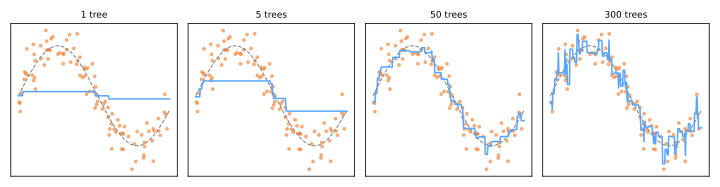

# Gradient Boosting

Se as [random forests](../random-forest/index.md) fazem a média de árvores independentes para cortar variância, o **boosting** faz o oposto: constrói árvores **sequencialmente, cada uma corrigindo os erros do ensemble até então**. A ideia começou com o AdaBoost (Freund & Schapire, 1997 — repondera pontos classificados incorretamente); Friedman (2001) a generalizou no **gradient boosting**, e seus descendentes de engenharia — **XGBoost** (2016), **LightGBM** (2017), **CatBoost** (2018) — dominam competições e a indústria de ML tabular desde então.

## Boosting como gradiente descendente sobre funções

Ajuste um modelo em \(M\) estágios aditivos:

\[
F_M(x) = F_0(x) + \nu \sum_{m=1}^{M} h_m(x)
\]

onde cada \(h_m\) é uma pequena árvore e \(\nu\) é a **taxa de aprendizado**. A percepção-chave: escolha cada \(h_m\) para apontar na direção que mais diminui a perda — exatamente como o [gradiente descendente](../gradient-descent-regularization/index.md#gradiente-descendente), mas os "parâmetros" são as **próprias previsões do modelo**. Cada estágio ajusta a nova árvore aos **pseudo-resíduos**:

\[
r_i^{(m)} = -\frac{\partial L\big(y_i, F(x_i)\big)}{\partial F(x_i)}\bigg|_{F = F_{m-1}}
\]

Para o erro quadrático, \(r_i = y_i - F_{m-1}(x_i)\) — literalmente *os resíduos*: cada árvore aprende o que o ensemble ainda erra. Trocar a perda redireciona a mesma maquinaria: log-loss → classificação, perda de quantil → regressão quantílica, perdas de ranqueamento → mecanismos de busca.

```text
F₀ = argmin_c Σ L(yᵢ, c)                      # ex.: a média / log-odds
para m em 1..M:
    rᵢ = −∂L(yᵢ, F(xᵢ))/∂F(xᵢ)               # pseudo-resíduos
    ajuste pequena árvore h_m a (X, r)         # profundidade 2–6
    F_m = F_{m−1} + ν · h_m                    # passo pequeno
```

Observe o ensemble montar uma senoide a partir de árvores de profundidade 2, estágio por estágio:



Uma árvore é uma escada grosseira; 5 árvores esboçam a forma; 50 a ajustam bem; 300 começam a perseguir pontos ruidosos individuais. O boosting ataca o **viés** estágio por estágio — mas continua avançando para o ruído se não for contido, então, ao contrário de uma random forest, **mais árvores PODEM sobreajustar**.

## O kit de regularização

O poder do boosting exige freios — vários, usados juntos:

- **Taxa de aprendizado \(\nu\)** (0,01–0,3): encolher a contribuição de cada árvore. \(\nu\) pequeno + muitas árvores generaliza melhor que \(\nu\) grande + poucas — a troca padrão;
- **Tamanho da árvore**: profundidade 2–6. A profundidade também limita a **ordem de interação** que o modelo pode expressar (árvores de profundidade 2 = interações par a par);
- **Parada antecipada (early stopping)**: monitorar a perda de validação e parar de adicionar árvores quando ela deixa de melhorar — escolhendo \(M\) automaticamente;
- **Subamostragem**: cada árvore vê uma fração aleatória de linhas (gradient boosting *estocástico*) e/ou colunas — pegando emprestado o truque de descorrelação da floresta;
- **A adição do XGBoost**: penalidade explícita \(\Omega(h) = \gamma T + \frac{\lambda}{2}\lVert w \rVert^2\) sobre o número de folhas e os valores das folhas de cada árvore, mais passos de segunda ordem (Newton) — a [regularização](../gradient-descent-regularization/index.md#regularizacao) formalizada dentro do booster.

## As bibliotecas modernas

```python
# implementação rápida do scikit-learn (histogramas ao estilo LightGBM)
from sklearn.ensemble import HistGradientBoostingClassifier
model = HistGradientBoostingClassifier(
    learning_rate=0.1, max_iter=500,
    early_stopping=True, validation_fraction=0.1,
)
model.fit(X_train, y_train)     # suporte nativo a valores faltantes, sem escalonamento
```

```python
# XGBoost
import xgboost as xgb
model = xgb.XGBClassifier(n_estimators=1000, learning_rate=0.05,
                          max_depth=5, subsample=0.8, colsample_bytree=0.8,
                          early_stopping_rounds=50)
model.fit(X_train, y_train, eval_set=[(X_val, y_val)])
```

| | Se vende por |
|---|---|
| **XGBoost** | objetivo regularizado, robustez, ecossistema enorme |
| **LightGBM** | binning por histograma + crescimento leaf-wise → o mais rápido em dados grandes |
| **CatBoost** | atributos categóricos nativos (target encoding ordenado), ótimos padrões |

Todos lidam com valores faltantes nativamente e não precisam de escalonamento de atributos ([linhagem de árvores](../decision-trees/index.md#perfil-pratico)). Ajuste com [busca aleatória](../model-selection/index.md#busca-em-grade-com-validacao-cruzada) ou [Optuna](../automl/index.md) — botões-chave: `learning_rate`, `n_estimators` (via parada antecipada), `max_depth`/`num_leaves`, `subsample`, `colsample_bytree`, `reg_lambda`.

## Floresta ou boosting?

| | Random Forest | Gradient Boosting |
|---|---|---|
| Árvores construídas | independentemente, em paralelo | sequencialmente, cada uma corrigindo o resto |
| Ataca | variância | viés (variância via shrinkage/subamostragem) |
| Mais árvores | nunca prejudica | sobreajusta — use parada antecipada |
| Esforço de ajuste | mínimo | moderado — e compensa |
| Acurácia tabular típica | muito boa | **estado da arte (ajustado)** |

Em dados tabulares, o gradient boosting ajustado ainda rotineiramente supera o deep learning (Grinsztajn et al., 2022) — o campeão reinante onde os atributos são estruturados. Quando você ouve "usamos ML para escoragem de crédito / churn / precificação", o modelo é muito frequentemente um booster da família XGBoost. Para imagens, áudio e texto, as [redes neurais](../neural-networks/index.md) assumem — a história da Parte VI.

## Material de aula

!!! example "Notebook da aula (em português)"
    Notebook prático usado em sala — **Aula 21 — Gradient Boosting**:
    [:simple-googlecolab: abrir no Colab](https://colab.research.google.com/drive/1_9PwDnCZ_CzM8CyrgwgkPb_IHVgCaZT3){:target="_blank"}

---

## Quiz

<div id="quiz-gradient-boosting"></div>
<script>
buildQuiz('gradient-boosting', 'Gradient Boosting', [
  {
    q: "A diferença fundamental entre boosting e bagging é que o boosting...",
    opts: [
      "treina árvores em paralelo sobre amostras bootstrap",
      "treina árvores sequencialmente, cada uma ajustada para corrigir os erros (pseudo-resíduos) do ensemble até então",
      "usa árvores mais profundas",
      "só funciona para regressão"
    ],
    ans: 1,
    exp: "O bagging faz a média de árvores independentes para reduzir variância. O boosting é um modelo aditivo por estágios: cada nova árvore mira no que o ensemble atual ainda erra, atacando o viés."
  },
  {
    q: "Com perda de erro quadrático, os pseudo-resíduos que cada nova árvore ajusta são...",
    opts: [
      "as previsões da árvore anterior",
      "simplesmente os resíduos atuais yᵢ − F(xᵢ)",
      "ruído aleatório",
      "as importâncias dos atributos"
    ],
    ans: 1,
    exp: "O gradiente negativo de ½(y−F)² em relação a F é exatamente y − F. 'Gradient boosting' = gradiente descendente no espaço de funções; para outras perdas os pseudo-resíduos generalizam a mesma ideia."
  },
  {
    q: "Por que o gradient boosting pode sobreajustar quando uma random forest (em n_estimators) não pode?",
    opts: [
      "O boosting usa árvores maiores",
      "Cada estágio do boosting continua reduzindo a perda de treino, eventualmente ajustando ruído; as árvores da floresta apenas fazem a média, o que estabiliza em vez de acumular",
      "As random forests usam regularização internamente",
      "O boosting também não pode sobreajustar"
    ],
    ans: 1,
    exp: "O boosting é otimização: mais estágios = menor perda de treino, sem limite. Depois que o sinal é ajustado, árvores adicionais modelam ruído. A parada antecipada na perda de validação escolhe o número certo de estágios."
  },
  {
    q: "O conselho padrão 'reduza a taxa de aprendizado e adicione mais árvores' funciona porque...",
    opts: [
      "acelera o treino",
      "muitos passos pequenos e encolhidos seguem a paisagem de perda com mais cuidado, generalizando melhor que poucos passos grandes",
      "taxas de aprendizado grandes causam divisão por zero",
      "reduz o uso de memória"
    ],
    ans: 1,
    exp: "ν encolhe a contribuição de cada árvore, regularizando o caminho aditivo. ν pequeno com M interrompido cedo supera consistentemente ν grande na prática — o custo de processamento é o preço da acurácia."
  },
  {
    q: "Definir max_depth = 2 para as árvores base limita o modelo a...",
    opts: [
      "apenas relações lineares",
      "interações de no máximo dois atributos por vez",
      "duas árvores no total",
      "duas classes"
    ],
    ans: 1,
    exp: "Uma árvore de profundidade d pode condicionar em no máximo d atributos ao longo de qualquer caminho raiz-folha, limitando a ordem de interação de cada estágio. Árvores rasas = blocos de construção simples, que o boosting então combina."
  },
  {
    q: "Para um conjunto de dados de negócio estruturado/tabular (digamos, previsão de churn), a família empiricamente mais forte costuma ser...",
    opts: [
      "redes neurais profundas",
      "gradient boosting ajustado (XGBoost/LightGBM/CatBoost)",
      "k-vizinhos mais próximos",
      "regressão logística"
    ],
    ans: 1,
    exp: "Benchmarks (ex.: Grinsztajn et al., 2022) mostram repetidamente árvores com boosting liderando em dados tabulares — robustas a escalas de atributos, valores faltantes e colunas irrelevantes. O deep learning vence em percepção (imagens, áudio, texto)."
  }
]);
</script>
