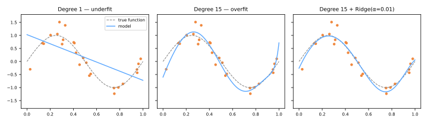

# Gradient Descent & Regularization

The [closed-form OLS solution](../linear-regression/index.md#the-closed-form-solution) is elegant, but it does not scale to huge feature counts, does not exist for most other models, and says nothing about controlling overfitting. This lesson adds the two tools that do: **gradient descent** — the optimization engine behind nearly all of modern ML — and **regularization** — the standard brake on model complexity.

## Gradient descent

To minimize a differentiable loss \(J(w)\), repeatedly step **against the gradient** (the direction of steepest increase):

\[
w^{(t+1)} = w^{(t)} - \eta \, \nabla_w J\big(w^{(t)}\big)
\]

where \(\eta\) is the **learning rate**. For linear regression with mean squared error,

\[
J(w) = \frac{1}{n}\lVert y - Xw \rVert^2,
\qquad
\nabla_w J = -\frac{2}{n} X^\top (y - Xw),
\]

a convex bowl with a single global minimum — gradient descent is guaranteed to reach it for small enough \(\eta\).

### The learning rate

- \(\eta\) too small → tiny steps, painfully slow convergence;
- \(\eta\) too large → steps overshoot the minimum; the loss oscillates or **diverges**;
- practical recipe: try \(\eta \in \{10^{-3}, 10^{-2}, 10^{-1}\}\), monitor the training-loss curve — it should fall smoothly.

Feel it yourself — step through the descent, then set \(\eta = 1.05\) and watch it explode:

<div id="sim-gd"></div>

!!! warning "Scale your features"
    Unscaled features create an elongated, ravine-like loss surface: the gradient points across the ravine, not along it, and convergence crawls. [Standardization](../preprocessing/index.md#scaling-methods) makes the bowl round and gradient descent fast — the practical reason scaling matters for all gradient-trained models.

### Batch, stochastic, and mini-batch

| Variant | Gradient computed on | Per-step cost | Behavior |
|---------|---------------------|---------------|----------|
| Batch GD | the full dataset | \(O(nd)\) | exact, smooth descent |
| Stochastic GD (SGD) | one random sample | \(O(d)\) | noisy but cheap; escapes shallow traps |
| Mini-batch GD | a batch of ~32–512 | in between | the modern default (vectorizes well) |

```python
from sklearn.linear_model import SGDRegressor
model = SGDRegressor(loss='squared_error', penalty='l2', alpha=1e-4,
                     learning_rate='invscaling', max_iter=1000)
```

The same loop — with different losses — trains [logistic regression](../logistic-regression/index.md), [SVMs](../svm/index.md), and [neural networks](../neural-networks/index.md). Learn it once, reuse it everywhere.

## From lines to curves: polynomial features

Linear regression is linear **in the parameters**, not necessarily in the inputs. Expanding features to powers, \(x \mapsto (x, x^2, \dots, x^p)\), fits polynomials with the same OLS machinery:

```python
from sklearn.pipeline import make_pipeline
from sklearn.preprocessing import PolynomialFeatures

model = make_pipeline(PolynomialFeatures(degree=3), LinearRegression())
```

But flexibility cuts both ways:



Degree 1 **underfits** — too rigid to follow the sine. Degree 15 **overfits** — 16 parameters chase 25 noisy points, producing wild oscillations. The right panel keeps all 16 parameters but adds a Ridge penalty: the curve relaxes back to the signal. That is regularization at work.

## Regularization

Instead of restricting the number of parameters, penalize their **magnitude** — add a complexity term to the loss:

### Ridge (L2) — Tikhonov, 1943; Hoerl & Kennard, 1970

\[
J(w) = \lVert y - Xw \rVert^2 + \alpha \sum_{j=1}^{d} w_j^2
\]

- shrinks all coefficients smoothly toward zero (never exactly zero);
- spreads weight across correlated features — the standard cure for [multicollinearity](../linear-regression/index.md#assumptions-behind-the-inferences);
- closed form still exists: \(\hat{w} = (X^\top X + \alpha I)^{-1} X^\top y\) — the \(\alpha I\) makes the matrix invertible even with collinear features.

### Lasso (L1) — Tibshirani, 1996

\[
J(w) = \lVert y - Xw \rVert^2 + \alpha \sum_{j=1}^{d} \lvert w_j \rvert
\]

- the absolute-value penalty has corners at zero: solutions land **exactly at zero** for weak features;
- performs **automatic feature selection** — the surviving nonzero coefficients name the features that matter;
- among a group of highly correlated features, it tends to keep one arbitrarily and zero the rest.

**Elastic Net** blends both penalties (`l1_ratio`) — a robust default when features are many and correlated.

```python
from sklearn.linear_model import Ridge, Lasso, ElasticNet

Ridge(alpha=1.0)
Lasso(alpha=0.1)
ElasticNet(alpha=0.1, l1_ratio=0.5)
```

### The knob α

\(\alpha\) trades data fidelity against coefficient size:

- \(\alpha \to 0\): plain OLS (no brake);
- \(\alpha \to \infty\): all coefficients crushed to ~0, model predicts the mean (full brake);
- the right \(\alpha\) is **not known in advance** — it is chosen by [cross-validation](../validation/index.md) (`RidgeCV`, `LassoCV`, or a [grid search](../model-selection/index.md)).

!!! danger "Scale before regularizing — and don't penalize the intercept"
    The penalty \(\sum w_j^2\) compares coefficients across features, which is only fair if features share a scale: otherwise a feature measured in kilometers is penalized differently than the same one in meters. Standardize first (in a [Pipeline](../pipelines/index.md)). By convention the intercept \(w_0\) is excluded from the penalty — scikit-learn does this for you.

## Class materials

!!! example "Class notebook (in Portuguese)"
    Hands-on notebook used in class — **Aula 12 — Regressão Linear**:
    [:simple-googlecolab: open in Colab](https://colab.research.google.com/drive/1uUX77IjsxJmQTOH1It2YVtEPWoJS-SmY){:target="_blank"}

---

## Quiz

<div id="quiz-gradient-descent-regularization"></div>
<script>
buildQuiz('gradient-descent-regularization', 'Gradient Descent & Regularization', [
  {
    q: "In the update w ← w − η∇J(w), why the minus sign?",
    opts: [
      "To keep weights positive",
      "The gradient points toward steepest increase of the loss, so we step in the opposite direction to decrease it",
      "It compensates for the learning rate",
      "It is an arbitrary convention"
    ],
    ans: 1,
    exp: "∇J gives the direction in which J grows fastest. Descending means moving against it. The learning rate η controls the step size along that direction."
  },
  {
    q: "During training the loss oscillates wildly and then explodes to infinity. The most likely culprit is...",
    opts: [
      "the learning rate is too small",
      "the learning rate is too large, making updates overshoot the minimum",
      "too few features",
      "the data has no noise"
    ],
    ans: 1,
    exp: "Oversized steps jump across the valley to an even steeper point, producing bigger gradients and bigger jumps — divergence. Reduce η (and check feature scaling)."
  },
  {
    q: "What distinguishes stochastic gradient descent (SGD) from batch gradient descent?",
    opts: [
      "SGD uses a different loss function",
      "SGD estimates the gradient from one (or few) random samples per step instead of the whole dataset — noisier but far cheaper per step",
      "SGD only works for classification",
      "SGD requires the closed-form solution first"
    ],
    ans: 1,
    exp: "Batch GD computes the exact gradient over all n samples each step; SGD trades exactness for speed, enabling learning on datasets too large to sweep every iteration. Mini-batch is the practical middle ground."
  },
  {
    q: "A degree-15 polynomial fit oscillates wildly through 25 noisy points. Adding a Ridge penalty fixes this by...",
    opts: [
      "reducing the polynomial degree automatically",
      "penalizing large coefficient magnitudes, forcing a smoother function that ignores the noise",
      "removing the outliers from the data",
      "increasing the learning rate"
    ],
    ans: 1,
    exp: "Wild oscillations require huge coefficients of alternating sign. The α·Σwⱼ² term makes such solutions expensive, so the optimizer prefers smaller weights — a smoother curve closer to the signal."
  },
  {
    q: "You need a model that automatically selects a small subset of the 5,000 available features. Which penalty does this?",
    opts: [
      "L2 (Ridge), because it shrinks coefficients smoothly",
      "L1 (Lasso), because its corners at zero drive weak coefficients exactly to zero",
      "No penalty — OLS selects features by itself",
      "The intercept penalty"
    ],
    ans: 1,
    exp: "The L1 penalty's geometry (a diamond in coefficient space) makes solutions land on axes, zeroing coefficients. Ridge shrinks but never reaches exactly zero, so it keeps all features."
  },
  {
    q: "How should the regularization strength α be chosen?",
    opts: [
      "Always α = 1.0",
      "By minimizing training error",
      "By cross-validation: pick the α with the best validation performance",
      "By taking the largest α that still runs"
    ],
    ans: 2,
    exp: "Training error always prefers α = 0 (no brake) — it cannot see overfitting. Only held-out performance reveals the right trade-off, hence RidgeCV/LassoCV or grid search with CV."
  },
  {
    q: "Why must features be standardized before applying Ridge or Lasso?",
    opts: [
      "Otherwise the closed form does not exist",
      "The penalty treats all coefficients as comparable, which is unfair if features live on different scales — the same feature in meters vs kilometers would be penalized differently",
      "Standardization increases R²",
      "It is only needed for Lasso"
    ],
    ans: 1,
    exp: "Coefficient size depends on feature units. A single penalty λΣwⱼ² across unscaled features effectively regularizes some features far more than others. Standardize (in a Pipeline) so the penalty is even-handed."
  }
]);
</script>
