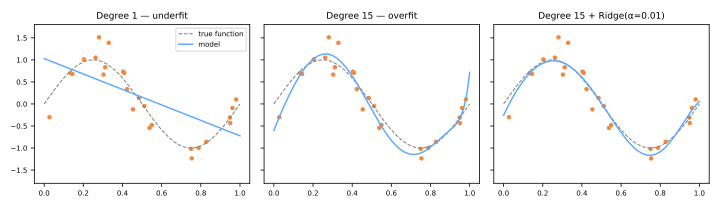

# Gradiente Descendente & Regularização

A [solução em forma fechada do OLS](../linear-regression/index.md#a-solucao-em-forma-fechada) é elegante, mas não escala para grandes quantidades de atributos, não existe para a maioria dos outros modelos e nada diz sobre controlar o sobreajuste. Esta aula acrescenta as duas ferramentas que fazem isso: o **gradiente descendente** — o motor de otimização por trás de quase todo o ML moderno — e a **regularização** — o freio padrão para a complexidade do modelo.

## Gradiente descendente

Para minimizar uma perda diferenciável \(J(w)\), dê passos repetidos **contra o gradiente** (a direção de maior aumento):

\[
w^{(t+1)} = w^{(t)} - \eta \, \nabla_w J\big(w^{(t)}\big)
\]

onde \(\eta\) é a **taxa de aprendizado**. Para a regressão linear com erro quadrático médio,

\[
J(w) = \frac{1}{n}\lVert y - Xw \rVert^2,
\qquad
\nabla_w J = -\frac{2}{n} X^\top (y - Xw),
\]

uma tigela convexa com um único mínimo global — o gradiente descendente tem garantia de alcançá-lo para \(\eta\) pequeno o bastante.

### A taxa de aprendizado

- \(\eta\) pequeno demais → passos minúsculos, convergência dolorosamente lenta;
- \(\eta\) grande demais → os passos ultrapassam o mínimo; a perda oscila ou **diverge**;
- receita prática: experimente \(\eta \in \{10^{-3}, 10^{-2}, 10^{-1}\}\), monitore a curva de perda de treino — ela deve cair suavemente.

Sinta você mesmo — avance pela descida, depois defina \(\eta = 1.05\) e observe-a explodir:

<div id="sim-gd"></div>

!!! warning "Escalone seus atributos"
    Atributos não escalonados criam uma superfície de perda alongada, em forma de ravina: o gradiente aponta para o outro lado da ravina, não ao longo dela, e a convergência se arrasta. A [padronização](../preprocessing/index.md#metodos-de-escalonamento) deixa a tigela redonda e o gradiente descendente rápido — a razão prática de o escalonamento importar para todos os modelos treinados por gradiente.

### Batch, estocástico e mini-batch

| Variante | Gradiente calculado sobre | Custo por passo | Comportamento |
|----------|---------------------------|-----------------|---------------|
| Batch GD | o conjunto de dados completo | \(O(nd)\) | descida exata e suave |
| GD estocástico (SGD) | uma amostra aleatória | \(O(d)\) | ruidoso mas barato; escapa de armadilhas rasas |
| Mini-batch GD | um lote de ~32–512 | intermediário | o padrão moderno (vetoriza bem) |

```python
from sklearn.linear_model import SGDRegressor
model = SGDRegressor(loss='squared_error', penalty='l2', alpha=1e-4,
                     learning_rate='invscaling', max_iter=1000)
```

O mesmo laço — com perdas diferentes — treina a [regressão logística](../logistic-regression/index.md), as [SVMs](../svm/index.md) e as [redes neurais](../neural-networks/index.md). Aprenda-o uma vez, reutilize em todo lugar.

## De retas a curvas: atributos polinomiais

A regressão linear é linear **nos parâmetros**, não necessariamente nas entradas. Expandir os atributos para potências, \(x \mapsto (x, x^2, \dots, x^p)\), ajusta polinômios com a mesma maquinaria do OLS:

```python
from sklearn.pipeline import make_pipeline
from sklearn.preprocessing import PolynomialFeatures

model = make_pipeline(PolynomialFeatures(degree=3), LinearRegression())
```

Mas a flexibilidade corta dos dois lados:



O grau 1 **subajusta** — rígido demais para seguir o seno. O grau 15 **sobreajusta** — 16 parâmetros perseguem 25 pontos ruidosos, produzindo oscilações selvagens. O painel da direita mantém todos os 16 parâmetros mas adiciona uma penalidade Ridge: a curva relaxa de volta ao sinal. Isso é a regularização em ação.

## Regularização

Em vez de restringir o número de parâmetros, penalize sua **magnitude** — adicione um termo de complexidade à perda:

### Ridge (L2) — Tikhonov, 1943; Hoerl & Kennard, 1970

\[
J(w) = \lVert y - Xw \rVert^2 + \alpha \sum_{j=1}^{d} w_j^2
\]

- encolhe todos os coeficientes suavemente em direção a zero (nunca exatamente zero);
- distribui o peso entre atributos correlacionados — a cura padrão para a [multicolinearidade](../linear-regression/index.md#suposicoes-por-tras-das-inferencias);
- a forma fechada ainda existe: \(\hat{w} = (X^\top X + \alpha I)^{-1} X^\top y\) — o \(\alpha I\) torna a matriz inversível mesmo com atributos colineares.

### Lasso (L1) — Tibshirani, 1996

\[
J(w) = \lVert y - Xw \rVert^2 + \alpha \sum_{j=1}^{d} \lvert w_j \rvert
\]

- a penalidade de valor absoluto tem quinas em zero: as soluções pousam **exatamente em zero** para atributos fracos;
- realiza **seleção automática de atributos** — os coeficientes não nulos que sobrevivem nomeiam os atributos que importam;
- entre um grupo de atributos altamente correlacionados, tende a manter um arbitrariamente e zerar o resto.

O **Elastic Net** mistura ambas as penalidades (`l1_ratio`) — um padrão robusto quando os atributos são muitos e correlacionados.

```python
from sklearn.linear_model import Ridge, Lasso, ElasticNet

Ridge(alpha=1.0)
Lasso(alpha=0.1)
ElasticNet(alpha=0.1, l1_ratio=0.5)
```

### O botão α

O \(\alpha\) troca fidelidade aos dados por tamanho dos coeficientes:

- \(\alpha \to 0\): OLS puro (sem freio);
- \(\alpha \to \infty\): todos os coeficientes esmagados para ~0, o modelo prevê a média (freio total);
- o \(\alpha\) certo **não é conhecido de antemão** — é escolhido por [validação cruzada](../validation/index.md) (`RidgeCV`, `LassoCV` ou uma [busca em grade](../model-selection/index.md)).

!!! danger "Escalone antes de regularizar — e não penalize o intercepto"
    A penalidade \(\sum w_j^2\) compara coeficientes entre atributos, o que só é justo se os atributos compartilharem uma escala: caso contrário, um atributo medido em quilômetros é penalizado de forma diferente do mesmo em metros. Padronize primeiro (em um [Pipeline](../pipelines/index.md)). Por convenção, o intercepto \(w_0\) é excluído da penalidade — o scikit-learn faz isso por você.

## Material de aula

!!! example "Notebook da aula (em português)"
    Notebook prático usado em sala — **Aula 12 — Regressão Linear**:
    [:simple-googlecolab: abrir no Colab](https://colab.research.google.com/drive/1uUX77IjsxJmQTOH1It2YVtEPWoJS-SmY){:target="_blank"}

---

## Quiz

<div id="quiz-gradient-descent-regularization"></div>
<script>
buildQuiz('gradient-descent-regularization', 'Gradiente Descendente & Regularização', [
  {
    q: "Na atualização w ← w − η∇J(w), por que o sinal de menos?",
    opts: [
      "Para manter os pesos positivos",
      "O gradiente aponta para o maior aumento da perda, então damos um passo na direção oposta para diminuí-la",
      "Compensa a taxa de aprendizado",
      "É uma convenção arbitrária"
    ],
    ans: 1,
    exp: "∇J dá a direção em que J cresce mais rápido. Descer significa mover-se contra ela. A taxa de aprendizado η controla o tamanho do passo nessa direção."
  },
  {
    q: "Durante o treino a perda oscila violentamente e depois explode para o infinito. O culpado mais provável é...",
    opts: [
      "a taxa de aprendizado é pequena demais",
      "a taxa de aprendizado é grande demais, fazendo as atualizações ultrapassarem o mínimo",
      "poucos atributos",
      "os dados não têm ruído"
    ],
    ans: 1,
    exp: "Passos grandes demais saltam para o outro lado do vale, para um ponto ainda mais íngreme, produzindo gradientes maiores e saltos maiores — divergência. Reduza η (e verifique o escalonamento dos atributos)."
  },
  {
    q: "O que distingue o gradiente descendente estocástico (SGD) do gradiente descendente em lote (batch)?",
    opts: [
      "O SGD usa uma função de perda diferente",
      "O SGD estima o gradiente a partir de uma (ou poucas) amostras aleatórias por passo em vez do conjunto inteiro — mais ruidoso, mas muito mais barato por passo",
      "O SGD só funciona para classificação",
      "O SGD exige a solução em forma fechada primeiro"
    ],
    ans: 1,
    exp: "O batch GD calcula o gradiente exato sobre todas as n amostras a cada passo; o SGD troca exatidão por velocidade, viabilizando o aprendizado em conjuntos grandes demais para percorrer a cada iteração. O mini-batch é o meio-termo prático."
  },
  {
    q: "Um ajuste polinomial de grau 15 oscila violentamente entre 25 pontos ruidosos. Adicionar uma penalidade Ridge corrige isso ao...",
    opts: [
      "reduzir o grau do polinômio automaticamente",
      "penalizar magnitudes grandes de coeficientes, forçando uma função mais suave que ignora o ruído",
      "remover os outliers dos dados",
      "aumentar a taxa de aprendizado"
    ],
    ans: 1,
    exp: "Oscilações selvagens exigem coeficientes enormes de sinal alternado. O termo α·Σwⱼ² torna tais soluções caras, então o otimizador prefere pesos menores — uma curva mais suave, mais próxima do sinal."
  },
  {
    q: "Você precisa de um modelo que selecione automaticamente um pequeno subconjunto dos 5.000 atributos disponíveis. Qual penalidade faz isso?",
    opts: [
      "L2 (Ridge), porque encolhe os coeficientes suavemente",
      "L1 (Lasso), porque suas quinas em zero levam os coeficientes fracos exatamente a zero",
      "Nenhuma penalidade — o OLS seleciona atributos sozinho",
      "A penalidade do intercepto"
    ],
    ans: 1,
    exp: "A geometria da penalidade L1 (um losango no espaço de coeficientes) faz as soluções pousarem nos eixos, zerando coeficientes. O Ridge encolhe mas nunca chega exatamente a zero, então mantém todos os atributos."
  },
  {
    q: "Como a força de regularização α deve ser escolhida?",
    opts: [
      "Sempre α = 1,0",
      "Minimizando o erro de treino",
      "Por validação cruzada: escolha o α com o melhor desempenho de validação",
      "Pegando o maior α que ainda roda"
    ],
    ans: 2,
    exp: "O erro de treino sempre prefere α = 0 (sem freio) — ele não enxerga o sobreajuste. Só o desempenho em dados separados revela o trade-off certo, daí RidgeCV/LassoCV ou busca em grade com CV."
  },
  {
    q: "Por que os atributos precisam ser padronizados antes de aplicar Ridge ou Lasso?",
    opts: [
      "Caso contrário a forma fechada não existe",
      "A penalidade trata todos os coeficientes como comparáveis, o que é injusto se os atributos vivem em escalas diferentes — o mesmo atributo em metros vs quilômetros seria penalizado de forma diferente",
      "A padronização aumenta o R²",
      "Só é necessário para o Lasso"
    ],
    ans: 1,
    exp: "O tamanho do coeficiente depende das unidades do atributo. Uma única penalidade λΣwⱼ² sobre atributos não escalonados regulariza efetivamente alguns atributos muito mais que outros. Padronize (em um Pipeline) para que a penalidade seja imparcial."
  }
]);
</script>
