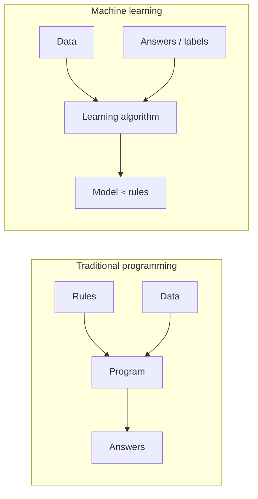

# Introduction & History

Machine Learning (ML) is the field of study that gives computers the ability to **learn from data** without being explicitly programmed for every situation. Instead of writing rules by hand, we write programs that *infer* the rules from examples.

The classic formal definition is due to Tom Mitchell:

!!! quote "Mitchell (1997)"
    A computer program is said to **learn** from experience *E* with respect to some class of tasks *T* and performance measure *P*, if its performance at tasks in *T*, as measured by *P*, improves with experience *E*.

Every project in this course can be described in that vocabulary. A spam filter, for instance:

- **Task \(T\)**: classify e-mails as spam or not spam;
- **Experience \(E\)**: a corpus of e-mails already labeled by humans;
- **Performance \(P\)**: the fraction of e-mails classified correctly (or a more careful metric, as we will see in [Classification & Metrics](../classification-metrics/index.md)).

## Why learn from data?

Hand-written rules break down when:

1. **The rules are unknown.** Nobody can write down the exact rules that distinguish a malignant tumor from a benign one in a raw image.
2. **The rules change.** Spammers adapt; a static filter decays. A learning system can be retrained.
3. **The rules are too many.** Recognizing handwritten digits with `if/else` statements is hopeless — there are too many ways to write a "7".
4. **Personalization is needed.** A recommender must behave differently for every user; learning from each user's history scales, hand-tuning does not.

Machine learning inverts the traditional flow: instead of *rules + data → answers*, we feed *data + answers* to an algorithm and obtain a **model** — an approximation of the rules — which we then use to answer new, unseen cases.

## Why now?

None of the core ideas are new — least squares is from 1805 — but three forces converged in the last two decades to make ML ubiquitous:

- **Data**: the web, sensors, and digitization produced datasets large enough to learn subtle patterns;
- **Compute**: GPUs and cloud computing made it cheap to fit large models;
- **Algorithms & software**: open-source libraries (scikit-learn, XGBoost, PyTorch) turned decades of research into a few lines of code.

## A brief history of machine learning

The history of ML is a 200-year conversation between **statistics** and **computer science**. The timeline below marks the milestones this course will visit — from the historical basis to the current edge.

[timeline left alternate(./docs/2026.2/classes/introduction/timeline.json)]

### Reading the arc

Three lessons from this history shape the design of this course:

1. **The classics never left.** Least squares (1805) is still the first model you should try on a regression problem. Logistic regression (1958) remains a production workhorse. Understanding them deeply is not archaeology — it is engineering.
2. **Hype cycles are real.** The field went through two "AI winters" (roughly 1974–1980 and 1987–1993) when promises outran results. Honest evaluation — the subject of Part III — is the antidote.
3. **Modern methods are compositions of classical ideas.** BERTopic (2022), which we will study in Part II, is literally a pipeline of embeddings + dimensionality reduction + clustering + TF-IDF — every ingredient is a classical technique. Gradient boosting is functional gradient descent on decision trees. Knowing the parts lets you understand — and debug — the whole.

## Where this course fits

This course covers **classical machine learning** end to end and finishes at the frontier: neural networks, explainability, AutoML, MLOps, and foundation models. Deep learning gets one bridging lecture here; its full treatment lives in the companion course [Artificial Neural Networks and Deep Learning](https://insper.github.io/ann-dl/).

---

## Quiz

