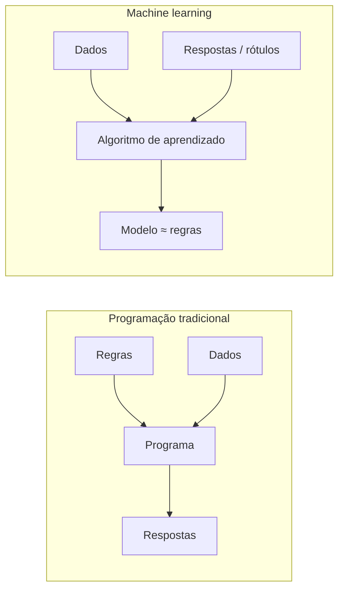

# Introdução & História

Machine Learning (ML) é o campo de estudo que dá aos computadores a capacidade de **aprender a partir de dados** sem serem explicitamente programados para cada situação. Em vez de escrever regras à mão, escrevemos programas que *inferem* as regras a partir de exemplos.

A definição formal clássica é de Tom Mitchell:

!!! quote "Mitchell (1997)"
    Dizemos que um programa de computador **aprende** com a experiência *E* em relação a alguma classe de tarefas *T* e medida de desempenho *P*, se seu desempenho nas tarefas em *T*, medido por *P*, melhora com a experiência *E*.

Todo projeto neste curso pode ser descrito com esse vocabulário. Um filtro de spam, por exemplo:

- **Tarefa \(T\)**: classificar e-mails como spam ou não spam;
- **Experiência \(E\)**: um corpus de e-mails já rotulados por humanos;
- **Desempenho \(P\)**: a fração de e-mails classificados corretamente (ou uma métrica mais cuidadosa, como veremos em [Classificação & Métricas](../classification-metrics/index.md)).

## Por que aprender a partir de dados?

Regras escritas à mão falham quando:

1. **As regras são desconhecidas.** Ninguém consegue escrever as regras exatas que distinguem um tumor maligno de um benigno em uma imagem bruta.
2. **As regras mudam.** Spammers se adaptam; um filtro estático se degrada. Um sistema que aprende pode ser retreinado.
3. **As regras são numerosas demais.** Reconhecer dígitos manuscritos com instruções `if/else` é inviável — há maneiras demais de escrever um "7".
4. **É preciso personalização.** Um recomendador deve se comportar de forma diferente para cada usuário; aprender do histórico de cada usuário escala, ajustar à mão não.

O machine learning inverte o fluxo tradicional: em vez de *regras + dados → respostas*, alimentamos *dados + respostas* a um algoritmo e obtemos um **modelo** — uma aproximação das regras — que então usamos para responder a casos novos, nunca vistos.

## Por que agora?

Nenhuma das ideias centrais é nova — os mínimos quadrados são de 1805 — mas três forças convergiram nas últimas duas décadas para tornar o ML onipresente:

- **Dados**: a web, os sensores e a digitalização produziram conjuntos de dados grandes o suficiente para aprender padrões sutis;
- **Poder computacional**: GPUs e computação em nuvem tornaram barato ajustar modelos grandes;
- **Algoritmos & software**: bibliotecas de código aberto (scikit-learn, XGBoost, PyTorch) transformaram décadas de pesquisa em algumas linhas de código.

## Uma breve história do machine learning

A história do ML é uma conversa de 200 anos entre a **estatística** e a **ciência da computação**. A linha do tempo abaixo marca os marcos que este curso visitará — das bases históricas até a fronteira atual.

[timeline left alternate(./docs/2026.2/classes/introduction/timeline.json)]

### Lendo a trajetória

Três lições dessa história moldam o desenho deste curso:

1. **Os clássicos nunca foram embora.** Os mínimos quadrados (1805) ainda são o primeiro modelo que você deve experimentar em um problema de regressão. A regressão logística (1958) continua sendo um cavalo de batalha em produção. Entendê-los profundamente não é arqueologia — é engenharia.
2. **Os ciclos de hype são reais.** O campo passou por dois "invernos da IA" (aproximadamente 1974–1980 e 1987–1993) quando as promessas ultrapassaram os resultados. A avaliação honesta — tema da Parte III — é o antídoto.
3. **Os métodos modernos são composições de ideias clássicas.** O BERTopic (2022), que estudaremos na Parte II, é literalmente um pipeline de embeddings + redução de dimensionalidade + agrupamento + TF-IDF — cada ingrediente é uma técnica clássica. O gradient boosting é gradiente descendente funcional sobre árvores de decisão. Conhecer as partes permite entender — e depurar — o todo.

## Uma máquina que aprende feita de caixas de fósforos

Muito antes das GPUs, a coluna de 1962 de Martin Gardner na *Scientific American* descreveu uma máquina que **aprende a jogar um jogo usando apenas caixas de fósforos e contas coloridas** — sem eletrônica alguma. Para o minijogo *Hexapawn* (três peões por lado em um tabuleiro 3×3), construa uma caixa de fósforos para cada posição possível do tabuleiro e a preencha com contas para cada jogada legal:

1. para jogar, abra a caixa de fósforos da posição atual e sorteie uma conta aleatória — essa é a jogada;
2. se a máquina eventualmente **perder** a partida, remova a conta que levou à jogada perdedora (punição);
3. se ela **vencer**, as contas permanecem (ou cópias extras são adicionadas — recompensa).

Depois de algumas dezenas de partidas, as jogadas ruins foram literalmente *removidas das caixas*: a máquina joga perfeitamente. Essa é a **aprendizagem por reforço em sua forma mecânica mais pura** (Donald Michie construiu a mesma ideia para o jogo da velha em 1961 e a chamou de MENACE), e torna tangível a definição de Mitchell: a tarefa \(T\) é jogar Hexapawn, a experiência \(E\) são as partidas jogadas, o desempenho \(P\) é a taxa de vitórias — e aprender nada mais é do que *ajustar parâmetros (contas) com base em feedback*.

!!! example "Leia o original"
    Gardner, M. (1962). *How to build a game-learning machine and then teach it to play and to win.* Scientific American — [PDF na pasta da turma](https://drive.google.com/file/d/1HDRFEUHFsCTogX_LRlvTZ2QExIEkSIVD/view){:target="_blank"}. Jogamos este jogo na primeira aula.

## Onde este curso se encaixa

Este curso cobre o **machine learning clássico** de ponta a ponta e termina na fronteira: redes neurais, explicabilidade, AutoML, MLOps e modelos de fundação. O deep learning ganha uma aula de transição aqui; seu tratamento completo está no curso complementar [Artificial Neural Networks and Deep Learning](https://insper.github.io/ann-dl/).

## Material de aula

!!! example "Slides da aula (em português)"
    - **Aula 01 — Apresentação**: [:simple-googleslides: abrir os slides](https://docs.google.com/presentation/d/1Rwn_AIJnbEz4Wy6mCiFWs9dVvPlvuN2pxZa3kAhQH-8/edit){:target="_blank"}
    - Fichas do Hexapawn: [treino](https://drive.google.com/file/d/15-8gOXzlKVyyIR_ZcZkh372UegPcKcbq/view){:target="_blank"} / [teste](https://drive.google.com/file/d/1LOY131bEJbEkcFVuJTgtv-7VDyRgVqst/view){:target="_blank"}

---

## Quiz

