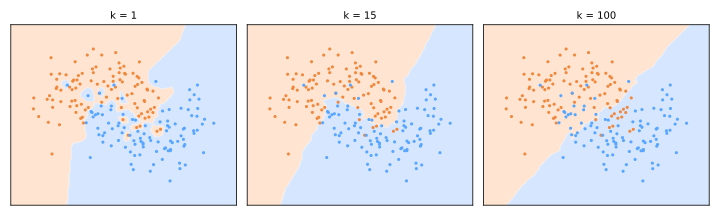

# k-Vizinhos Mais Próximos

O k-NN (Fix & Hodges, 1951; Cover & Hart, 1967) é o classificador mais intuitivo que existe: **para classificar um ponto novo, olhe para os \(k\) pontos conhecidos mais parecidos e faça uma votação.** Sem equações a ajustar, sem laço de treino — o "modelo" *é* os dados de treino.

## O algoritmo

Para prever para um ponto de consulta \(x\):

1. calcule a distância de \(x\) a todo ponto de treino;
2. pegue os \(k\) mais próximos;
3. **classificação**: preveja a classe majoritária entre eles (opcionalmente dando mais peso aos vizinhos mais próximos); **regressão**: preveja a média (ponderada) deles.

```python
from sklearn.neighbors import KNeighborsClassifier
from sklearn.pipeline import make_pipeline
from sklearn.preprocessing import StandardScaler

knn = make_pipeline(StandardScaler(),                 # distâncias precisam de escalonamento!
                    KNeighborsClassifier(n_neighbors=5))
knn.fit(X_train, y_train)
```

O k-NN é um aprendiz **preguiçoso** (baseado em instâncias): o `fit` apenas armazena os dados. Todo o trabalho acontece no momento da previsão — o perfil de custo oposto ao da maioria dos modelos (lento para prever, instantâneo para "treinar").

## Métricas de distância

A noção de "parecido" é uma escolha de modelagem. Para a família de Minkowski,

\[
d_p(a, b) = \Big( \sum_{j=1}^{d} \lvert a_j - b_j \rvert^p \Big)^{1/p}
\]

- \(p = 2\): **euclidiana** — distância em linha reta, o padrão;
- \(p = 1\): **Manhattan** — soma das diferenças de coordenadas; menos dominada por um único atributo de grande diferença;
- **similaridade de cosseno** para vetores de texto/embedding ([Representação de Texto](../text-representation/index.md#tf-idf)); **Hamming** para vetores binários.

!!! danger "Escalone primeiro — sempre"
    As distâncias são dominadas por atributos com grandes faixas: renda (milhares) esmaga idade (dezenas). k-NN sem [padronização](../preprocessing/index.md#metodos-de-escalonamento) é um bug, não um modelo. Da mesma forma, aplique one-hot em categorias nominais — categorias codificadas como inteiros criam [distâncias fictícias](../preprocessing/index.md#codificacao-de-atributos-categoricos).

## Escolhendo k: viés–variância em sua forma mais pura

O \(k\) é o botão de complexidade, e ele mapeia perfeitamente no [trade-off viés–variância](../model-selection/index.md#o-trade-off-viesvariancia) — apenas invertido (\(k\) pequeno = modelo complexo):



- **\(k = 1\)**: cada ponto de treino governa sua própria ilha — fronteira irregular, ruído memorizado, erro de treino zero, **variância alta** (sobreajuste);
- **\(k = 15\)**: fronteira suave seguindo a estrutura verdadeira — o ponto ideal aqui;
- **\(k = 100\)** (metade do conjunto): a votação é engolida pela maioria global — **viés alto** (subajuste); em \(k = n\) toda previsão é a classe majoritária.

Escolha \(k\) por [validação cruzada](../validation/index.md#validacao-cruzada); valores ímpares evitam empates em problemas binários. Bons valores típicos crescem aproximadamente como \(\sqrt{n}\), mas valide em vez de confiar em regras de bolso.

Brinque você mesmo com a votação — arraste o ponto de consulta para a zona de sobreposição e observe o k pequeno oscilar enquanto o k grande permanece estável:

<div id="sim-knn"></div>

## A maldição da dimensionalidade, revisitada

A premissa do k-NN — *perto significa parecido* — se degrada conforme as dimensões crescem ([Redução de Dimensionalidade](../dimensionality-reduction/index.md)):

- o volume cresce exponencialmente: com dados uniformes, cobrir 10% das amostras em \(d=100\) dimensões exige uma vizinhança abrangendo ~98% de cada eixo — os vizinhos "mais próximos" não estão próximos;
- as distâncias par a par se concentram: a razão entre o vizinho mais distante e o mais próximo tende a 1, então a votação fica arbitrária;
- atributos irrelevantes adicionam puro ruído à distância.

Remédios: seleção de atributos, [PCA/UMAP](../dimensionality-reduction/index.md) antes do k-NN, ou aprendizado de métrica. Regra de bolso: o k-NN brilha em **dimensões baixas a moderadas com muitos dados**.

## Perfil prático

| | |
|---|---|
| **Pontos fortes** | tempo de treino zero; naturalmente multiclasse; fronteiras não lineares de graça; um hiperparâmetro intuitivo; uma baseline forte |
| **Fraquezas** | a previsão é \(O(n \cdot d)\) por consulta (mitigada por KD-trees/ball trees em baixas dimensões, NN aproximado — FAISS, HNSW — em escala); memória = conjunto inteiro; sensível a escalonamento, atributos irrelevantes e alta dimensionalidade |
| **Usos clássicos** | candidatos de recomendação ("usuários como você"), recuperação de imagens, detecção de anomalias (distância ao k-ésimo vizinho), imputação ([KNNImputer](../preprocessing/index.md#imputacao-de-valores-faltantes)), busca semântica sobre embeddings |

A operação "encontre os embeddings mais próximos" também é o coração dos **bancos de dados vetoriais** modernos que alimentam sistemas de LLM com recuperação aumentada (RAG) ([A Fronteira](../frontier/index.md)) — ideias dos anos 1950 servindo sistemas dos anos 2020.

## Material de aula

!!! example "Notebook da aula (em português)"
    Notebook prático usado em sala — **Aula 14 — K-NN**:
    [:simple-googlecolab: abrir no Colab](https://colab.research.google.com/drive/1Iw8CJxt2c-94hWyOCVsFOGOnL7_9mTOr){:target="_blank"}

---

## Quiz

<div id="quiz-knn"></div>
<script>
buildQuiz('knn', 'k-Vizinhos Mais Próximos', [
  {
    q: "Por que o k-NN é chamado de aprendiz 'preguiçoso'?",
    opts: [
      "Ele converge lentamente",
      "O fit() apenas armazena os dados de treino; todo o cálculo é adiado para o momento da previsão",
      "Só funciona em conjuntos pequenos",
      "Ignora metade dos atributos"
    ],
    ans: 1,
    exp: "Não há fase de treino — nenhum parâmetro é estimado. Cada previsão busca vizinhos no conjunto armazenado, dando ao k-NN o perfil de custo inverso ao de modelos ávidos como a regressão linear."
  },
  {
    q: "Com k = 1, o erro de treino do k-NN é...",
    opts: [
      "sempre 0 (cada ponto de treino é seu próprio vizinho mais próximo) — um sinal de alerta de sobreajuste",
      "sempre 50%",
      "igual ao erro de teste",
      "indefinido"
    ],
    ans: 0,
    exp: "Todo ponto de treino se classifica corretamente, então a acurácia de treino é trivialmente perfeita enquanto a fronteira irregular memoriza ruído. k pequeno = variância alta; avalie em dados separados."
  },
  {
    q: "Definir k igual ao tamanho do conjunto de treino faz o k-NN...",
    opts: [
      "ficar perfeitamente acurado",
      "prever a classe majoritária global para toda consulta — viés máximo",
      "equivalente a k = 1",
      "travar"
    ],
    ans: 1,
    exp: "Com todos os pontos votando, a vizinhança local é irrelevante: toda previsão é a maioria global. O k controla o viés–variância: k=1 sobreajusta, k=n subajusta, o ponto ideal é encontrado por validação cruzada."
  },
  {
    q: "Um modelo k-NN usa renda bruta (0–500.000) e idade (18–90). O que acontece?",
    opts: [
      "A idade domina porque vem primeiro",
      "A renda domina a distância euclidiana; a idade fica quase irrelevante para a votação",
      "O modelo equilibra ambas automaticamente",
      "O modelo se recusa a ajustar"
    ],
    ans: 1,
    exp: "As diferenças ao quadrado na renda são milhões de vezes maiores que na idade. Os vizinhos são escolhidos apenas pela renda. Padronizar antes do k-NN é obrigatório."
  },
  {
    q: "Em dimensões muito altas, o k-NN se degrada principalmente porque...",
    opts: [
      "os computadores não conseguem armazenar os dados",
      "as distâncias se concentram — o vizinho mais próximo mal é mais próximo que o mais distante — então 'perto significa parecido' desmorona",
      "a classe majoritária desaparece",
      "os empates ficam impossíveis de desempatar"
    ],
    ans: 1,
    exp: "A maldição da dimensionalidade: o volume cresce exponencialmente, os dados ficam esparsos e o contraste entre perto e longe some. Reduza dimensões (PCA/UMAP) ou selecione atributos antes do k-NN."
  },
  {
    q: "Qual situação joga a favor dos pontos fortes do k-NN?",
    opts: [
      "Um conjunto esparso de 10.000 dimensões com 200 amostras",
      "Previsões em tempo real sobre bilhões de linhas sem pré-processamento",
      "Um conjunto de baixa dimensão, bem escalonado, com amostras abundantes e uma fronteira de classe não linear",
      "Um problema que exige coeficientes interpretáveis por atributo"
    ],
    ans: 2,
    exp: "Muitos dados em poucas dimensões tornam as vizinhanças significativas, e o k-NN ajusta fronteiras arbitrárias sem assumir uma forma funcional. Altas dimensões, volumes enormes de consulta ou interpretabilidade por coeficiente pedem outras ferramentas."
  }
]);
</script>
