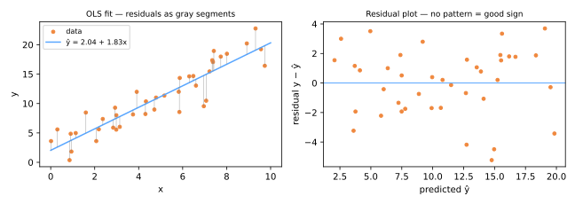

# Regressão Linear

A regressão linear é o **algoritmo mais antigo deste curso** — Legendre publicou os mínimos quadrados em 1805 para ajustar órbitas de cometas, Gauss alegou tê-los usado antes, e os estudos de hereditariedade de Galton (1886) deram nome à "regressão". Dois séculos depois, ela continua sendo o primeiro modelo a experimentar em qualquer problema de regressão: rápido, interpretável e uma baseline surpreendentemente forte.

## O modelo

Prever um alvo contínuo como uma soma ponderada de atributos:

\[
\hat{y} = w_0 + w_1 x_1 + w_2 x_2 + \dots + w_d x_d = w_0 + \sum_{j=1}^{d} w_j x_j
\]

- \(w_j\): a variação em \(\hat{y}\) por unidade de variação em \(x_j\), *mantendo os outros atributos fixos*;
- \(w_0\) (intercepto/viés): a previsão quando todos os atributos são zero.

Em forma matricial, com uma coluna inicial de 1s absorvida em \(X\): \(\hat{y} = Xw\).

## Mínimos quadrados

Escolha \(w\) para minimizar a **soma dos resíduos ao quadrado** — as distâncias verticais ao quadrado entre os dados e a reta ajustada:

\[
J(w) = \sum_{i=1}^{n} \big(y_i - \hat{y}_i\big)^2 = \lVert y - Xw \rVert^2
\]

Por que *quadrados*? Elevar ao quadrado penaliza fortemente erros grandes, gera um objetivo suave (diferenciável) e — sob ruído gaussiano — coincide com a estimação de máxima verossimilhança.

### A solução em forma fechada

Igualando o gradiente a zero, \(\nabla_w J = -2X^\top(y - Xw) = 0\), obtemos as **equações normais**:

\[
X^\top X \, w = X^\top y
\qquad\Longrightarrow\qquad
\hat{w} = (X^\top X)^{-1} X^\top y
\]

Para a regressão simples (um atributo) isso se reduz às fórmulas que vale a pena memorizar:

\[
\hat{w}_1 = \frac{\sum_i (x_i - \bar{x})(y_i - \bar{y})}{\sum_i (x_i - \bar{x})^2} = r_{xy}\frac{s_y}{s_x},
\qquad
\hat{w}_0 = \bar{y} - \hat{w}_1 \bar{x}
\]

— a inclinação é a [correlação](../eda/index.md#correlacao-com-cuidado) reescalonada pelos desvios padrão, e a reta sempre passa por \((\bar{x}, \bar{y})\).



O **gráfico de resíduos** (à direita) é o diagnóstico padrão: os resíduos devem parecer ruído sem estrutura em torno de zero. Curvatura sugere um termo não linear ausente; um formato de funil sugere variância não constante; resíduos extremos isolados apontam para outliers (lembre-se do [quarteto de Anscombe](../eda/index.md#por-que-estatisticas-nao-bastam)).

```python
from sklearn.linear_model import LinearRegression

model = LinearRegression().fit(X_train, y_train)
model.coef_, model.intercept_
y_pred = model.predict(X_test)
```

Sinta o ajuste — arraste os pontos e observe a reta perseguir o SSE mínimo. Depois arraste um ponto para bem longe e veja o quanto um único outlier pode puxar a reta (lembre-se do [conjunto 3 de Anscombe](../eda/index.md#por-que-estatisticas-nao-bastam)):

<div id="sim-ols"></div>

!!! note "Quando a forma fechada tem dificuldade"
    Inverter \(X^\top X\) custa \(O(d^3)\) e falha quando os atributos são perfeitamente colineares. Para problemas enormes ou malcondicionados, passamos para o [gradiente descendente e a regularização](../gradient-descent-regularization/index.md) — a próxima aula.

## Suposições por trás das inferências

As *previsões* do OLS exigem pouco; mas *interpretar coeficientes e barras de erro* se apoia nas suposições clássicas:

1. **Linearidade** — a relação verdadeira é (aproximadamente) linear nos atributos;
2. **Independência** — os resíduos não são correlacionados entre si (cuidado com séries temporais);
3. **Homoscedasticidade** — a variância dos resíduos é constante ao longo da faixa de \(\hat{y}\);
4. **Normalidade dos resíduos** — necessária para intervalos de confiança e p-valores exatos;
5. **Sem multicolinearidade severa** — [atributos altamente correlacionados](../eda/index.md) tornam os coeficientes individuais instáveis (sua *soma* pode estar bem determinada enquanto cada um oscila muito).

## Medindo a qualidade da regressão

Com resíduos \(e_i = y_i - \hat{y}_i\):

| Métrica | Fórmula | Leitura |
|---------|---------|---------|
| MAE | \(\frac{1}{n}\sum \lvert e_i \rvert\) | erro médio nas unidades do alvo; robusto a outliers |
| MSE | \(\frac{1}{n}\sum e_i^2\) | pune erros grandes; o objetivo de treino |
| RMSE | \(\sqrt{\text{MSE}}\) | como o MSE, mas de volta às unidades do alvo |
| R² | \(1 - \frac{\sum e_i^2}{\sum (y_i - \bar{y})^2}\) | fração da variância explicada; 1 = perfeito, 0 = não melhor que prever \(\bar{y}\) |

O R² pode ser **negativo** em dados de teste — o modelo é então *pior* que a baseline constante \(\bar{y}\). Sempre compare com essa baseline (`DummyRegressor`): é constrangedor com que frequência um modelo sofisticado mal a supera.

!!! warning "Avalie em dados separados"
    Todas as métricas acima só têm sentido em dados que o modelo não viu — o tema de [Validação & Vazamento de Dados](../validation/index.md).

## Material de aula

!!! example "Notebook da aula (em português)"
    Notebook prático usado em sala — **Aula 09 — Regressão**:
    [:simple-googlecolab: abrir no Colab](https://colab.research.google.com/drive/1YKeRwIls37GmghCGHwS0gI4LrmT-joWd){:target="_blank"}

---

## Quiz

<div id="quiz-linear-regression"></div>
<script>
buildQuiz('linear-regression', 'Regressão Linear', [
  {
    q: "O que os mínimos quadrados ordinários minimizam?",
    opts: [
      "A soma dos resíduos absolutos",
      "A soma das distâncias verticais ao quadrado entre os valores observados e previstos",
      "O número de atributos usados",
      "A correlação entre os atributos"
    ],
    ans: 1,
    exp: "O OLS minimiza J(w) = Σ(yᵢ − ŷᵢ)². Elevar ao quadrado dá um objetivo suave com a solução em forma fechada ŵ = (XᵀX)⁻¹Xᵀy e corresponde à máxima verossimilhança sob ruído gaussiano."
  },
  {
    q: "Em um modelo ajustado preço = 50000 + 3200·área − 1500·idade, o coeficiente 3200 significa...",
    opts: [
      "o preço de um apartamento médio",
      "cada unidade extra de área adiciona 3200 ao preço previsto, mantendo a idade fixa",
      "a área é 3200 vezes mais importante que a idade",
      "o modelo explica 32% da variância"
    ],
    ans: 1,
    exp: "Um coeficiente linear é um efeito parcial: a variação prevista por unidade daquele atributo com os outros mantidos constantes. Comparar magnitudes brutas entre atributos só faz sentido após a padronização."
  },
  {
    q: "Seu gráfico de resíduos mostra uma curva clara em forma de U. O que isso indica?",
    opts: [
      "O modelo é perfeito",
      "A relação tem um componente não linear que o modelo linear está deixando de capturar",
      "Os resíduos são homoscedásticos",
      "O alvo deveria ser codificado com one-hot"
    ],
    ans: 1,
    exp: "Curvatura sistemática nos resíduos significa que a forma linear está errada — considere adicionar termos polinomiais ou transformar variáveis. Bons resíduos parecem ruído sem padrão em torno de zero."
  },
  {
    q: "No conjunto de teste seu modelo obtém R² = −0,3. A interpretação correta é...",
    opts: [
      "impossível — o R² está sempre entre 0 e 1",
      "o modelo explica 30% da variância",
      "o modelo tem desempenho pior do que simplesmente prever a média de y para toda observação",
      "os atributos são negativamente correlacionados com y"
    ],
    ans: 2,
    exp: "R² = 1 − SSE/SST. Em dados separados o SSE pode exceder o SST, tornando o R² negativo: a baseline constante ŷ = ȳ supera seu modelo. Sempre confira a baseline dummy."
  },
  {
    q: "Dois atributos são quase perfeitamente correlacionados (r = 0,99). Ajustar OLS com ambos costuma causar...",
    opts: [
      "um erro de sintaxe",
      "coeficientes individuais instáveis com variância enorme, ainda que as previsões possam continuar boas",
      "o desaparecimento do intercepto",
      "o R² se tornar exatamente zero"
    ],
    ans: 1,
    exp: "A multicolinearidade torna XᵀX quase singular: os dados não conseguem distinguir os dois coeficientes, então eles oscilam muito (muitas vezes com sinais opostos) enquanto seu efeito combinado — e as previsões — permanecem estáveis."
  },
  {
    q: "Por que o RMSE é frequentemente reportado em vez do MSE?",
    opts: [
      "O RMSE é sempre menor",
      "O RMSE está nas mesmas unidades do alvo, tornando-o interpretável (ex.: 'erra por R$ 23 mil em média')",
      "O MSE não pode ser calculado em dados de teste",
      "O RMSE ignora outliers"
    ],
    ans: 1,
    exp: "O MSE está em unidades ao quadrado (R$²...), que ninguém consegue ler. Sua raiz quadrada retorna às unidades do alvo preservando a mesma ordenação de modelos."
  }
]);
</script>
