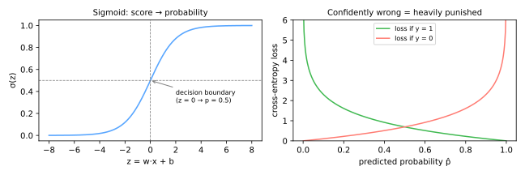

# Logistic Regression

Despite the name, logistic regression (Cox, 1958; roots in Verhulst's logistic curve, 1838) is the canonical **classification** algorithm — the default first model for any classification problem, a fixture of credit scoring and medicine, and the conceptual gateway to [neural networks](../neural-networks/index.md): a single neuron *is* a logistic regression.

## From line to probability

[Linear regression](../linear-regression/index.md) outputs any real number — useless as a probability. Logistic regression keeps the linear score

\[
z = w^\top x + b
\]

and squashes it through the **sigmoid** (logistic) function:

\[
\hat{p} = \sigma(z) = \frac{1}{1 + e^{-z}} \in (0, 1)
\]



Predict class 1 when \(\hat{p} \geq\) threshold (0.5 by default → \(z \geq 0\)). The set \(w^\top x + b = 0\) is a hyperplane: logistic regression is a **linear classifier** — its decision boundary is a straight line/plane in feature space (curved boundaries require engineered features, e.g. [polynomial ones](../gradient-descent-regularization/index.md#from-lines-to-curves-polynomial-features), or other models).

### Odds and interpretability

Inverting the sigmoid shows the linear score is the **log-odds**:

\[
\log \frac{\hat{p}}{1 - \hat{p}} = w^\top x + b
\]

So each unit increase in \(x_j\) multiplies the **odds** \(\frac{p}{1-p}\) by \(e^{w_j}\). A coefficient of 0.7 on "number of overdue payments" means each one multiplies the odds of default by \(e^{0.7} \approx 2\) — the kind of statement regulators and doctors demand, and the reason logistic regression persists in high-stakes domains ([Explainability](../explainability/index.md)).

## The loss: cross-entropy

Squared error on probabilities creates a non-convex landscape. Instead, maximize the likelihood of the observed labels — equivalently minimize the **log loss / binary cross-entropy**:

\[
J(w) = -\frac{1}{n} \sum_{i=1}^{n} \Big[ y_i \log \hat{p}_i + (1 - y_i) \log (1 - \hat{p}_i) \Big]
\]

Each term reads: *the log of the probability the model assigned to what actually happened*. As the right panel above shows, being **confidently wrong** (\(\hat{p} \to 0\) when \(y = 1\)) costs unboundedly much — the model is pushed toward calibrated honesty, not just correct labels.

### Training by gradient descent

No closed form exists, but \(J\) is **convex** — one global minimum. The gradient is astonishingly clean:

\[
\nabla_w J = \frac{1}{n} X^\top (\hat{p} - y)
\]

— *identical in form* to linear regression's gradient, with \(\hat{p} = \sigma(Xw)\) replacing \(Xw\). The same [gradient descent loop](../gradient-descent-regularization/index.md#gradient-descent) applies unchanged:

```python
import numpy as np

def sigmoid(z):
    return 1 / (1 + np.exp(-z))

w = np.zeros(X.shape[1])
for _ in range(n_epochs):
    p = sigmoid(X @ w)
    w -= eta * X.T @ (p - y) / len(y)
```

## Regularization

Everything from [Ridge and Lasso](../gradient-descent-regularization/index.md#regularization) transfers: add \(\alpha \lVert w \rVert_2^2\) (L2) or \(\alpha \lVert w \rVert_1\) (L1) to the loss. It is so essential — especially with many features, where unregularized weights can grow without bound on separable data — that **scikit-learn regularizes by default**, parameterized by \(C = 1/\alpha\):

```python
from sklearn.linear_model import LogisticRegression

model = LogisticRegression(C=1.0,            # SMALLER C = STRONGER regularization
                           penalty='l2',
                           class_weight='balanced',   # for imbalance
                           max_iter=1000)
model.fit(X_train_scaled, y_train)
model.predict_proba(X_test_scaled)[:, 1]     # probabilities for ROC/PR analysis
```

Tune \(C\) on a log grid by [cross-validation](../model-selection/index.md#grid-search-with-cross-validation); [scale features first](../preprocessing/index.md#scaling-methods) (regularized + gradient-based ⇒ doubly necessary).

## Multi-class: softmax

For \(k\) classes, learn one weight vector per class and normalize scores with **softmax**:

\[
\hat{p}_c = \frac{e^{z_c}}{\sum_{j=1}^{k} e^{z_j}}, \qquad z_c = w_c^\top x + b_c
\]

Cross-entropy generalizes verbatim. `LogisticRegression` handles this automatically (`multi_class='multinomial'` is the modern default). This exact construction — linear scores + softmax + cross-entropy — is the **output layer of essentially every neural classifier**, including LLMs choosing their next token.

## Practical profile

| | |
|---|---|
| **Strengths** | fast; convex (reliable training); well-calibrated probabilities; interpretable via odds ratios; strong baseline; scales to millions of samples |
| **Weaknesses** | linear boundary (needs feature engineering for curves); struggles when interactions dominate; sensitive to unscaled features under regularization |
| **Reach for it when** | you need a solid, explainable baseline; probabilities matter (risk, triage); features are informative individually |

---

## Quiz

<div id="quiz-logistic-regression"></div>
<script>
buildQuiz('logistic-regression', 'Logistic Regression', [
  {
    q: "What role does the sigmoid function play in logistic regression?",
    opts: [
      "It makes the decision boundary nonlinear",
      "It maps the linear score w·x + b into (0,1), so the output can be read as a probability",
      "It removes outliers from the data",
      "It selects the most important features"
    ],
    ans: 1,
    exp: "The model is still linear — σ only rescales the score into a valid probability. The boundary σ(z) = 0.5 corresponds to the hyperplane z = 0, which is why the classifier remains linear."
  },
  {
    q: "A coefficient of w = 0.7 on 'overdue payments' (log-odds scale) means each additional overdue payment...",
    opts: [
      "adds 0.7 to the predicted probability",
      "multiplies the odds of default by e^0.7 ≈ 2",
      "doubles the probability",
      "has no interpretation"
    ],
    ans: 1,
    exp: "Coefficients act additively on log-odds, hence multiplicatively on odds: odds ×= e^w per unit. Probabilities do not change by a fixed amount — the effect on p depends on where you start."
  },
  {
    q: "Why is cross-entropy used instead of squared error for training?",
    opts: [
      "It is faster to compute",
      "Squared error with a sigmoid gives a non-convex loss; cross-entropy is convex and heavily punishes confident wrong predictions",
      "Squared error cannot be differentiated",
      "Cross-entropy ignores the labels"
    ],
    ans: 1,
    exp: "Cross-entropy = negative log-likelihood: convex for logistic regression, with the clean gradient Xᵀ(p̂ − y), and loss → ∞ as the model becomes confidently wrong — encouraging calibrated probabilities."
  },
  {
    q: "In scikit-learn's LogisticRegression, decreasing C from 1.0 to 0.01...",
    opts: [
      "weakens regularization",
      "strengthens regularization, shrinking the coefficients (C = 1/α)",
      "changes the threshold to 0.01",
      "switches to squared error loss"
    ],
    ans: 1,
    exp: "C is the inverse of regularization strength — a frequent source of confusion. Small C = strong penalty = smaller weights = simpler model; tune it on a log grid with CV."
  },
  {
    q: "Logistic regression struggles most, without feature engineering, when...",
    opts: [
      "classes are separated by a curved or XOR-like boundary that no hyperplane can express",
      "there are more than two classes",
      "features are standardized",
      "probabilities need to be calibrated"
    ],
    ans: 0,
    exp: "The decision boundary is a hyperplane. Multi-class is handled by softmax, and calibration is a strength. Nonlinear structure requires engineered features (polynomials, interactions) or nonlinear models."
  },
  {
    q: "The connection between logistic regression and neural networks is that...",
    opts: [
      "neural networks cannot do classification",
      "a single neuron with sigmoid activation computes exactly a logistic regression, and softmax + cross-entropy is the standard output layer of neural classifiers",
      "logistic regression uses backpropagation",
      "they share no connection"
    ],
    ans: 1,
    exp: "σ(w·x + b) is both. A neural network stacks such units with nonlinearities in between, learning the features that logistic regression requires you to engineer by hand."
  }
]);
</script>
