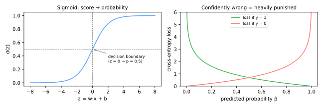

# Regressão Logística

Apesar do nome, a regressão logística (Cox, 1958; com raízes na curva logística de Verhulst, 1838) é o algoritmo de **classificação** canônico — o primeiro modelo padrão para qualquer problema de classificação, presença constante em escoragem de crédito e medicina, e a porta de entrada conceitual para as [redes neurais](../neural-networks/index.md): um único neurônio *é* uma regressão logística.

## Da reta à probabilidade

A [regressão linear](../linear-regression/index.md) produz qualquer número real — inútil como probabilidade. A regressão logística mantém o escore linear

\[
z = w^\top x + b
\]

e o comprime pela função **sigmoide** (logística):

\[
\hat{p} = \sigma(z) = \frac{1}{1 + e^{-z}} \in (0, 1)
\]



Preveja a classe 1 quando \(\hat{p} \geq\) limiar (0,5 por padrão → \(z \geq 0\)). O conjunto \(w^\top x + b = 0\) é um hiperplano: a regressão logística é um **classificador linear** — sua fronteira de decisão é uma reta/plano no espaço de atributos (fronteiras curvas exigem atributos construídos, por exemplo [polinomiais](../gradient-descent-regularization/index.md#de-retas-a-curvas-atributos-polinomiais), ou outros modelos).

### Chances (odds) e interpretabilidade

Inverter a sigmoide mostra que o escore linear é o **log das chances (log-odds)**:

\[
\log \frac{\hat{p}}{1 - \hat{p}} = w^\top x + b
\]

Então cada aumento unitário em \(x_j\) multiplica as **chances (odds)** \(\frac{p}{1-p}\) por \(e^{w_j}\). Um coeficiente de 0,7 em "número de pagamentos atrasados" significa que cada um multiplica as chances de inadimplência por \(e^{0.7} \approx 2\) — o tipo de afirmação que reguladores e médicos exigem, e a razão de a regressão logística persistir em domínios de alto risco ([Explicabilidade](../explainability/index.md)).

## A perda: entropia cruzada

O erro quadrático sobre probabilidades cria uma paisagem não convexa. Em vez disso, maximize a verossimilhança dos rótulos observados — equivalentemente, minimize a **log loss / entropia cruzada binária**:

\[
J(w) = -\frac{1}{n} \sum_{i=1}^{n} \Big[ y_i \log \hat{p}_i + (1 - y_i) \log (1 - \hat{p}_i) \Big]
\]

Cada termo se lê: *o log da probabilidade que o modelo atribuiu ao que de fato aconteceu*. Como mostra o painel direito acima, estar **confiantemente errado** (\(\hat{p} \to 0\) quando \(y = 1\)) custa ilimitadamente caro — o modelo é empurrado para uma honestidade calibrada, não apenas para rótulos corretos.

### Treino por gradiente descendente

Não existe forma fechada, mas \(J\) é **convexa** — um único mínimo global. O gradiente é surpreendentemente limpo:

\[
\nabla_w J = \frac{1}{n} X^\top (\hat{p} - y)
\]

— *idêntico em forma* ao gradiente da regressão linear, com \(\hat{p} = \sigma(Xw)\) substituindo \(Xw\). O mesmo [laço de gradiente descendente](../gradient-descent-regularization/index.md#gradiente-descendente) se aplica sem mudanças:

```python
import numpy as np

def sigmoid(z):
    return 1 / (1 + np.exp(-z))

w = np.zeros(X.shape[1])
for _ in range(n_epochs):
    p = sigmoid(X @ w)
    w -= eta * X.T @ (p - y) / len(y)
```

## Regularização

Tudo de [Ridge e Lasso](../gradient-descent-regularization/index.md#regularizacao) se transfere: adicione \(\alpha \lVert w \rVert_2^2\) (L2) ou \(\alpha \lVert w \rVert_1\) (L1) à perda. É tão essencial — especialmente com muitos atributos, onde pesos não regularizados podem crescer sem limite em dados separáveis — que o **scikit-learn regulariza por padrão**, parametrizado por \(C = 1/\alpha\):

```python
from sklearn.linear_model import LogisticRegression

model = LogisticRegression(C=1.0,            # C MENOR = regularização MAIS FORTE
                           penalty='l2',
                           class_weight='balanced',   # para desbalanceamento
                           max_iter=1000)
model.fit(X_train_scaled, y_train)
model.predict_proba(X_test_scaled)[:, 1]     # probabilidades para análise ROC/PR
```

Ajuste \(C\) em uma grade logarítmica por [validação cruzada](../model-selection/index.md#busca-em-grade-com-validacao-cruzada); [escalone os atributos primeiro](../preprocessing/index.md#metodos-de-escalonamento) (regularizado + baseado em gradiente ⇒ duplamente necessário).

## Multiclasse: softmax

Para \(k\) classes, aprenda um vetor de pesos por classe e normalize os escores com o **softmax**:

\[
\hat{p}_c = \frac{e^{z_c}}{\sum_{j=1}^{k} e^{z_j}}, \qquad z_c = w_c^\top x + b_c
\]

A entropia cruzada se generaliza literalmente. O `LogisticRegression` lida com isso automaticamente (`multi_class='multinomial'` é o padrão moderno). Essa construção exata — escores lineares + softmax + entropia cruzada — é a **camada de saída de essencialmente todo classificador neural**, incluindo os LLMs escolhendo seu próximo token.

## Perfil prático

| | |
|---|---|
| **Pontos fortes** | rápido; convexo (treino confiável); probabilidades bem calibradas; interpretável via razões de chances; baseline forte; escala para milhões de amostras |
| **Fraquezas** | fronteira linear (precisa de engenharia de atributos para curvas); tem dificuldade quando interações dominam; sensível a atributos não escalonados sob regularização |
| **Recorra a ela quando** | você precisa de uma baseline sólida e explicável; as probabilidades importam (risco, triagem); os atributos são informativos individualmente |

## Material de aula

!!! example "Notebook da aula (em português)"
    Notebook prático usado em sala — **Aula 16 — Regressão Logística com Gradiente Descendente e Regularização**:
    [:simple-googlecolab: abrir no Colab](https://colab.research.google.com/drive/1swnb_wP1QlxFScuzFgfSZlCS9YsqfXe-){:target="_blank"}

---

## Quiz

<div id="quiz-logistic-regression"></div>
<script>
buildQuiz('logistic-regression', 'Regressão Logística', [
  {
    q: "Que papel a função sigmoide desempenha na regressão logística?",
    opts: [
      "Torna a fronteira de decisão não linear",
      "Mapeia o escore linear w·x + b para (0,1), para que a saída possa ser lida como uma probabilidade",
      "Remove outliers dos dados",
      "Seleciona os atributos mais importantes"
    ],
    ans: 1,
    exp: "O modelo continua linear — σ apenas reescala o escore para uma probabilidade válida. A fronteira σ(z) = 0,5 corresponde ao hiperplano z = 0, e é por isso que o classificador permanece linear."
  },
  {
    q: "Um coeficiente de w = 0,7 em 'pagamentos atrasados' (escala de log-odds) significa que cada pagamento atrasado adicional...",
    opts: [
      "adiciona 0,7 à probabilidade prevista",
      "multiplica as chances de inadimplência por e^0,7 ≈ 2",
      "dobra a probabilidade",
      "não tem interpretação"
    ],
    ans: 1,
    exp: "Os coeficientes agem aditivamente sobre o log-odds, portanto multiplicativamente sobre as chances: chances ×= e^w por unidade. As probabilidades não mudam por uma quantidade fixa — o efeito sobre p depende de onde você começa."
  },
  {
    q: "Por que a entropia cruzada é usada em vez do erro quadrático para o treino?",
    opts: [
      "É mais rápida de calcular",
      "O erro quadrático com uma sigmoide dá uma perda não convexa; a entropia cruzada é convexa e pune fortemente previsões confiantes e erradas",
      "O erro quadrático não pode ser diferenciado",
      "A entropia cruzada ignora os rótulos"
    ],
    ans: 1,
    exp: "Entropia cruzada = log-verossimilhança negativa: convexa para a regressão logística, com o gradiente limpo Xᵀ(p̂ − y), e perda → ∞ conforme o modelo fica confiantemente errado — incentivando probabilidades calibradas."
  },
  {
    q: "No LogisticRegression do scikit-learn, diminuir C de 1,0 para 0,01...",
    opts: [
      "enfraquece a regularização",
      "fortalece a regularização, encolhendo os coeficientes (C = 1/α)",
      "muda o limiar para 0,01",
      "troca para a perda de erro quadrático"
    ],
    ans: 1,
    exp: "C é o inverso da força de regularização — uma fonte frequente de confusão. C pequeno = penalidade forte = pesos menores = modelo mais simples; ajuste-o em uma grade logarítmica com CV."
  },
  {
    q: "A regressão logística tem mais dificuldade, sem engenharia de atributos, quando...",
    opts: [
      "as classes são separadas por uma fronteira curva ou tipo XOR que nenhum hiperplano consegue expressar",
      "há mais de duas classes",
      "os atributos são padronizados",
      "as probabilidades precisam ser calibradas"
    ],
    ans: 0,
    exp: "A fronteira de decisão é um hiperplano. Multiclasse é tratado pelo softmax, e a calibração é um ponto forte. Estrutura não linear exige atributos construídos (polinômios, interações) ou modelos não lineares."
  },
  {
    q: "A conexão entre a regressão logística e as redes neurais é que...",
    opts: [
      "redes neurais não conseguem fazer classificação",
      "um único neurônio com ativação sigmoide calcula exatamente uma regressão logística, e softmax + entropia cruzada é a camada de saída padrão dos classificadores neurais",
      "a regressão logística usa retropropagação",
      "elas não compartilham conexão"
    ],
    ans: 1,
    exp: "σ(w·x + b) é ambos. Uma rede neural empilha tais unidades com não linearidades entre elas, aprendendo os atributos que a regressão logística exige que você construa à mão."
  }
]);
</script>
