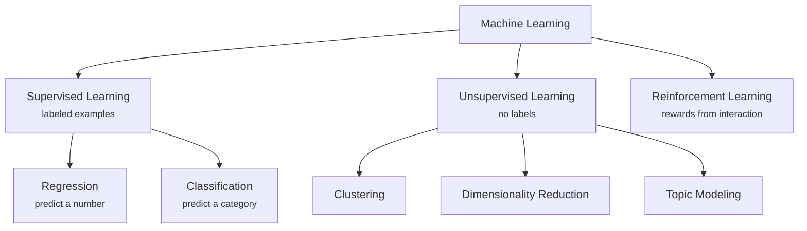
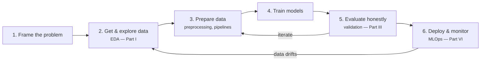

# The ML Landscape

Before diving into algorithms, we need a map: what kinds of learning exist, what a real ML project looks like from end to end, and what it means for a model to *generalize*.

## Learning paradigms

Machine learning problems are classified by the kind of **feedback** available to the learner.

### Supervised learning

The dataset contains inputs \(x\) **and** the desired outputs \(y\) (labels). The goal is to learn a function \(f\) such that \(f(x) \approx y\) on *new* data.

- **Regression** — \(y\) is continuous: predicting house prices, energy demand, a patient's length of stay. (Part III)
- **Classification** — \(y\) is categorical: spam/ham, tumor benign/malignant, which digit is in the image. (Parts IV–V)

### Unsupervised learning

Only inputs \(x\) — no labels. The goal is to discover **structure**:

- **Clustering** — group similar observations (customer segments). ([Clustering](../clustering/index.md))
- **Dimensionality reduction** — compress many features into few informative ones ([PCA, t-SNE, UMAP](../dimensionality-reduction/index.md));
- **Topic modeling** — discover themes in a collection of documents ([BERTopic](../topic-modeling-bertopic/index.md)).

### Reinforcement learning

An **agent** interacts with an environment, receives **rewards**, and learns a policy that maximizes long-term reward — the paradigm behind game-playing systems (AlphaGo) and robotic control. It is out of scope for this course, but you should recognize it on the map.

!!! info "In between"
    Real projects often mix paradigms: **semi-supervised** learning (few labels, many unlabeled examples), **self-supervised** learning (labels manufactured from the data itself — how foundation models are pre-trained), and **weak supervision** (noisy, programmatic labels).

## The ML workflow

A model is a small part of a larger, iterative process. This course is organized around this loop:

Two practical truths about this diagram:

1. **Most of the work is in steps 2–3.** Practitioners routinely report spending the majority of their time understanding and preparing data, not fitting models.
2. **The loop never ends.** Deployed models decay as the world changes (*drift*); monitoring and retraining are part of the job, not an afterthought.

## Generalization: the central problem

A model that memorizes its training data perfectly can still be useless. What matters is performance on **data it has never seen**.

- **Underfitting**: the model is too simple to capture the pattern — poor performance even on training data.
- **Overfitting**: the model captures noise as if it were signal — excellent on training data, poor on new data.

\[
\text{Goal: minimize } \underbrace{\mathbb{E}_{(x,y)\sim \mathcal{D}}\big[L\big(f(x),\,y\big)\big]}_{\text{expected loss on new data}} \quad \text{while only observing a finite sample.}
\]

Everything in Part III — train/test splits, cross-validation, regularization, the bias–variance trade-off — exists to manage this tension. For now, keep one rule:

!!! danger "The golden rule"
    **Never evaluate a model on data it was trained on.** Test data must simulate the future: unseen, untouched, used once.

## No free lunch

The **No Free Lunch theorem** (Wolpert, 1996) says that averaged over *all possible problems*, no learning algorithm is better than any other. In practice this means: there is no universally best model — you must **try several families and validate**. That is why this course teaches a portfolio (linear models, neighbors, kernels, trees, ensembles, networks) rather than a single silver bullet.

## Ethics and responsibility

Models trained on historical data inherit historical bias. Before shipping a model, ask:

- **Fairness** — does the model perform equally across demographic groups? A credit model trained on biased decisions reproduces them at scale.
- **Privacy** — was the data collected with consent? Can individuals be re-identified?
- **Transparency** — can decisions be explained to those affected? (Part VI covers [explainability](../explainability/index.md).)
- **Feedback loops** — does deploying the model change the data it will be retrained on? (Predictive policing is the canonical cautionary tale.)

!!! warning
    "The model said so" is never an acceptable justification for a decision that affects people. You — the practitioner — own the consequences.

---

## Quiz

