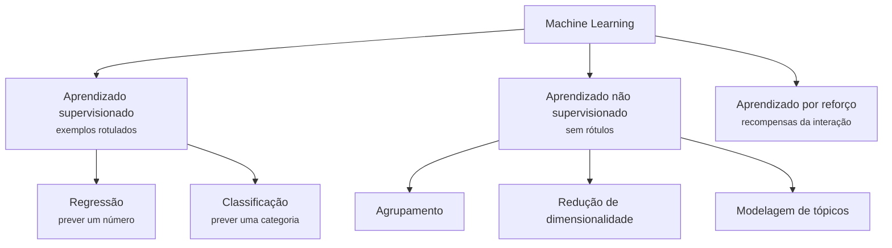
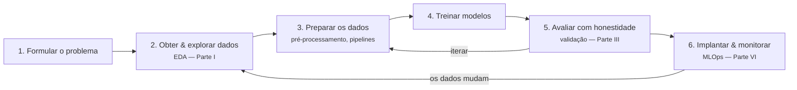

# O panorama de ML

Antes de mergulhar nos algoritmos, precisamos de um mapa: que tipos de aprendizado existem, como é um projeto de ML real de ponta a ponta e o que significa um modelo *generalizar*.

## Paradigmas de aprendizado

Os problemas de machine learning são classificados pelo tipo de **feedback** disponível ao aprendiz.

### Aprendizado supervisionado

O conjunto de dados contém entradas \(x\) **e** as saídas desejadas \(y\) (rótulos). O objetivo é aprender uma função \(f\) tal que \(f(x) \approx y\) em dados *novos*.

- **Regressão** — \(y\) é contínuo: prever preços de imóveis, demanda de energia, o tempo de internação de um paciente. (Parte III)
- **Classificação** — \(y\) é categórico: spam/não spam, tumor benigno/maligno, qual dígito está na imagem. (Partes IV–V)

### Aprendizado não supervisionado

Apenas as entradas \(x\) — sem rótulos. O objetivo é descobrir **estrutura**:

- **Agrupamento** — agrupar observações semelhantes (segmentos de clientes). ([Agrupamento](../clustering/index.md))
- **Redução de dimensionalidade** — comprimir muitos atributos em poucos informativos ([PCA, t-SNE, UMAP](../dimensionality-reduction/index.md));
- **Modelagem de tópicos** — descobrir temas em uma coleção de documentos ([BERTopic](../topic-modeling-bertopic/index.md)).

### Aprendizado por reforço

Um **agente** interage com um ambiente, recebe **recompensas** e aprende uma política que maximiza a recompensa de longo prazo — o paradigma por trás de sistemas que jogam (AlphaGo) e do controle robótico. Está fora do escopo deste curso, mas você deve reconhecê-lo no mapa.

!!! info "No meio-termo"
    Projetos reais frequentemente misturam paradigmas: aprendizado **semissupervisionado** (poucos rótulos, muitos exemplos não rotulados), aprendizado **autossupervisionado** (rótulos fabricados a partir dos próprios dados — como os modelos de fundação são pré-treinados) e **supervisão fraca** (rótulos ruidosos e programáticos).

## O fluxo de trabalho de ML

Um modelo é uma pequena parte de um processo maior e iterativo. Este curso é organizado em torno deste ciclo:

Duas verdades práticas sobre este diagrama:

1. **A maior parte do trabalho está nos passos 2–3.** É comum profissionais relatarem que passam a maior parte do tempo entendendo e preparando dados, não ajustando modelos.
2. **O ciclo nunca termina.** Modelos implantados se degradam conforme o mundo muda (*drift*); monitorar e retreinar fazem parte do trabalho, não são uma reflexão tardia.

## Generalização: o problema central

Um modelo que memoriza perfeitamente seus dados de treino ainda pode ser inútil. O que importa é o desempenho em **dados que ele nunca viu**.

- **Subajuste (underfitting)**: o modelo é simples demais para capturar o padrão — desempenho ruim mesmo nos dados de treino.
- **Sobreajuste (overfitting)**: o modelo captura ruído como se fosse sinal — excelente nos dados de treino, ruim em dados novos.

\[
\text{Objetivo: minimizar } \underbrace{\mathbb{E}_{(x,y)\sim \mathcal{D}}\big[L\big(f(x),\,y\big)\big]}_{\text{perda esperada em dados novos}} \quad \text{observando apenas uma amostra finita.}
\]

Tudo na Parte III — divisões treino/teste, validação cruzada, regularização, o trade-off viés–variância — existe para gerenciar essa tensão. Por ora, guarde uma regra:

!!! danger "A regra de ouro"
    **Nunca avalie um modelo com dados em que ele foi treinado.** Os dados de teste devem simular o futuro: nunca vistos, intocados, usados uma única vez.

## Sem almoço grátis

O **teorema No Free Lunch** (Wolpert, 1996) diz que, na média sobre *todos os problemas possíveis*, nenhum algoritmo de aprendizado é melhor que qualquer outro. Na prática, isso significa: não existe modelo universalmente melhor — você precisa **experimentar várias famílias e validar**. É por isso que este curso ensina um portfólio (modelos lineares, vizinhos, kernels, árvores, ensembles, redes) em vez de uma única bala de prata.

## Ética e responsabilidade

Modelos treinados em dados históricos herdam vieses históricos. Antes de colocar um modelo em produção, pergunte:

- **Justiça** — o modelo tem desempenho igual entre grupos demográficos? Um modelo de crédito treinado em decisões enviesadas as reproduz em escala.
- **Privacidade** — os dados foram coletados com consentimento? As pessoas podem ser reidentificadas?
- **Transparência** — as decisões podem ser explicadas aos afetados? (A Parte VI cobre [explicabilidade](../explainability/index.md).)
- **Ciclos de retroalimentação** — implantar o modelo altera os dados com que ele será retreinado? (O policiamento preditivo é o exemplo canônico de alerta.)

!!! warning
    "O modelo disse isso" nunca é uma justificativa aceitável para uma decisão que afeta pessoas. Você — o profissional — é responsável pelas consequências.

---

## Quiz

