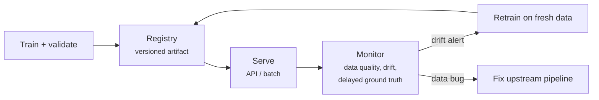

# MLOps

A model in a notebook creates no value; predictions delivered reliably to users do. **MLOps** applies engineering discipline (versioning, testing, CI/CD, monitoring) to the special failure modes of ML systems. The [workflow diagram](../ml-landscape/index.md#the-ml-workflow) promised that "deploy & monitor" loops back to the data — this lesson is that loop.

The famous warning from Sculley et al. (2015), *Hidden Technical Debt in Machine Learning Systems*: in a production ML system, the model is a **small box surrounded by infrastructure** — data pipelines, feature engineering, serving, monitoring — where most failures happen.

## Serving a model

The universal contract: **ship the whole [pipeline](../pipelines/index.md#inspection-and-persistence)** — preprocessing + model, one artifact — so serving cannot drift from training.

| Pattern | Latency | Example |
|---------|---------|---------|
| **Batch** | hours | nightly churn scores written to a table |
| **Online (API)** | milliseconds | credit decision at checkout |
| **Streaming** | seconds | fraud flags on a transaction stream |
| **Edge** | on-device | keyboard prediction on your phone |

A minimal online service — FastAPI around a serialized pipeline:

```python
import joblib
import pandas as pd
from fastapi import FastAPI
from pydantic import BaseModel

app = FastAPI()
pipe = joblib.load("churn-pipeline.joblib")     # preprocessing + model together

class Customer(BaseModel):
    age: int
    income: float
    tenure: int
    plan: str

@app.post("/predict")
def predict(c: Customer):
    X = pd.DataFrame([c.model_dump()])
    proba = pipe.predict_proba(X)[0, 1]
    return {"churn_probability": round(float(proba), 4),
            "model_version": "2026.07.02-1"}
```

```bash
$ uvicorn app:app --port 8000
$ curl -X POST localhost:8000/predict -H 'Content-Type: application/json' \
       -d '{"age": 34, "income": 8200.0, "tenure": 18, "plan": "premium"}'
{"churn_probability": 0.2213, "model_version": "2026.07.02-1"}
```

Production hardening: containerize (Docker), validate inputs strictly (pydantic already helps), log every request/prediction (you will need them for monitoring), and version the endpoint.

## Reproducibility and versioning

"Which model is running, and could we rebuild it?" needs a versioned answer for **three things at once** — code (git), **data** (DVC, lakeFS, snapshots), and **model artifacts + metrics** (MLflow, Weights & Biases). A **model registry** ties them together: every deployed model traces back to the exact code, data, hyperparameters, and validation scores that produced it.

```python
import mlflow

with mlflow.start_run():
    mlflow.log_params(search.best_params_)
    mlflow.log_metric("val_roc_auc", search.best_score_)
    mlflow.sklearn.log_model(search.best_estimator_, name="model",
                             registered_model_name="churn")
```

## Monitoring and drift

Software breaks loudly; **models decay silently** — the service returns 200 OK while predictions rot. Monitor three layers:

1. **System**: latency, throughput, errors (ordinary SRE);
2. **Data quality**: schema changes, missing-value spikes, out-of-range features — most "model" incidents are upstream data incidents;
3. **Statistical drift**:
   - **Data drift** — input distribution shifts: \(P(x)\) changes (new demographics, inflation moving incomes, a new app version changing usage patterns). Detect by comparing live feature distributions against a training reference (PSI, KS tests);
   - **Concept drift** — the *relationship* changes: \(P(y \mid x)\) moves (fraudsters adapt, consumer behavior shifts post-pandemic). The same inputs now deserve different answers.

**Ground truth arrives late** (churn is known in 60 days; default in months), so drift metrics on *inputs and prediction distributions* are the early-warning system while you wait for true labels to compute real accuracy.



**Retraining** closes the loop — scheduled (weekly/monthly) or drift-triggered. Automatic retraining needs automatic **evaluation gates** (new model must beat current on held-out recent data) plus a **rollback** path. Roll out carefully: shadow deployment (new model predicts silently alongside), canary (small traffic slice), A/B test with business metrics.

!!! danger "Feedback loops"
    Once deployed, the model shapes the data it will retrain on: the credit model only observes repayment for loans it *approved*; the recommender only sees clicks on items it *showed*. Naive retraining amplifies the model's own biases — recall the [ethics lesson](../ml-landscape/index.md#ethics-and-responsibility). Mitigations include holdout traffic and careful sample weighting.

## Maturity, honestly

Most teams do not need the full platform on day one. A sane ladder:

1. notebook → **script + versioned artifacts** (git + MLflow);
2. manual deploy → **CI/CD**: tests (data validation, pipeline fit, metric threshold) run before any model ships;
3. no visibility → **logging + dashboards + drift alerts**;
4. manual retrain → **scheduled/triggered retraining with gates**.

Each rung eliminates one class of 3 a.m. incident. Climb when the pain justifies it.

---

## Quiz

<div id="quiz-mlops"></div>
<script>
buildQuiz('mlops', 'MLOps', [
  {
    q: "Why should the serialized artifact be the entire pipeline rather than just the model?",
    opts: [
      "It loads faster",
      "Serving must replay exactly the training-time preprocessing; separate preprocessing code inevitably drifts from it (training/serving skew)",
      "Models cannot be serialized alone",
      "To reduce file size"
    ],
    ans: 1,
    exp: "If preprocessing is reimplemented in the serving layer, any mismatch (different scaler stats, changed encoding) silently corrupts predictions. One artifact = one source of truth — the pipelines lesson, now in production."
  },
  {
    q: "Nightly churn scores written to a database vs a credit decision during checkout are examples of...",
    opts: [
      "batch serving vs online (real-time API) serving",
      "edge serving vs streaming",
      "the same serving pattern",
      "shadow vs canary deployment"
    ],
    ans: 0,
    exp: "Batch scoring runs on schedule with relaxed latency; online serving answers individual requests in milliseconds. The pattern drives the architecture (job scheduler vs low-latency API)."
  },
  {
    q: "Data drift and concept drift differ in that...",
    opts: [
      "data drift is about P(x) shifting (inputs look different) while concept drift is about P(y|x) shifting (the same inputs now deserve different answers)",
      "data drift only happens in images",
      "concept drift is detectable instantly, data drift is not",
      "they are synonyms"
    ],
    ans: 0,
    exp: "New demographics arriving = data drift; fraudsters changing tactics so old patterns stop predicting fraud = concept drift. Both silently degrade a static model — the reason monitoring exists."
  },
  {
    q: "Why monitor input and prediction distributions instead of just accuracy?",
    opts: [
      "Accuracy is too expensive to compute",
      "Ground truth often arrives weeks or months late; distribution drift is the early-warning signal available immediately",
      "Distributions are more precise than accuracy",
      "Regulators forbid accuracy monitoring"
    ],
    ans: 1,
    exp: "You learn who actually churned or defaulted long after predicting. Comparing live feature/prediction distributions against the training reference detects trouble now, not at the end of the label-delay window."
  },
  {
    q: "A shadow deployment is...",
    opts: [
      "deploying without informing users",
      "running the new model on live traffic and logging its predictions, while the old model's outputs are still the ones served",
      "serving the model from a CDN",
      "a deployment with no monitoring"
    ],
    ans: 1,
    exp: "Shadow mode measures the candidate on real traffic with zero user risk. If its predictions and stability look good, promote via canary/A-B; if not, nothing happened."
  },
  {
    q: "A credit model is retrained only on loans it previously approved. The danger is...",
    opts: [
      "the dataset becomes too large",
      "a feedback loop: the model never observes outcomes for rejected profiles, so its biases are reinforced with each retraining cycle",
      "training becomes slower",
      "the model's precision becomes 100%"
    ],
    ans: 1,
    exp: "The deployed model filters its own future training data (selective labels). Groups it wrongly rejects never get a chance to prove it wrong. Mitigations: exploration/holdout traffic, reweighting, careful evaluation design."
  }
]);
</script>
