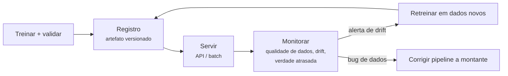

# MLOps

Um modelo em um notebook não cria valor; previsões entregues de forma confiável aos usuários criam. O **MLOps** aplica disciplina de engenharia (versionamento, testes, CI/CD, monitoramento) aos modos de falha especiais dos sistemas de ML. O [diagrama do fluxo de trabalho](../ml-landscape/index.md#o-fluxo-de-trabalho-de-ml) prometeu que "implantar & monitorar" retorna aos dados — esta aula é esse laço.

O famoso alerta de Sculley et al. (2015), *Hidden Technical Debt in Machine Learning Systems*: em um sistema de ML em produção, o modelo é uma **caixinha cercada de infraestrutura** — pipelines de dados, engenharia de atributos, serving, monitoramento — onde a maioria das falhas acontece.

## Servindo um modelo

O contrato universal: **entregue o [pipeline](../pipelines/index.md#inspecao-e-persistencia) inteiro** — pré-processamento + modelo, um único artefato — para que o serving não possa divergir do treino.

| Padrão | Latência | Exemplo |
|--------|----------|---------|
| **Batch** | horas | escores de churn noturnos gravados numa tabela |
| **Online (API)** | milissegundos | decisão de crédito no checkout |
| **Streaming** | segundos | flags de fraude em um fluxo de transações |
| **Edge** | no dispositivo | previsão de teclado no seu celular |

Um serviço online mínimo — FastAPI em torno de um pipeline serializado:

```python
import joblib
import pandas as pd
from fastapi import FastAPI
from pydantic import BaseModel

app = FastAPI()
pipe = joblib.load("churn-pipeline.joblib")     # pré-processamento + modelo juntos

class Customer(BaseModel):
    age: int
    income: float
    tenure: int
    plan: str

@app.post("/predict")
def predict(c: Customer):
    X = pd.DataFrame([c.model_dump()])
    proba = pipe.predict_proba(X)[0, 1]
    return {"churn_probability": round(float(proba), 4),
            "model_version": "2026.07.02-1"}
```

```bash
$ uvicorn app:app --port 8000
$ curl -X POST localhost:8000/predict -H 'Content-Type: application/json' \
       -d '{"age": 34, "income": 8200.0, "tenure": 18, "plan": "premium"}'
{"churn_probability": 0.2213, "model_version": "2026.07.02-1"}
```

Endurecimento para produção: containerizar (Docker), validar as entradas estritamente (o pydantic já ajuda), registrar (log) cada requisição/previsão (você precisará delas para o monitoramento) e versionar o endpoint.

## Reprodutibilidade e versionamento

"Qual modelo está rodando, e conseguiríamos reconstruí-lo?" precisa de uma resposta versionada para **três coisas ao mesmo tempo** — código (git), **dados** (DVC, lakeFS, snapshots) e **artefatos de modelo + métricas** (MLflow, Weights & Biases). Um **registro de modelos (model registry)** os amarra: todo modelo implantado remete ao código, aos dados, aos hiperparâmetros e aos escores de validação exatos que o produziram.

```python
import mlflow

with mlflow.start_run():
    mlflow.log_params(search.best_params_)
    mlflow.log_metric("val_roc_auc", search.best_score_)
    mlflow.sklearn.log_model(search.best_estimator_, name="model",
                             registered_model_name="churn")
```

## Monitoramento e drift

O software quebra ruidosamente; os **modelos se degradam silenciosamente** — o serviço retorna 200 OK enquanto as previsões apodrecem. Monitore três camadas:

1. **Sistema**: latência, throughput, erros (SRE comum);
2. **Qualidade dos dados**: mudanças de schema, picos de valores faltantes, atributos fora de faixa — a maioria dos incidentes de "modelo" são, na verdade, incidentes de dados a montante;
3. **Drift estatístico**:
   - **Drift de dados** — a distribuição das entradas muda: \(P(x)\) muda (novas demografias, inflação movendo rendas, uma nova versão do app mudando os padrões de uso). Detecte comparando as distribuições dos atributos ao vivo com uma referência de treino (PSI, testes KS);
   - **Drift de conceito** — a *relação* muda: \(P(y \mid x)\) se move (fraudadores se adaptam, o comportamento do consumidor muda pós-pandemia). As mesmas entradas agora merecem respostas diferentes.

**A verdade de referência chega atrasada** (o churn é conhecido em 60 dias; a inadimplência em meses), então as métricas de drift sobre *entradas e distribuições de previsão* são o sistema de alerta antecipado enquanto você espera os rótulos verdadeiros para calcular a acurácia real.



O **retreino** fecha o laço — agendado (semanal/mensal) ou disparado por drift. O retreino automático precisa de **portões de avaliação** automáticos (o novo modelo deve superar o atual em dados recentes separados) mais um caminho de **rollback**. Faça o rollout com cuidado: implantação em sombra (o novo modelo prevê silenciosamente em paralelo), canário (uma pequena fatia de tráfego), teste A/B com métricas de negócio.

!!! danger "Ciclos de retroalimentação"
    Uma vez implantado, o modelo molda os dados com que será retreinado: o modelo de crédito só observa o pagamento dos empréstimos que *aprovou*; o recomendador só vê cliques em itens que *mostrou*. O retreino ingênuo amplifica os próprios vieses do modelo — lembre-se da [aula de ética](../ml-landscape/index.md#etica-e-responsabilidade). Mitigações incluem tráfego de holdout e ponderação cuidadosa das amostras.

## Maturidade, com honestidade

A maioria das equipes não precisa da plataforma completa no primeiro dia. Uma escada sensata:

1. notebook → **script + artefatos versionados** (git + MLflow);
2. deploy manual → **CI/CD**: testes (validação de dados, ajuste do pipeline, limiar de métrica) rodam antes de qualquer modelo ir para produção;
3. sem visibilidade → **logging + dashboards + alertas de drift**;
4. retreino manual → **retreino agendado/disparado com portões**.

Cada degrau elimina uma classe de incidente das 3 da manhã. Suba quando a dor justificar.

---

## Quiz

<div id="quiz-mlops"></div>
<script>
buildQuiz('mlops', 'MLOps', [
  {
    q: "Por que o artefato serializado deve ser o pipeline inteiro em vez de apenas o modelo?",
    opts: [
      "Carrega mais rápido",
      "O serving precisa reproduzir exatamente o pré-processamento do treino; código de pré-processamento separado inevitavelmente diverge dele (skew treino/serving)",
      "Modelos não podem ser serializados sozinhos",
      "Para reduzir o tamanho do arquivo"
    ],
    ans: 1,
    exp: "Se o pré-processamento é reimplementado na camada de serving, qualquer divergência (estatísticas de scaler diferentes, codificação alterada) corrompe silenciosamente as previsões. Um artefato = uma fonte de verdade — a aula de pipelines, agora em produção."
  },
  {
    q: "Escores de churn noturnos gravados num banco vs uma decisão de crédito durante o checkout são exemplos de...",
    opts: [
      "serving em batch vs serving online (API em tempo real)",
      "serving em edge vs streaming",
      "o mesmo padrão de serving",
      "implantação em sombra vs canário"
    ],
    ans: 0,
    exp: "A escoragem em batch roda de forma agendada com latência relaxada; o serving online responde a requisições individuais em milissegundos. O padrão dita a arquitetura (agendador de jobs vs API de baixa latência)."
  },
  {
    q: "O drift de dados e o drift de conceito diferem em que...",
    opts: [
      "o drift de dados é sobre P(x) mudando (as entradas parecem diferentes) enquanto o drift de conceito é sobre P(y|x) mudando (as mesmas entradas agora merecem respostas diferentes)",
      "o drift de dados só acontece em imagens",
      "o drift de conceito é detectável instantaneamente, o de dados não",
      "são sinônimos"
    ],
    ans: 0,
    exp: "Novas demografias chegando = drift de dados; fraudadores mudando de tática de modo que os padrões antigos deixam de prever fraude = drift de conceito. Ambos degradam silenciosamente um modelo estático — a razão de o monitoramento existir."
  },
  {
    q: "Por que monitorar as distribuições de entrada e de previsão em vez de apenas a acurácia?",
    opts: [
      "A acurácia é cara demais para calcular",
      "A verdade de referência muitas vezes chega semanas ou meses depois; o drift de distribuição é o sinal de alerta antecipado disponível imediatamente",
      "As distribuições são mais precisas que a acurácia",
      "Os reguladores proíbem o monitoramento de acurácia"
    ],
    ans: 1,
    exp: "Você descobre quem de fato deu churn ou ficou inadimplente muito depois de prever. Comparar as distribuições de atributos/previsões ao vivo com a referência de treino detecta problemas agora, não no fim da janela de atraso dos rótulos."
  },
  {
    q: "Uma implantação em sombra (shadow) é...",
    opts: [
      "implantar sem informar os usuários",
      "rodar o novo modelo no tráfego ao vivo e registrar suas previsões, enquanto as saídas do modelo antigo continuam sendo as servidas",
      "servir o modelo a partir de um CDN",
      "uma implantação sem monitoramento"
    ],
    ans: 1,
    exp: "O modo sombra mede o candidato em tráfego real com zero risco ao usuário. Se suas previsões e estabilidade parecerem boas, promova via canário/A-B; se não, nada aconteceu."
  },
  {
    q: "Um modelo de crédito é retreinado apenas com os empréstimos que ele previamente aprovou. O perigo é...",
    opts: [
      "o conjunto de dados fica grande demais",
      "um ciclo de retroalimentação: o modelo nunca observa os desfechos dos perfis rejeitados, então seus vieses são reforçados a cada ciclo de retreino",
      "o treino fica mais lento",
      "a precisão do modelo vira 100%"
    ],
    ans: 1,
    exp: "O modelo implantado filtra seus próprios dados de treino futuros (rótulos seletivos). Grupos que ele rejeita por engano nunca têm a chance de provar o contrário. Mitigações: tráfego de exploração/holdout, reponderação, desenho de avaliação cuidadoso."
  }
]);
</script>
