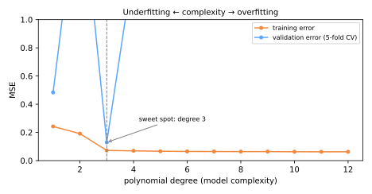

# Model Selection

You can now train several model families and validate them honestly. **Model selection** is the discipline of choosing among them — and among their hyperparameters — without fooling yourself. Its theoretical heart is the **bias–variance trade-off**; its oldest trap is **regression to the mean**; its workhorse tool is **grid search with cross-validation**.

## The bias–variance trade-off

Imagine retraining your model on many different samples of training data and looking at its prediction for one fixed point \(x\). For squared error, the expected test error decomposes:

\[
\mathbb{E}\big[(y - \hat{f}(x))^2\big] =
\underbrace{\big(f(x) - \mathbb{E}[\hat{f}(x)]\big)^2}_{\text{bias}^2}
+ \underbrace{\mathbb{E}\big[(\hat{f}(x) - \mathbb{E}[\hat{f}(x)])^2\big]}_{\text{variance}}
+ \underbrace{\sigma^2}_{\text{irreducible noise}}
\]

- **Bias** — systematic error from a model too simple to represent the truth (degree-1 fit to a sine: wrong *everywhere*, in the same way, on every retraining);
- **Variance** — sensitivity to the particular training sample (degree-15 fit: wildly different curves for each sample of 25 points);
- **Noise** — the part no model can remove.

Simple models: high bias, low variance → **underfitting**. Complex models: low bias, high variance → **overfitting**. Somewhere between lies the sweet spot — visible experimentally in a **validation curve**:



Training error (orange) falls monotonically with complexity — it *cannot* see overfitting. Validation error (blue) is U-shaped: it falls while complexity reduces bias, then rises as variance takes over. **Select complexity at the bottom of the blue curve, never the orange one.**

Knobs that move you along this curve: polynomial degree, [regularization α](../gradient-descent-regularization/index.md#the-knob) (inverted: larger α = simpler), tree depth ([Decision Trees](../decision-trees/index.md)), k in [k-NN](../knn/index.md) (inverted), number of features.

Drive the trade-off yourself — slide from degree 0 (pure bias) to 12 (pure variance) and watch the two errors part ways:

<div id="sim-bias-variance"></div>

### Learning curves: is more data worth it?

Plot train and validation scores versus **training-set size**:

- curves converge at a low score → **high bias**: more data won't help; add capacity or features;
- large persistent gap → **high variance**: more data (or regularization) will help.

## Regression to the mean

Galton (1886) noticed children of very tall parents are usually closer to average height. The general phenomenon: **extreme observations are partly luck, and luck does not repeat**. Whenever performance = skill + noise, the top performer of round one tends to fall back in round two — with no causal explanation needed.

Why this haunts model selection: compare 50 model configurations by validation score and pick the winner. The winner won partly by *being good* and partly by *being lucky on that validation data*. Its reported score is **optimistically biased** — expect it to regress when retested. Concretely:

- the more configurations you try, the more inflated the best validation score becomes;
- this is why the untouched [test set](../validation/index.md#train-validation-test) exists: it gives the winner one honest, luck-free measurement;
- the same effect explains why last year's Kaggle winner underperforms on fresh data, and why the "best fund manager of 2025" disappoints in 2026.

!!! warning "Selection inflates scores"
    The maximum of many noisy estimates overestimates the true best. Report the winner's **test** score, not its winning validation score.

## Grid search with cross-validation

`GridSearchCV` automates honest hyperparameter selection: for every combination in a grid, run k-fold CV; pick the best mean score; refit on all training data.

```python
from sklearn.model_selection import GridSearchCV
from sklearn.pipeline import Pipeline

pipe = Pipeline([('preprocess', preprocess), ('model', Ridge())])

param_grid = {
    'model__alpha': [0.01, 0.1, 1, 10, 100],
    'preprocess__num__imputer__strategy': ['mean', 'median'],
}

search = GridSearchCV(pipe, param_grid, cv=5,
                      scoring='neg_root_mean_squared_error', n_jobs=-1)
search.fit(X_train, y_train)

search.best_params_       # winning combination
search.best_score_        # its mean CV score (optimistic — see above!)
search.best_estimator_    # pipeline refit on ALL training data
search.score(X_test, y_test)   # the honest number
```

Design notes:

- **Search over the pipeline**, not the bare model — preprocessing choices are hyperparameters too, and CV inside the pipeline stays [leak-free](../validation/index.md#data-leakage);
- Grid cost is multiplicative (5 α's × 2 strategies × 5 folds = 50 fits) — for large spaces use `RandomizedSearchCV`, which samples combinations and usually finds near-optimal settings much faster (Bergstra & Bengio, 2012), or the smarter strategies of [AutoML](../automl/index.md);
- Choose `scoring` to match the problem — F1 or ROC-AUC for [imbalanced classification](../roc-imbalanced/index.md), not accuracy;
- Prefer log-spaced grids for scale parameters (α, C): `[0.01, 0.1, 1, 10, 100]`.

### Occam's razor, operationalized

When two configurations score within noise of each other (compare their CV standard deviations), **prefer the simpler one** — fewer features, stronger regularization, shallower trees. Simpler models are cheaper to serve, easier to [explain](../explainability/index.md), and more robust to [drift](../mlops/index.md).

## Class materials

!!! example "Class notebook (in Portuguese)"
    Hands-on notebook used in class — **Aula 11 — Model Selection, Regression to the Mean e GridSearchCV**:
    [:simple-googlecolab: open in Colab](https://colab.research.google.com/drive/1BZ8kIUgT_dVQ7IExjUUstyy59bUWYNB3){:target="_blank"}

---

## Quiz

<div id="quiz-model-selection"></div>
<script>
buildQuiz('model-selection', 'Model Selection', [
  {
    q: "In the bias–variance decomposition, 'variance' refers to...",
    opts: [
      "the variance of the target variable",
      "how much the fitted model changes when trained on different samples of training data",
      "the spread of the residuals",
      "measurement error in the features"
    ],
    ans: 1,
    exp: "Variance measures sensitivity to the training sample: a degree-15 polynomial refit on new samples of 25 points gives wildly different curves. Bias is the systematic error that persists across all retrainings."
  },
  {
    q: "Why does training error keep decreasing with model complexity while validation error eventually rises?",
    opts: [
      "Validation sets are always harder",
      "More capacity lets the model fit training noise (variance), which helps the training score but hurts generalization",
      "Training error is computed with a different metric",
      "It is a numerical artifact"
    ],
    ans: 1,
    exp: "Extra flexibility is always usable to memorize the training sample, so training error is monotone. Validation error is U-shaped: bias falls, then variance dominates. Select at the bottom of the validation curve."
  },
  {
    q: "Learning curves show train and validation scores converging to a similar but disappointing plateau. What should you do?",
    opts: [
      "Collect more data",
      "The model has high bias — increase capacity or engineer better features; more data will not help",
      "Increase regularization",
      "Reduce the number of folds"
    ],
    ans: 1,
    exp: "Converged curves mean variance is not the problem; the model is too simple even with abundant data. More data helps when a large gap persists between train and validation (high variance)."
  },
  {
    q: "You compare 100 configurations and the winner scores 0.94 in CV. What does regression to the mean predict?",
    opts: [
      "The test score will also be 0.94",
      "The winner's true performance is likely below 0.94 — it won partly by luck, and its winning score is optimistically biased",
      "The winner will improve with more folds",
      "Nothing — CV scores are unbiased in all situations"
    ],
    ans: 1,
    exp: "The maximum of many noisy estimates overestimates the true maximum. The more configurations you compare, the more inflated the winning score. The held-out test set exists to give one honest measurement."
  },
  {
    q: "Why should GridSearchCV wrap the entire pipeline rather than just the model?",
    opts: [
      "It runs faster that way",
      "So preprocessing choices can be tuned too, and preprocessing is re-fit inside each fold, preventing leakage",
      "Pipelines cannot be used outside grid search",
      "To avoid setting random_state"
    ],
    ans: 1,
    exp: "Imputation strategy, scaling, feature selection — all are hyperparameters. Searching over the pipeline tunes them honestly, with each fold's transformers fit only on that fold's training part."
  },
  {
    q: "Two configurations score 0.912 ± 0.015 and 0.914 ± 0.016 in CV; the second uses 10× more features. Occam's razor suggests...",
    opts: [
      "always pick 0.914 — higher mean wins",
      "pick the simpler model: the difference is far within noise, and simplicity buys robustness, interpretability, and cheaper serving",
      "average the two models",
      "rerun until one clearly wins"
    ],
    ans: 1,
    exp: "A 0.002 difference against ±0.015 std is indistinguishable from luck. When scores tie within noise, prefer the simpler configuration — it generalizes and operates better."
  }
]);
</script>
