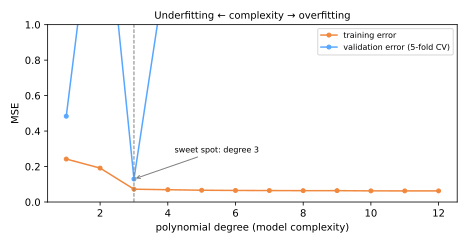

# Seleção de Modelos

Agora você já consegue treinar várias famílias de modelos e validá-las honestamente. A **seleção de modelos** é a disciplina de escolher entre elas — e entre seus hiperparâmetros — sem se enganar. Seu coração teórico é o **trade-off viés–variância**; sua armadilha mais antiga é a **regressão à média**; sua ferramenta de trabalho é a **busca em grade com validação cruzada**.

## O trade-off viés–variância

Imagine retreinar seu modelo em muitas amostras diferentes de dados de treino e observar sua previsão para um ponto fixo \(x\). Para o erro quadrático, o erro de teste esperado se decompõe:

\[
\mathbb{E}\big[(y - \hat{f}(x))^2\big] =
\underbrace{\big(f(x) - \mathbb{E}[\hat{f}(x)]\big)^2}_{\text{viés}^2}
+ \underbrace{\mathbb{E}\big[(\hat{f}(x) - \mathbb{E}[\hat{f}(x)])^2\big]}_{\text{variância}}
+ \underbrace{\sigma^2}_{\text{ruído irredutível}}
\]

- **Viés** — erro sistemático de um modelo simples demais para representar a verdade (ajuste de grau 1 a um seno: errado *em toda parte*, do mesmo jeito, a cada retreinamento);
- **Variância** — sensibilidade à amostra de treino específica (ajuste de grau 15: curvas radicalmente diferentes para cada amostra de 25 pontos);
- **Ruído** — a parte que nenhum modelo consegue remover.

Modelos simples: viés alto, variância baixa → **subajuste**. Modelos complexos: viés baixo, variância alta → **sobreajuste**. Em algum ponto intermediário está o ponto ideal — visível experimentalmente em uma **curva de validação**:



O erro de treino (laranja) cai monotonicamente com a complexidade — ele *não consegue* enxergar o sobreajuste. O erro de validação (azul) tem forma de U: cai enquanto a complexidade reduz o viés e depois sobe conforme a variância assume. **Selecione a complexidade no fundo da curva azul, nunca na laranja.**

Botões que movem você ao longo dessa curva: grau do polinômio, [regularização α](../gradient-descent-regularization/index.md#o-botao) (invertido: α maior = mais simples), profundidade da árvore ([Árvores de Decisão](../decision-trees/index.md)), k no [k-NN](../knn/index.md) (invertido), número de atributos.

Conduza você mesmo o trade-off — deslize do grau 0 (viés puro) ao 12 (variância pura) e observe os dois erros se separarem:

<div id="sim-bias-variance"></div>

### Curvas de aprendizado: mais dados valem a pena?

Plote os escores de treino e validação versus o **tamanho do conjunto de treino**:

- as curvas convergem para um escore baixo → **viés alto**: mais dados não ajudam; adicione capacidade ou atributos;
- grande diferença persistente → **variância alta**: mais dados (ou regularização) ajudarão.

## Regressão à média

Galton (1886) notou que filhos de pais muito altos costumam estar mais próximos da altura média. O fenômeno geral: **observações extremas são em parte sorte, e a sorte não se repete**. Sempre que desempenho = habilidade + ruído, o melhor colocado da primeira rodada tende a recuar na segunda — sem necessidade de nenhuma explicação causal.

Por que isso assombra a seleção de modelos: compare 50 configurações de modelo pelo escore de validação e escolha a vencedora. A vencedora venceu em parte por *ser boa* e em parte por *ter tido sorte naqueles dados de validação*. Seu escore reportado é **otimisticamente enviesado** — espere que ele regrida quando testado de novo. Concretamente:

- quanto mais configurações você tenta, mais inflado fica o melhor escore de validação;
- é por isso que o [conjunto de teste](../validation/index.md#treino-validacao-teste) intocado existe: ele dá à vencedora uma medição honesta, sem sorte;
- o mesmo efeito explica por que o vencedor do Kaggle do ano passado tem desempenho pior em dados novos, e por que o "melhor gestor de fundos de 2025" decepciona em 2026.

!!! warning "A seleção infla os escores"
    O máximo de muitas estimativas ruidosas superestima o verdadeiro melhor. Reporte o escore de **teste** da vencedora, não seu escore de validação vencedor.

## Busca em grade com validação cruzada

O `GridSearchCV` automatiza a seleção honesta de hiperparâmetros: para cada combinação em uma grade, rode CV k-fold; escolha o melhor escore médio; reajuste em todos os dados de treino.

```python
from sklearn.model_selection import GridSearchCV
from sklearn.pipeline import Pipeline

pipe = Pipeline([('preprocess', preprocess), ('model', Ridge())])

param_grid = {
    'model__alpha': [0.01, 0.1, 1, 10, 100],
    'preprocess__num__imputer__strategy': ['mean', 'median'],
}

search = GridSearchCV(pipe, param_grid, cv=5,
                      scoring='neg_root_mean_squared_error', n_jobs=-1)
search.fit(X_train, y_train)

search.best_params_       # combinação vencedora
search.best_score_        # seu escore médio de CV (otimista — veja acima!)
search.best_estimator_    # pipeline reajustado em TODOS os dados de treino
search.score(X_test, y_test)   # o número honesto
```

Notas de projeto:

- **Busque sobre o pipeline**, não sobre o modelo nu — escolhas de pré-processamento também são hiperparâmetros, e a CV dentro do pipeline permanece [livre de vazamento](../validation/index.md#vazamento-de-dados);
- O custo da grade é multiplicativo (5 α's × 2 estratégias × 5 folds = 50 ajustes) — para espaços grandes use `RandomizedSearchCV`, que amostra combinações e costuma encontrar configurações quase ótimas muito mais rápido (Bergstra & Bengio, 2012), ou as estratégias mais inteligentes do [AutoML](../automl/index.md);
- Escolha o `scoring` de acordo com o problema — F1 ou ROC-AUC para [classificação desbalanceada](../roc-imbalanced/index.md), não acurácia;
- Prefira grades em escala logarítmica para parâmetros de escala (α, C): `[0.01, 0.1, 1, 10, 100]`.

### A navalha de Occam, operacionalizada

Quando duas configurações têm escores dentro do ruído uma da outra (compare seus desvios padrão de CV), **prefira a mais simples** — menos atributos, regularização mais forte, árvores mais rasas. Modelos mais simples são mais baratos de servir, mais fáceis de [explicar](../explainability/index.md) e mais robustos a [drift](../mlops/index.md).

## Material de aula

!!! example "Notebook da aula (em português)"
    Notebook prático usado em sala — **Aula 11 — Model Selection, Regression to the Mean e GridSearchCV**:
    [:simple-googlecolab: abrir no Colab](https://colab.research.google.com/drive/1BZ8kIUgT_dVQ7IExjUUstyy59bUWYNB3){:target="_blank"}

---

## Quiz

<div id="quiz-model-selection"></div>
<script>
buildQuiz('model-selection', 'Seleção de Modelos', [
  {
    q: "Na decomposição viés–variância, 'variância' se refere a...",
    opts: [
      "a variância da variável alvo",
      "o quanto o modelo ajustado muda quando treinado em amostras diferentes de dados de treino",
      "a dispersão dos resíduos",
      "o erro de medição nos atributos"
    ],
    ans: 1,
    exp: "A variância mede a sensibilidade à amostra de treino: um polinômio de grau 15 reajustado em novas amostras de 25 pontos gera curvas radicalmente diferentes. O viés é o erro sistemático que persiste em todos os retreinamentos."
  },
  {
    q: "Por que o erro de treino continua caindo com a complexidade do modelo enquanto o erro de validação eventualmente sobe?",
    opts: [
      "Conjuntos de validação são sempre mais difíceis",
      "Mais capacidade permite que o modelo ajuste o ruído de treino (variância), o que ajuda o escore de treino mas prejudica a generalização",
      "O erro de treino é calculado com uma métrica diferente",
      "É um artefato numérico"
    ],
    ans: 1,
    exp: "Flexibilidade extra sempre pode ser usada para memorizar a amostra de treino, então o erro de treino é monótono. O erro de validação tem forma de U: o viés cai, depois a variância domina. Selecione no fundo da curva de validação."
  },
  {
    q: "As curvas de aprendizado mostram os escores de treino e validação convergindo para um platô semelhante mas decepcionante. O que você deve fazer?",
    opts: [
      "Coletar mais dados",
      "O modelo tem viés alto — aumente a capacidade ou engenhe atributos melhores; mais dados não ajudarão",
      "Aumentar a regularização",
      "Reduzir o número de folds"
    ],
    ans: 1,
    exp: "Curvas convergidas significam que a variância não é o problema; o modelo é simples demais mesmo com dados abundantes. Mais dados ajudam quando persiste uma grande diferença entre treino e validação (variância alta)."
  },
  {
    q: "Você compara 100 configurações e a vencedora pontua 0,94 na CV. O que a regressão à média prevê?",
    opts: [
      "O escore de teste também será 0,94",
      "O desempenho verdadeiro da vencedora provavelmente está abaixo de 0,94 — ela venceu em parte por sorte, e seu escore vencedor é otimisticamente enviesado",
      "A vencedora melhorará com mais folds",
      "Nada — escores de CV são não enviesados em todas as situações"
    ],
    ans: 1,
    exp: "O máximo de muitas estimativas ruidosas superestima o verdadeiro máximo. Quanto mais configurações você compara, mais inflado fica o escore vencedor. O conjunto de teste separado existe para dar uma medição honesta."
  },
  {
    q: "Por que o GridSearchCV deve envolver o pipeline inteiro em vez de apenas o modelo?",
    opts: [
      "Roda mais rápido assim",
      "Para que escolhas de pré-processamento também possam ser ajustadas, e o pré-processamento seja reajustado dentro de cada fold, evitando vazamento",
      "Pipelines não podem ser usados fora da busca em grade",
      "Para evitar definir random_state"
    ],
    ans: 1,
    exp: "Estratégia de imputação, escalonamento, seleção de atributos — todos são hiperparâmetros. Buscar sobre o pipeline os ajusta honestamente, com os transformadores de cada fold ajustados apenas na parte de treino daquele fold."
  },
  {
    q: "Duas configurações pontuam 0,912 ± 0,015 e 0,914 ± 0,016 na CV; a segunda usa 10× mais atributos. A navalha de Occam sugere...",
    opts: [
      "escolher sempre 0,914 — a maior média vence",
      "escolher o modelo mais simples: a diferença está bem dentro do ruído, e a simplicidade compra robustez, interpretabilidade e serving mais barato",
      "fazer a média dos dois modelos",
      "rodar de novo até um vencer claramente"
    ],
    ans: 1,
    exp: "Uma diferença de 0,002 contra desvio de ±0,015 é indistinguível de sorte. Quando os escores empatam dentro do ruído, prefira a configuração mais simples — ela generaliza e opera melhor."
  }
]);
</script>
