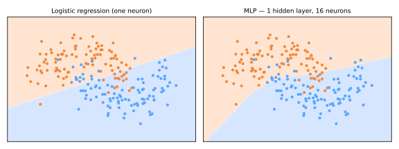

# Redes Neurais

A Parte VI começa na fronteira — e a fronteira é construída com peças que você já possui. Uma rede neural são [regressões logísticas](../logistic-regression/index.md) empilhadas e compostas, treinadas por [gradiente descendente](../gradient-descent-regularization/index.md#gradiente-descendente), regularizadas com penalidades que você conhece do [Ridge](../gradient-descent-regularization/index.md#regularizacao). Esta é a aula de transição; a jornada completa — CNNs, transformers, modelos generativos — está no curso complementar [ANN-DL](https://insper.github.io/ann-dl/).

## De um neurônio a uma rede

O **perceptron** de Rosenblatt (1958) calcula \(\hat{y} = \operatorname{step}(w^\top x + b)\) — um classificador linear. Sua regra de aprendizado é lindamente simples: percorra os dados ponto a ponto e, a cada erro, empurre os pesos em direção ao ponto classificado incorretamente: \(w \leftarrow w + \eta\, y_i x_i\). Observe-o convergir:

<div id="sim-perceptron"></div>

Minsky & Papert (1969) provaram que uma única unidade dessas não consegue resolver o XOR (nenhuma reta o separa), desencadeando o [primeiro inverno da IA](../introduction/index.md#uma-breve-historia-do-machine-learning). A saída, tornada treinável pela **retropropagação (backpropagation)** (Rumelhart, Hinton & Williams, 1986): **compor** neurônios em camadas.

Um **perceptron multicamadas (MLP)** com uma camada oculta:

\[
h = \sigma(W_1 x + b_1) \qquad\text{(camada oculta: atributos aprendidos)}
\]
\[
\hat{y} = \operatorname{softmax}(W_2\, h + b_2) \qquad\text{(uma camada logística/softmax no topo)}
\]

Leia no vocabulário do curso: a camada de saída é *exatamente* a regressão logística multiclasse — mas, em vez de rodar sobre atributos construídos à mão (os polinômios que você montou [aqui](../gradient-descent-regularization/index.md#de-retas-a-curvas-atributos-polinomiais)), roda sobre **atributos \(h\) que a rede aprende sozinha**. Essa é toda a revolução: **a engenharia de atributos vira parte da otimização.**

### Funções de ativação: a não linearidade essencial

Sem \(\sigma\), empilhar camadas colapsa: \(W_2(W_1 x) = (W_2 W_1)x\) — ainda linear. A não linearidade entre camadas é o que compra poder expressivo. Padrão moderno: **ReLU**, \(\max(0, z)\) — barata e amigável ao gradiente. O **teorema da aproximação universal** (Cybenko, 1989; Hornik, 1991): uma camada oculta com neurônios suficientes pode aproximar qualquer função contínua — a existência é garantida; *aprendê-la* eficientemente é para o que servem a profundidade, os dados e os truques de otimização.



O neurônio único traça sua única reta; dezesseis unidades ReLU ocultas aprendem uma fronteira curva — sem atributos polinomiais fornecidos, a camada oculta *inventou* a representação.

## Treino: retropropagação

O treino minimiza a [entropia cruzada](../logistic-regression/index.md#a-perda-entropia-cruzada) (ou o MSE) por [gradiente descendente em mini-batch](../gradient-descent-regularization/index.md#batch-estocastico-e-mini-batch). A **retropropagação** calcula os gradientes: é a regra da cadeia, aplicada camada por camada da perda para trás, reaproveitando resultados intermediários:

1. **Passo para frente (forward pass)** — calcular as ativações camada por camada, armazenando-as;
2. **Passo para trás (backward pass)** — propagar \(\partial L / \partial \text{ativação}\) da saída para a entrada, obtendo cada \(\partial L / \partial W_\ell\) em uma única varredura;
3. **Atualizar** — dar um passo em todos os pesos: \(W_\ell \mathrel{-}= \eta\, \partial L / \partial W_\ell\).

Nova complicação: a superfície de perda é **não convexa** — ao contrário da regressão logística, sem garantia de ótimo global. Na prática, bons mínimos locais são abundantes; métodos de momento e o **Adam** (taxas de aprendizado adaptativas, 2015) navegam de forma confiável.

Regularização, traduzida: **penalidade L2** (chamada de *weight decay*), **parada antecipada** (versão da perda de validação, como no [boosting](../gradient-boosting/index.md#o-kit-de-regularizacao)) e um truque genuinamente novo — o **dropout** (silenciar neurônios aleatoriamente durante o treino), que treina um [ensemble](../random-forest/index.md) implícito de subredes.

```python
from sklearn.neural_network import MLPClassifier
from sklearn.pipeline import make_pipeline
from sklearn.preprocessing import StandardScaler

mlp = make_pipeline(StandardScaler(),               # treinado por gradiente ⇒ escalone!
    MLPClassifier(hidden_layer_sizes=(64, 32), activation='relu',
                  alpha=1e-4,                        # penalidade L2
                  early_stopping=True, max_iter=500, random_state=0))
mlp.fit(X_train, y_train)
```

(O MLP do scikit-learn serve para experimentos tabulares; deep learning sério usa PyTorch/JAX — veja ANN-DL.)

## Por que profundidade, e quando

Redes profundas empilham muitas camadas ocultas, aprendendo **hierarquias de atributos** (bordas → texturas → partes → objetos, em visão). A profundidade compensa quando as entradas brutas são **perceptuais** — pixels, áudio, texto — onde bons atributos são desconhecidos e há dados em abundância. Foi aí que o deep learning esmagou o campo a partir de 2012 ([AlexNet](../introduction/index.md#uma-breve-historia-do-machine-learning)).

Para **dados tabulares**, a resposta atual honesta permanece: o [gradient boosting](../gradient-boosting/index.md#floresta-ou-boosting) geralmente vence, com menos ajuste e menos dados. Escolha pelo tipo de dado, não pelo hype:

| Dado | Primeira escolha |
|------|------------------|
| tabular / estruturado | árvores com boosting ([Parte V](../gradient-boosting/index.md)) |
| imagens, áudio, vídeo | CNNs / vision transformers → ANN-DL |
| texto | transformers (os [embeddings](../text-representation/index.md) que você já usou) |
| conjuntos minúsculos | modelos lineares, k-NN |

---

## Quiz

<div id="quiz-neural-networks"></div>
<script>
buildQuiz('neural-networks', 'Redes Neurais', [
  {
    q: "Por que uma rede multicamadas precisa de funções de ativação não lineares entre as camadas?",
    opts: [
      "Para tornar o treino mais rápido",
      "Sem elas, a composição de camadas lineares colapsa em um único mapa linear — não mais expressivo que a regressão logística",
      "Para manter os pesos positivos",
      "Porque a retropropagação exige especificamente a sigmoide"
    ],
    ans: 1,
    exp: "W₂(W₁x) = (W₂W₁)x: camadas lineares empilhadas são uma única camada linear. A não linearidade (ReLU, sigmoide, tanh) entre camadas é o que permite à rede construir fronteiras de decisão curvas e atributos hierárquicos."
  },
  {
    q: "A camada de saída de um classificador neural (escores lineares + softmax + entropia cruzada) é exatamente...",
    opts: [
      "uma árvore de decisão",
      "regressão logística multiclasse, operando sobre atributos aprendidos pelas camadas ocultas",
      "uma máquina de vetores de suporte",
      "análise de componentes principais"
    ],
    ans: 1,
    exp: "A camada final é a regressão softmax da Parte IV. A diferença são suas entradas: atributos construídos à mão antes, representações aprendidas agora — a engenharia de atributos se moveu para dentro da otimização."
  },
  {
    q: "A retropropagação é melhor descrita como...",
    opts: [
      "um novo otimizador que substitui o gradiente descendente",
      "uma aplicação eficiente da regra da cadeia que calcula o gradiente da perda em relação a cada peso em uma única varredura para trás",
      "um método para inicializar pesos",
      "uma técnica de regularização"
    ],
    ans: 1,
    exp: "A retropropagação calcula gradientes; o gradiente descendente (SGD/Adam) então os usa para atualizar os pesos. Sua eficiência — reaproveitar as ativações do forward armazenadas camada por camada — é o que torna viável treinar redes profundas."
  },
  {
    q: "Ao contrário da regressão logística, treinar uma rede neural é um problema não convexo. Na prática isso significa...",
    opts: [
      "redes neurais não podem ser treinadas",
      "não há garantia de ótimo global — mas bons mínimos locais são tipicamente abundantes e alcançáveis com SGD/Adam",
      "a taxa de aprendizado precisa ser zero",
      "a perda sempre aumenta"
    ],
    ans: 1,
    exp: "A convexidade (um único mínimo global) se perde quando as camadas se compõem. Empiricamente, redes superparametrizadas têm muitos bons mínimos; otimizadores adaptativos, momento e esquemas de inicialização os encontram de forma confiável."
  },
  {
    q: "O dropout regulariza uma rede ao...",
    opts: [
      "remover permanentemente os menores pesos",
      "desativar neurônios aleatoriamente durante o treino, forçando redundância — como treinar um ensemble implícito de subredes",
      "reduzir a taxa de aprendizado ao longo do tempo",
      "excluir exemplos de treino"
    ],
    ans: 1,
    exp: "Cada batch treina uma subrede aleatória, então nenhum neurônio pode depender demais de outros específicos. No teste, todos os neurônios estão ativos (com escalonamento) — efetivamente fazendo a média do ensemble, ecoando a ideia da random forest."
  },
  {
    q: "Para uma tabela de clientes com 50.000 linhas e colunas numéricas e categóricas, as evidências atuais sugerem que você deve primeiro experimentar...",
    opts: [
      "um MLP profundo — redes neurais são sempre superiores",
      "gradient boosting, já que árvores com boosting continuam sendo as mais fortes e baratas em dados tabulares",
      "uma rede convolucional",
      "k-means"
    ],
    ans: 1,
    exp: "O deep learning domina a percepção (imagens, áudio, texto), onde os atributos precisam ser aprendidos do sinal bruto. Em tabelas estruturadas, os benchmarks continuam favorecendo XGBoost/LightGBM — com muito menos ajuste e fome de dados."
  }
]);
</script>
