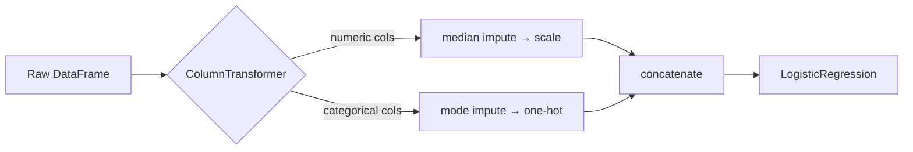

# Pipelines

A real preprocessing chain — impute, encode, scale, then model — is a sequence of steps that must be **fit on training data only** and **replayed identically** on validation folds, the test set, and production traffic. Doing this by hand invites bugs. scikit-learn's `Pipeline` packages the whole chain as a single estimator.

## The problem pipelines solve

Without a pipeline, the honest workflow requires careful bookkeeping:

```python
# Fragile: every step must be manually fit on train, applied to test
imputer.fit(X_train)
X_train_i = imputer.transform(X_train)
X_test_i = imputer.transform(X_test)

scaler.fit(X_train_i)
X_train_s = scaler.transform(X_train_i)
X_test_s = scaler.transform(X_test_i)

model.fit(X_train_s, y_train)
model.predict(X_test_s)
```

One misplaced `fit` — or a `fit_transform` on the full dataset — and you have [data leakage](../validation/index.md). Worse, during [cross-validation](../validation/index.md#cross-validation) the preprocessing must be re-fit on *each* training fold, which is practically impossible to do correctly by hand.

## `Pipeline`: one estimator, many steps

```python
from sklearn.pipeline import Pipeline
from sklearn.impute import SimpleImputer
from sklearn.preprocessing import StandardScaler
from sklearn.linear_model import LogisticRegression

pipe = Pipeline([
    ('imputer', SimpleImputer(strategy='median')),
    ('scaler', StandardScaler()),
    ('model', LogisticRegression()),
])

pipe.fit(X_train, y_train)      # fits imputer → scaler → model, in order, on train
pipe.predict(X_test)            # transforms X_test through the SAME fitted steps
```

Rules of the composition:

- every step except the last must be a **transformer** (`fit` + `transform`);
- the last step is typically an **estimator** (`fit` + `predict`);
- `pipe.fit(X, y)` calls `fit_transform` on each transformer in sequence, then `fit` on the estimator;
- `pipe.predict(X)` calls only `transform` on each transformer — parameters are frozen.

Because the pipeline *is* an estimator, it drops directly into `cross_val_score` and `GridSearchCV` — and preprocessing is automatically re-fit inside each fold, killing the leakage bug by construction:

```python
from sklearn.model_selection import cross_val_score
scores = cross_val_score(pipe, X, y, cv=5)   # leak-free by design
```

## Heterogeneous columns: `ColumnTransformer`

Real tables mix numeric and categorical columns that need *different* treatments. `ColumnTransformer` routes column subsets to parallel preprocessing branches and concatenates the results:

```python
from sklearn.compose import ColumnTransformer
from sklearn.preprocessing import OneHotEncoder

numeric = ['age', 'income', 'tenure']
categorical = ['city', 'plan', 'device']

preprocess = ColumnTransformer([
    ('num', Pipeline([
        ('imputer', SimpleImputer(strategy='median')),
        ('scaler', StandardScaler()),
    ]), numeric),
    ('cat', Pipeline([
        ('imputer', SimpleImputer(strategy='most_frequent')),
        ('onehot', OneHotEncoder(handle_unknown='ignore')),
    ]), categorical),
])

pipe = Pipeline([
    ('preprocess', preprocess),
    ('model', LogisticRegression(max_iter=1000)),
])
```



## Tuning through the pipeline

Hyperparameters of any step are addressed as `stepname__paramname` (double underscore) — so a single grid search can tune preprocessing choices *and* model hyperparameters together, honestly:

```python
from sklearn.model_selection import GridSearchCV

param_grid = {
    'preprocess__num__imputer__strategy': ['mean', 'median'],
    'model__C': [0.01, 0.1, 1, 10],
}
search = GridSearchCV(pipe, param_grid, cv=5, scoring='f1')
search.fit(X_train, y_train)
```

More on this in [Model Selection](../model-selection/index.md).

## Inspection and persistence

```python
pipe.named_steps['model'].coef_            # access any fitted step
pipe[:-1].transform(X_train)               # run preprocessing only
pipe.get_feature_names_out()               # names after one-hot expansion

import joblib
joblib.dump(pipe, 'churn-model.joblib')    # ship ONE artifact: preprocessing + model
```

Persisting the whole pipeline is the foundation of reliable [MLOps](../mlops/index.md): production code cannot "forget" a preprocessing step, because the steps travel inside the artifact.

!!! tip "Design habit"
    Start every project by writing the pipeline skeleton — even before choosing the model. It forces the train/test discipline from the first line of code and makes every later experiment a one-line change.

## Class materials

!!! example "Class notebook (in Portuguese)"
    Hands-on notebook used in class — **Aula 04 — Pipelines**:
    [:simple-googlecolab: open in Colab](https://colab.research.google.com/drive/1U25v7jqB3NOIaDICjIp4nUt3eBgZo3d0){:target="_blank"}

---

## Quiz

<div id="quiz-pipelines"></div>
<script>
buildQuiz('pipelines', 'Pipelines', [
  {
    q: "What is the main correctness (not convenience) argument for using a Pipeline?",
    opts: [
      "It makes the code shorter",
      "It guarantees preprocessing is fit only on training data — including inside every cross-validation fold",
      "It makes models train faster",
      "It automatically chooses the best model"
    ],
    ans: 1,
    exp: "When a pipeline is passed to cross_val_score or GridSearchCV, each fold re-fits the transformers on that fold's training portion only. Doing that manually is error-prone; the pipeline makes leakage structurally impossible."
  },
  {
    q: "In a Pipeline, what is required of every step except the last?",
    opts: [
      "It must be a classifier",
      "It must implement fit and transform (be a transformer)",
      "It must be a ColumnTransformer",
      "It must not have hyperparameters"
    ],
    ans: 1,
    exp: "Intermediate steps transform the data flowing through; only the final step is an estimator with predict. That is why the imputer and scaler come before the model."
  },
  {
    q: "When you call pipe.predict(X_test), what happens in the preprocessing steps?",
    opts: [
      "They are re-fit on X_test to adapt to the new distribution",
      "They are skipped",
      "They apply transform using parameters learned during pipe.fit on training data",
      "They raise an error if X_test differs from X_train"
    ],
    ans: 2,
    exp: "Prediction must replay exactly the transformations learned at training time. Re-fitting on test data would be leakage — and in production there is often no batch to fit on anyway."
  },
  {
    q: "Why is ColumnTransformer needed in addition to Pipeline?",
    opts: [
      "Pipelines only accept NumPy arrays",
      "Numeric and categorical columns need different, parallel preprocessing branches applied to different column subsets",
      "ColumnTransformer is faster than Pipeline",
      "It replaces the need for encoders"
    ],
    ans: 1,
    exp: "Pipeline chains steps sequentially over all columns; ColumnTransformer splits columns into groups (e.g., numeric → impute+scale, categorical → impute+one-hot) and concatenates the outputs."
  },
  {
    q: "In param_grid = {'model__C': [0.1, 1]}, what does the double underscore mean?",
    opts: [
      "It is a typo",
      "It accesses parameter C of the pipeline step named 'model'",
      "It multiplies C by 2",
      "It creates a new step called model__C"
    ],
    ans: 1,
    exp: "The stepname__param convention lets GridSearchCV reach inside composite estimators — including nested ones like preprocess__num__imputer__strategy."
  },
  {
    q: "Why should you persist (joblib.dump) the entire fitted pipeline rather than just the model?",
    opts: [
      "The file becomes smaller",
      "Because production inputs are raw and must pass through the exact fitted preprocessing; shipping one artifact prevents training/serving mismatch",
      "Models cannot be saved without a pipeline",
      "To hide the model hyperparameters"
    ],
    ans: 1,
    exp: "If preprocessing lives in separate code, the serving path can drift from the training path (different scaler stats, missing steps). One serialized pipeline = one source of truth."
  }
]);
</script>
