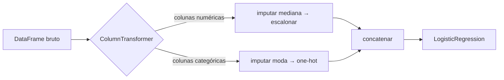

# Pipelines

Uma cadeia real de pré-processamento — imputar, codificar, escalonar e então modelar — é uma sequência de passos que deve ser **ajustada apenas nos dados de treino** e **reproduzida de forma idêntica** nos folds de validação, no conjunto de teste e no tráfego de produção. Fazer isso à mão convida a bugs. O `Pipeline` do scikit-learn empacota toda a cadeia como um único estimador.

## O problema que os pipelines resolvem

Sem um pipeline, o fluxo honesto exige uma contabilidade cuidadosa:

```python
# Frágil: cada passo precisa ser ajustado à mão no treino e aplicado ao teste
imputer.fit(X_train)
X_train_i = imputer.transform(X_train)
X_test_i = imputer.transform(X_test)

scaler.fit(X_train_i)
X_train_s = scaler.transform(X_train_i)
X_test_s = scaler.transform(X_test_i)

model.fit(X_train_s, y_train)
model.predict(X_test_s)
```

Um `fit` fora do lugar — ou um `fit_transform` no conjunto completo — e você tem [vazamento de dados](../validation/index.md). Pior: durante a [validação cruzada](../validation/index.md#validacao-cruzada) o pré-processamento precisa ser reajustado em *cada* fold de treino, o que é praticamente impossível de fazer corretamente à mão.

## `Pipeline`: um estimador, vários passos

```python
from sklearn.pipeline import Pipeline
from sklearn.impute import SimpleImputer
from sklearn.preprocessing import StandardScaler
from sklearn.linear_model import LogisticRegression

pipe = Pipeline([
    ('imputer', SimpleImputer(strategy='median')),
    ('scaler', StandardScaler()),
    ('model', LogisticRegression()),
])

pipe.fit(X_train, y_train)      # ajusta imputer → scaler → model, em ordem, no treino
pipe.predict(X_test)            # transforma X_test pelos MESMOS passos ajustados
```

Regras da composição:

- todo passo, exceto o último, deve ser um **transformador** (`fit` + `transform`);
- o último passo é tipicamente um **estimador** (`fit` + `predict`);
- `pipe.fit(X, y)` chama `fit_transform` em cada transformador em sequência e depois `fit` no estimador;
- `pipe.predict(X)` chama apenas `transform` em cada transformador — os parâmetros ficam congelados.

Como o pipeline *é* um estimador, ele se encaixa diretamente em `cross_val_score` e `GridSearchCV` — e o pré-processamento é automaticamente reajustado dentro de cada fold, eliminando o bug de vazamento por construção:

```python
from sklearn.model_selection import cross_val_score
scores = cross_val_score(pipe, X, y, cv=5)   # livre de vazamento por design
```

## Colunas heterogêneas: `ColumnTransformer`

Tabelas reais misturam colunas numéricas e categóricas que precisam de tratamentos *diferentes*. O `ColumnTransformer` roteia subconjuntos de colunas para ramos de pré-processamento paralelos e concatena os resultados:

```python
from sklearn.compose import ColumnTransformer
from sklearn.preprocessing import OneHotEncoder

numeric = ['age', 'income', 'tenure']
categorical = ['city', 'plan', 'device']

preprocess = ColumnTransformer([
    ('num', Pipeline([
        ('imputer', SimpleImputer(strategy='median')),
        ('scaler', StandardScaler()),
    ]), numeric),
    ('cat', Pipeline([
        ('imputer', SimpleImputer(strategy='most_frequent')),
        ('onehot', OneHotEncoder(handle_unknown='ignore')),
    ]), categorical),
])

pipe = Pipeline([
    ('preprocess', preprocess),
    ('model', LogisticRegression(max_iter=1000)),
])
```



## Ajuste através do pipeline

Os hiperparâmetros de qualquer passo são endereçados como `nomedopasso__nomedoparam` (duplo sublinhado) — assim, uma única busca em grade pode ajustar escolhas de pré-processamento *e* hiperparâmetros do modelo juntos, de forma honesta:

```python
from sklearn.model_selection import GridSearchCV

param_grid = {
    'preprocess__num__imputer__strategy': ['mean', 'median'],
    'model__C': [0.01, 0.1, 1, 10],
}
search = GridSearchCV(pipe, param_grid, cv=5, scoring='f1')
search.fit(X_train, y_train)
```

Mais sobre isso em [Seleção de Modelos](../model-selection/index.md).

## Inspeção e persistência

```python
pipe.named_steps['model'].coef_            # acessar qualquer passo ajustado
pipe[:-1].transform(X_train)               # rodar apenas o pré-processamento
pipe.get_feature_names_out()               # nomes após a expansão one-hot

import joblib
joblib.dump(pipe, 'churn-model.joblib')    # entregar UM artefato: pré-processamento + modelo
```

Persistir o pipeline inteiro é a base de um [MLOps](../mlops/index.md) confiável: o código de produção não pode "esquecer" um passo de pré-processamento, porque os passos viajam dentro do artefato.

!!! tip "Hábito de projeto"
    Comece todo projeto escrevendo o esqueleto do pipeline — antes mesmo de escolher o modelo. Isso impõe a disciplina treino/teste desde a primeira linha de código e torna cada experimento posterior uma mudança de uma linha.

## Material de aula

!!! example "Notebook da aula (em português)"
    Notebook prático usado em sala — **Aula 04 — Pipelines**:
    [:simple-googlecolab: abrir no Colab](https://colab.research.google.com/drive/1U25v7jqB3NOIaDICjIp4nUt3eBgZo3d0){:target="_blank"}

---

## Quiz

<div id="quiz-pipelines"></div>
<script>
buildQuiz('pipelines', 'Pipelines', [
  {
    q: "Qual é o principal argumento de correção (não de conveniência) para usar um Pipeline?",
    opts: [
      "Torna o código mais curto",
      "Garante que o pré-processamento seja ajustado apenas nos dados de treino — inclusive dentro de cada fold da validação cruzada",
      "Faz os modelos treinarem mais rápido",
      "Escolhe automaticamente o melhor modelo"
    ],
    ans: 1,
    exp: "Quando um pipeline é passado a cross_val_score ou GridSearchCV, cada fold reajusta os transformadores apenas na porção de treino daquele fold. Fazer isso à mão é propenso a erros; o pipeline torna o vazamento estruturalmente impossível."
  },
  {
    q: "Em um Pipeline, o que é exigido de todo passo exceto o último?",
    opts: [
      "Deve ser um classificador",
      "Deve implementar fit e transform (ser um transformador)",
      "Deve ser um ColumnTransformer",
      "Não pode ter hiperparâmetros"
    ],
    ans: 1,
    exp: "Os passos intermediários transformam os dados que fluem por eles; apenas o passo final é um estimador com predict. Por isso o imputer e o scaler vêm antes do modelo."
  },
  {
    q: "Quando você chama pipe.predict(X_test), o que acontece nos passos de pré-processamento?",
    opts: [
      "São reajustados em X_test para se adaptar à nova distribuição",
      "São ignorados",
      "Aplicam transform usando os parâmetros aprendidos durante pipe.fit nos dados de treino",
      "Lançam um erro se X_test diferir de X_train"
    ],
    ans: 2,
    exp: "A previsão precisa reproduzir exatamente as transformações aprendidas no treino. Reajustar nos dados de teste seria vazamento — e em produção muitas vezes nem há um lote para ajustar."
  },
  {
    q: "Por que o ColumnTransformer é necessário além do Pipeline?",
    opts: [
      "Pipelines só aceitam arrays NumPy",
      "Colunas numéricas e categóricas precisam de ramos de pré-processamento diferentes e paralelos, aplicados a subconjuntos de colunas diferentes",
      "O ColumnTransformer é mais rápido que o Pipeline",
      "Ele substitui a necessidade de codificadores"
    ],
    ans: 1,
    exp: "O Pipeline encadeia passos sequencialmente sobre todas as colunas; o ColumnTransformer divide as colunas em grupos (ex.: numéricas → imputar+escalonar, categóricas → imputar+one-hot) e concatena as saídas."
  },
  {
    q: "Em param_grid = {'model__C': [0.1, 1]}, o que o duplo sublinhado significa?",
    opts: [
      "É um erro de digitação",
      "Acessa o parâmetro C do passo do pipeline chamado 'model'",
      "Multiplica C por 2",
      "Cria um novo passo chamado model__C"
    ],
    ans: 1,
    exp: "A convenção nomedopasso__param permite que o GridSearchCV alcance o interior de estimadores compostos — inclusive aninhados como preprocess__num__imputer__strategy."
  },
  {
    q: "Por que você deve persistir (joblib.dump) o pipeline ajustado inteiro em vez de apenas o modelo?",
    opts: [
      "O arquivo fica menor",
      "Porque as entradas de produção são brutas e precisam passar pelo pré-processamento ajustado exato; entregar um artefato evita divergência entre treino e serving",
      "Modelos não podem ser salvos sem um pipeline",
      "Para esconder os hiperparâmetros do modelo"
    ],
    ans: 1,
    exp: "Se o pré-processamento vive em código separado, o caminho de serving pode divergir do caminho de treino (estatísticas de scaler diferentes, passos faltando). Um pipeline serializado = uma única fonte de verdade."
  }
]);
</script>
