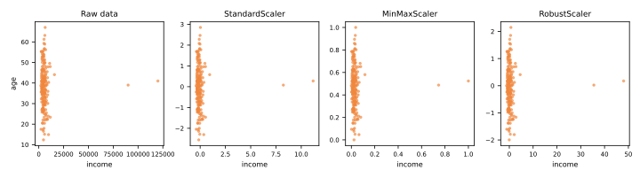
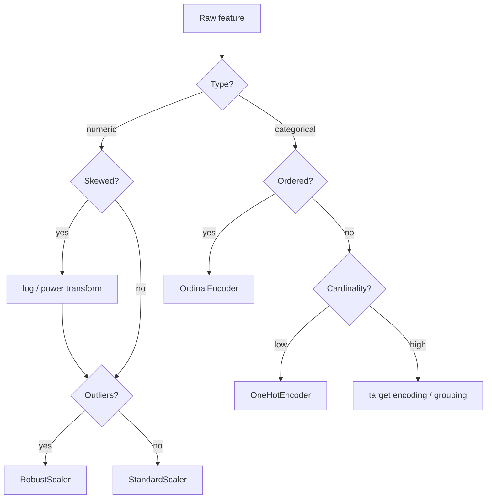

# Data Preprocessing

Raw data is almost never ready for a learning algorithm. Features live on different scales, categories are stored as strings, values are missing, and distributions are skewed. **Preprocessing** transforms raw features into a representation the algorithm can exploit — and done wrong, it is also the easiest place to leak information (see [Validation & Data Leakage](../validation/index.md)).

## Why scale features?

Many algorithms are **distance-based or gradient-based**, and both are distorted when features have wildly different magnitudes:

- [k-NN](../knn/index.md) computes Euclidean distances: a feature ranging in the thousands (income) drowns out one ranging in the tens (age);
- [Gradient descent](../gradient-descent-regularization/index.md) converges slowly on elongated loss surfaces created by unscaled features;
- [SVMs](../svm/index.md) and regularized models ([Ridge/Lasso](../gradient-descent-regularization/index.md)) penalize coefficients as if features were comparable;
- [PCA](../dimensionality-reduction/index.md) finds directions of maximum variance — the largest-scale feature wins by default.

Tree-based models ([decision trees](../decision-trees/index.md), [random forests](../random-forest/index.md), [gradient boosting](../gradient-boosting/index.md)) are the notable exception: they split on thresholds, so monotonic transformations do not affect them.

## Scaling methods

**Standardization** (z-score): center at zero, unit variance —

\[
x' = \frac{x - \mu}{\sigma}
\]

**Min-max normalization**: squeeze into \([0, 1]\) —

\[
x' = \frac{x - x_{\min}}{x_{\max} - x_{\min}}
\]

**Robust scaling**: use median and IQR instead of mean and standard deviation —

\[
x' = \frac{x - \text{median}(x)}{\text{IQR}(x)}
\]

The choice matters when outliers are present. Min-max is fully determined by the two most extreme points; standardization is somewhat distorted by them; robust scaling ignores them:



| Scaler | Formula anchors | Sensitive to outliers? | Typical use |
|--------|----------------|------------------------|-------------|
| `StandardScaler` | mean, std | moderately | default for linear models, SVM, PCA |
| `MinMaxScaler` | min, max | **highly** | when a bounded range is required (e.g. pixel values, some neural nets) |
| `RobustScaler` | median, IQR | robust | data with heavy tails / outliers |

```python
from sklearn.preprocessing import StandardScaler

scaler = StandardScaler()
X_train_scaled = scaler.fit_transform(X_train)  # learn μ, σ on TRAIN only
X_test_scaled = scaler.transform(X_test)        # apply the SAME μ, σ
```

!!! danger "Fit on train, transform on test"
    `fit` learns the parameters (\(\mu, \sigma\), min/max...). Calling `fit` (or `fit_transform`) on the test set — or on the full dataset before splitting — leaks information about the test distribution into training. This is the single most common leakage bug, and [Pipelines](../pipelines/index.md) exist largely to prevent it.

## Skewed features

Right-skewed features (income, prices, counts) often benefit from a **log transform**, \(x' = \log(1 + x)\), which compresses the long tail and makes the distribution more symmetric. More general tools: `PowerTransformer` (Box-Cox, Yeo-Johnson) and `QuantileTransformer`.

## Encoding categorical features

Algorithms consume numbers, not strings. The two workhorses:

**One-hot encoding** — one binary column per category:

```python
from sklearn.preprocessing import OneHotEncoder
enc = OneHotEncoder(handle_unknown='ignore')  # unseen categories → all zeros
```

- Safe for **nominal** categories (no order): city, color, product type;
- Explodes dimensionality for high-cardinality features (zip codes → thousands of columns).

**Ordinal encoding** — map categories to integers:

```python
from sklearn.preprocessing import OrdinalEncoder
enc = OrdinalEncoder(categories=[['small', 'medium', 'large']])
```

- Correct for **ordinal** categories (small < medium < large);
- **Wrong** for nominal ones: encoding cities as São Paulo=0, Rio=1, Recife=2 invents an order and distances that do not exist — linear models and k-NN will happily exploit the fiction.

For high-cardinality features, consider **target encoding** (replace each category by a smoothed mean of the target) — powerful but leakage-prone: it must be fit inside cross-validation.

## Missing value imputation

Building on the [EDA discussion of missingness mechanisms](../eda/index.md#missing-values-the-why-matters):

```python
from sklearn.impute import SimpleImputer, KNNImputer

SimpleImputer(strategy='median')       # numeric: robust default
SimpleImputer(strategy='most_frequent')  # categorical
KNNImputer(n_neighbors=5)              # impute from similar rows
```

Two useful practices:

- add a **missing-indicator** column (`add_indicator=True`) — the *fact* that a value was missing is often predictive;
- impute inside a [Pipeline](../pipelines/index.md), so the imputation statistics are learned from training folds only.

!!! warning "Never impute the target"
    Rows with a missing target should be dropped from supervised training — inventing labels manufactures signal that does not exist.

## The preprocessing map



---

## Quiz

<div id="quiz-preprocessing"></div>
<script>
buildQuiz('preprocessing', 'Data Preprocessing', [
  {
    q: "Why does k-NN require feature scaling while decision trees do not?",
    opts: [
      "k-NN uses distances, which are dominated by large-scale features; trees split on per-feature thresholds, unaffected by monotonic scaling",
      "Trees cannot handle numeric features at all",
      "k-NN only works with values between 0 and 1",
      "Scaling makes trees overfit"
    ],
    ans: 0,
    exp: "Euclidean distance sums squared differences: a feature in the thousands dominates one in the tens. A tree asks 'is income > 5000?' — the answer is the same on any monotonically rescaled version of the feature."
  },
  {
    q: "Your data has heavy outliers. Which scaler is most distorted by them?",
    opts: [
      "RobustScaler",
      "MinMaxScaler",
      "StandardScaler",
      "They are all equally affected"
    ],
    ans: 1,
    exp: "MinMaxScaler is anchored on the minimum and maximum — the two most extreme points. One outlier compresses all the normal data into a tiny sliver of [0,1]. RobustScaler (median/IQR) is the resistant choice."
  },
  {
    q: "What is wrong with calling scaler.fit_transform(X) on the entire dataset before the train/test split?",
    opts: [
      "Nothing — it is the recommended practice",
      "It is slower than fitting twice",
      "The scaler learns statistics (mean, std) from test rows, leaking test-set information into training",
      "It changes the data types of the columns"
    ],
    ans: 2,
    exp: "Preprocessing parameters are part of the model. Learning them from data that includes the test set gives the model information about 'the future', inflating evaluation scores. Fit on train, transform on test."
  },
  {
    q: "Encoding the nominal feature city as São Paulo=0, Rio=1, Recife=2 and feeding it to k-NN is problematic because...",
    opts: [
      "k-NN cannot handle integers",
      "it invents an artificial order and distances between cities that the algorithm will treat as real",
      "there are too many cities in Brazil",
      "one-hot encoding is always slower"
    ],
    ans: 1,
    exp: "Ordinal encoding asserts Recife is 'twice as far' from São Paulo as Rio is. For nominal categories use one-hot encoding, which makes all categories equidistant."
  },
  {
    q: "A feature like income is strongly right-skewed. A common transformation to make it better behaved for linear models is...",
    opts: [
      "squaring it",
      "one-hot encoding it",
      "log(1 + x)",
      "removing all values above the mean"
    ],
    ans: 2,
    exp: "The log transform compresses the long right tail, making the distribution more symmetric and relationships more linear. log(1+x) handles zeros gracefully."
  },
  {
    q: "Why add a missing-indicator column when imputing?",
    opts: [
      "To increase the dataset size",
      "Because scikit-learn requires it",
      "Because the fact that a value was missing can itself carry predictive signal",
      "To avoid using the median"
    ],
    ans: 2,
    exp: "Missingness is often informative (e.g., customers who skip the income field behave differently). Imputation erases that signal; the indicator column preserves it."
  }
]);
</script>
