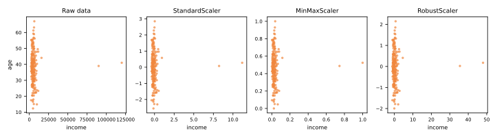
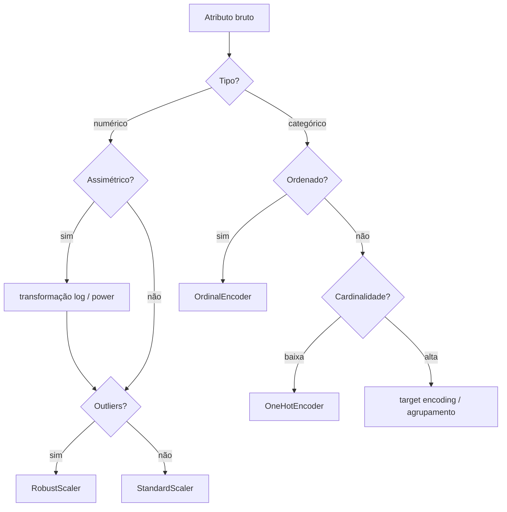

# Pré-processamento de Dados

Dados brutos quase nunca estão prontos para um algoritmo de aprendizado. Os atributos vivem em escalas diferentes, categorias são armazenadas como strings, valores estão faltando e distribuições são assimétricas. O **pré-processamento** transforma atributos brutos em uma representação que o algoritmo consegue explorar — e, feito errado, é também o lugar mais fácil de vazar informação (ver [Validação & Vazamento de Dados](../validation/index.md)).

## Por que escalonar atributos?

Muitos algoritmos são **baseados em distância ou em gradiente**, e ambos são distorcidos quando os atributos têm magnitudes muito diferentes:

- o [k-NN](../knn/index.md) calcula distâncias euclidianas: um atributo na casa dos milhares (renda) abafa um na casa das dezenas (idade);
- o [gradiente descendente](../gradient-descent-regularization/index.md) converge devagar em superfícies de perda alongadas criadas por atributos não escalonados;
- [SVMs](../svm/index.md) e modelos regularizados ([Ridge/Lasso](../gradient-descent-regularization/index.md)) penalizam coeficientes como se os atributos fossem comparáveis;
- o [PCA](../dimensionality-reduction/index.md) encontra direções de variância máxima — o atributo de maior escala vence por padrão.

Modelos baseados em árvores ([árvores de decisão](../decision-trees/index.md), [random forests](../random-forest/index.md), [gradient boosting](../gradient-boosting/index.md)) são a exceção notável: eles dividem por limiares, então transformações monotônicas não os afetam.

## Métodos de escalonamento

**Padronização** (z-score): centrar em zero, variância unitária —

\[
x' = \frac{x - \mu}{\sigma}
\]

**Normalização min-max**: comprimir para \([0, 1]\) —

\[
x' = \frac{x - x_{\min}}{x_{\max} - x_{\min}}
\]

**Escalonamento robusto**: usar mediana e IQR em vez de média e desvio padrão —

\[
x' = \frac{x - \text{mediana}(x)}{\text{IQR}(x)}
\]

A escolha importa quando há outliers. O min-max é totalmente determinado pelos dois pontos mais extremos; a padronização é um pouco distorcida por eles; o escalonamento robusto os ignora:



| Escalonador | Âncoras da fórmula | Sensível a outliers? | Uso típico |
|-------------|--------------------|----------------------|------------|
| `StandardScaler` | média, desvio | moderadamente | padrão para modelos lineares, SVM, PCA |
| `MinMaxScaler` | mín, máx | **muito** | quando é preciso um intervalo limitado (ex.: valores de pixel, algumas redes neurais) |
| `RobustScaler` | mediana, IQR | robusto | dados com caudas pesadas / outliers |

```python
from sklearn.preprocessing import StandardScaler

scaler = StandardScaler()
X_train_scaled = scaler.fit_transform(X_train)  # aprende μ, σ APENAS no TREINO
X_test_scaled = scaler.transform(X_test)        # aplica os MESMOS μ, σ
```

!!! danger "Ajuste no treino, transforme no teste"
    O `fit` aprende os parâmetros (\(\mu, \sigma\), mín/máx...). Chamar `fit` (ou `fit_transform`) no conjunto de teste — ou no conjunto completo antes da divisão — vaza informação sobre a distribuição de teste para o treino. Esse é o bug de vazamento mais comum de todos, e os [Pipelines](../pipelines/index.md) existem em grande parte para evitá-lo.

## Atributos assimétricos

Atributos assimétricos à direita (renda, preços, contagens) muitas vezes se beneficiam de uma **transformação logarítmica**, \(x' = \log(1 + x)\), que comprime a cauda longa e torna a distribuição mais simétrica. Ferramentas mais gerais: `PowerTransformer` (Box-Cox, Yeo-Johnson) e `QuantileTransformer`.

## Codificação de atributos categóricos

Algoritmos consomem números, não strings. Os dois cavalos de batalha:

**One-hot encoding** — uma coluna binária por categoria:

```python
from sklearn.preprocessing import OneHotEncoder
enc = OneHotEncoder(handle_unknown='ignore')  # categorias não vistas → tudo zero
```

- Seguro para categorias **nominais** (sem ordem): cidade, cor, tipo de produto;
- Explode a dimensionalidade para atributos de alta cardinalidade (CEPs → milhares de colunas).

**Codificação ordinal** — mapear categorias para inteiros:

```python
from sklearn.preprocessing import OrdinalEncoder
enc = OrdinalEncoder(categories=[['pequeno', 'médio', 'grande']])
```

- Correta para categorias **ordinais** (pequeno < médio < grande);
- **Errada** para as nominais: codificar cidades como São Paulo=0, Rio=1, Recife=2 inventa uma ordem e distâncias que não existem — modelos lineares e o k-NN explorarão alegremente a ficção.

Para atributos de alta cardinalidade, considere **target encoding** (substituir cada categoria por uma média suavizada do alvo) — poderoso, mas propenso a vazamento: precisa ser ajustado dentro da validação cruzada.

## Imputação de valores faltantes

Complementando a [discussão da EDA sobre mecanismos de falta](../eda/index.md#valores-faltantes-o-porque-importa):

```python
from sklearn.impute import SimpleImputer, KNNImputer

SimpleImputer(strategy='median')         # numérico: padrão robusto
SimpleImputer(strategy='most_frequent')  # categórico
KNNImputer(n_neighbors=5)                # imputar a partir de linhas semelhantes
```

Duas práticas úteis:

- adicionar uma coluna de **indicador de falta** (`add_indicator=True`) — o *fato* de um valor estar faltando muitas vezes é preditivo;
- imputar dentro de um [Pipeline](../pipelines/index.md), para que as estatísticas de imputação sejam aprendidas apenas dos folds de treino.

!!! warning "Nunca impute o alvo"
    Linhas com alvo faltante devem ser descartadas do treino supervisionado — inventar rótulos fabrica sinal que não existe.

## O mapa do pré-processamento



## Material de aula

!!! example "Notebook da aula (em português)"
    Notebook prático usado em sala — **Aula 03 — Normalização**:
    [:simple-googlecolab: abrir no Colab](https://colab.research.google.com/drive/1h1pv5pIiv2w4BZM0K8BGOA031yQeOLT0){:target="_blank"}

!!! abstract "Roteiro completo de transformação — Titanic (em português)"
    Material de referência de 3 h partindo dos dados faltantes: mecanismos MCAR / MAR / MNAR com
    evidência empírica, diagrama de decisão de técnicas por tipo de variável, escalonamento e
    transformação de forma, codificação de categóricas, vazamento medido em quatro cenários, e um
    exercício de aula em sete *checkpoints* que constrói a matriz de atributos sem usar modelo algum.

    [:material-file-document-outline: abrir o roteiro](../../handouts/handout-normalizacao-titanic.html){:target="_blank"}

---

## Quiz

<div id="quiz-preprocessing"></div>
<script>
buildQuiz('preprocessing', 'Pré-processamento de Dados', [
  {
    q: "Por que o k-NN exige escalonamento de atributos, mas as árvores de decisão não?",
    opts: [
      "O k-NN usa distâncias, dominadas por atributos de grande escala; árvores dividem por limiares de cada atributo, sem serem afetadas por escalonamento monotônico",
      "Árvores não conseguem lidar com atributos numéricos",
      "O k-NN só funciona com valores entre 0 e 1",
      "O escalonamento faz árvores sobreajustarem"
    ],
    ans: 0,
    exp: "A distância euclidiana soma diferenças ao quadrado: um atributo na casa dos milhares domina um na casa das dezenas. Uma árvore pergunta 'renda > 5000?' — a resposta é a mesma em qualquer versão monotonicamente reescalonada do atributo."
  },
  {
    q: "Seus dados têm outliers pesados. Qual escalonador é mais distorcido por eles?",
    opts: [
      "RobustScaler",
      "MinMaxScaler",
      "StandardScaler",
      "Todos são afetados igualmente"
    ],
    ans: 1,
    exp: "O MinMaxScaler é ancorado no mínimo e no máximo — os dois pontos mais extremos. Um outlier comprime todos os dados normais em uma fatia minúscula de [0,1]. O RobustScaler (mediana/IQR) é a escolha resistente."
  },
  {
    q: "O que há de errado em chamar scaler.fit_transform(X) no conjunto inteiro antes da divisão treino/teste?",
    opts: [
      "Nada — é a prática recomendada",
      "É mais lento que ajustar duas vezes",
      "O escalonador aprende estatísticas (média, desvio) das linhas de teste, vazando informação do conjunto de teste para o treino",
      "Muda os tipos de dados das colunas"
    ],
    ans: 2,
    exp: "Os parâmetros de pré-processamento fazem parte do modelo. Aprendê-los de dados que incluem o teste dá ao modelo informação sobre 'o futuro', inflando os escores de avaliação. Ajuste no treino, transforme no teste."
  },
  {
    q: "Codificar o atributo nominal cidade como São Paulo=0, Rio=1, Recife=2 e alimentá-lo ao k-NN é problemático porque...",
    opts: [
      "o k-NN não lida com inteiros",
      "inventa uma ordem e distâncias artificiais entre cidades que o algoritmo tratará como reais",
      "há cidades demais no Brasil",
      "o one-hot encoding é sempre mais lento"
    ],
    ans: 1,
    exp: "A codificação ordinal afirma que Recife está 'duas vezes mais longe' de São Paulo do que o Rio. Para categorias nominais use one-hot encoding, que torna todas as categorias equidistantes."
  },
  {
    q: "Um atributo como renda é fortemente assimétrico à direita. Uma transformação comum para deixá-lo melhor comportado para modelos lineares é...",
    opts: [
      "elevá-lo ao quadrado",
      "aplicar one-hot encoding",
      "log(1 + x)",
      "remover todos os valores acima da média"
    ],
    ans: 2,
    exp: "A transformação log comprime a longa cauda à direita, tornando a distribuição mais simétrica e as relações mais lineares. log(1+x) lida bem com zeros."
  },
  {
    q: "Por que adicionar uma coluna de indicador de falta ao imputar?",
    opts: [
      "Para aumentar o tamanho do conjunto de dados",
      "Porque o scikit-learn exige",
      "Porque o fato de um valor estar faltando pode em si carregar sinal preditivo",
      "Para evitar usar a mediana"
    ],
    ans: 2,
    exp: "A falta costuma ser informativa (ex.: clientes que pulam o campo de renda se comportam de forma diferente). A imputação apaga esse sinal; a coluna de indicador o preserva."
  }
]);
</script>
