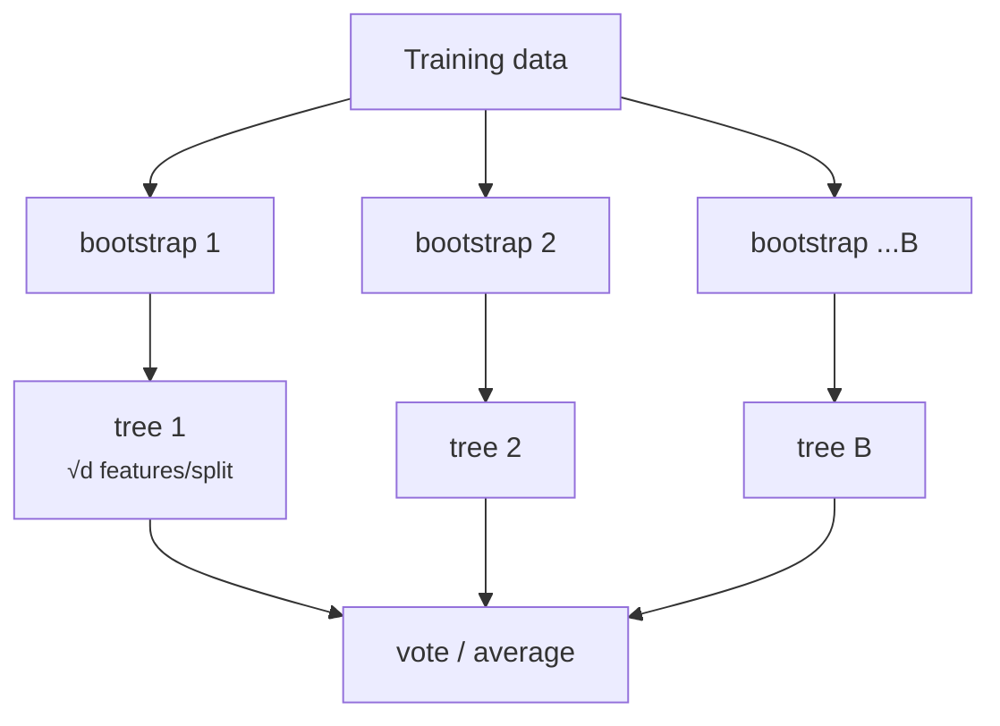

# Random Forest

[Decision trees](../decision-trees/index.md) are accurate on training data but unstable — **high variance**. Leo Breiman's insight (2001): don't fight the variance of one tree; **average many diverse trees** and let their errors cancel. The result is one of the most reliable algorithms in all of ML — a near-unbeatable default for tabular data with essentially no tuning.

## The statistics of averaging

Average \(B\) estimators, each with variance \(\sigma^2\) and pairwise correlation \(\rho\). The ensemble's variance is

\[
\operatorname{Var}\big(\bar{f}\big) = \rho \sigma^2 + \frac{1 - \rho}{B}\, \sigma^2
\]

The second term vanishes as \(B\) grows — but the first does not. **Averaging identical trees achieves nothing** (\(\rho = 1\)); the whole game is making trees *accurate yet decorrelated*. Random forests inject randomness twice:

### 1. Bagging (bootstrap aggregating)

Each tree trains on a **bootstrap sample**: \(n\) rows drawn *with replacement* from the training set. Each sample leaves out about \(1 - (1 - 1/n)^n \approx 1/e \approx 37\%\) of the rows, so every tree sees a different perturbed dataset.

### 2. Feature subsampling

At **every split**, only a random subset of features is eligible (typically \(\sqrt{d}\) for classification, \(d/3\) for regression). Without this, all trees would open with the same dominant feature and remain highly correlated; restricting candidates forces different trees to discover different structure — this is the step that turns bagging into a *random forest*.

Prediction: **majority vote** (classification) or **mean** (regression) over all trees.



``` python exec="on" html="on"
--8<-- "docs/2026.2/classes/random-forest/forest-vs-tree.py"
```

The single tree carves noise islands with hard 0/1 confidence; the forest's averaged vote yields a smooth, calibrated-looking boundary that ignores individual noise points — variance visibly averaged away.

## Out-of-bag evaluation: free validation

The ~37% of rows a tree never saw are its **out-of-bag (OOB)** samples. Predict each row using only the trees that didn't train on it, and you get an honest generalization estimate **without a validation split** — conceptually a built-in [cross-validation](../validation/index.md#cross-validation):

```python
from sklearn.ensemble import RandomForestClassifier

rf = RandomForestClassifier(
    n_estimators=300,        # more = better, plateaus; never overfits via B
    max_features='sqrt',     # the decorrelation knob
    min_samples_leaf=1,      # tree depth control if needed
    oob_score=True,
    n_jobs=-1,               # trees train in parallel
    random_state=0,
)
rf.fit(X_train, y_train)
rf.oob_score_                # ≈ honest accuracy estimate, no split spent
```

Key facts about \(B\) (`n_estimators`): adding trees **cannot overfit** — it only stabilizes the average (the \((1-\rho)\sigma^2/B\) term shrinks). Performance plateaus; the only cost of more trees is compute. Overfitting, when it happens, comes from the *individual trees* being too deep on too-noisy data — control with `min_samples_leaf` or `max_depth`.

## Feature importance

Two standard measures:

- **Impurity-based** (`rf.feature_importances_`): total impurity decrease contributed by each feature across all trees. Fast, but **biased toward high-cardinality features** (more possible thresholds = more chances to look useful) and computed on training data;
- **Permutation importance**: shuffle one feature's column in *validation* data and measure the score drop. Slower, model-agnostic, and more trustworthy — the bridge to [Explainability](../explainability/index.md).

```python
from sklearn.inspection import permutation_importance
imp = permutation_importance(rf, X_val, y_val, n_repeats=10, random_state=0)
```

## Practical profile

| | |
|---|---|
| **Strengths** | excellent accuracy with default settings; robust to outliers/noise; no scaling; handles high dimensions and interactions; OOB estimate; parallel training; hard to misuse |
| **Weaknesses** | slower/heavier than one tree; loses the single tree's readability; can't extrapolate (inherits tree leaves); usually edged out by tuned [gradient boosting](../gradient-boosting/index.md) on tabular benchmarks |
| **Reach for it when** | you want a strong tabular baseline in one line; features and samples are messy; tuning time is scarce |

!!! note "Bagging vs boosting"
    Bagging builds trees **independently, in parallel**, and averages to cut **variance**. Boosting — next lesson — builds them **sequentially**, each correcting its predecessors, attacking **bias**. Same building block, opposite philosophies.

---

## Quiz

<div id="quiz-random-forest"></div>
<script>
buildQuiz('random-forest', 'Random Forest', [
  {
    q: "Random forests improve on single decision trees primarily by...",
    opts: [
      "growing deeper trees",
      "averaging many decorrelated trees, canceling their individual variance",
      "using a better impurity measure",
      "pruning more aggressively"
    ],
    ans: 1,
    exp: "Trees are low-bias but high-variance. Averaging B decorrelated estimators divides the uncorrelated part of the variance by B — the ensemble is far more stable than any member."
  },
  {
    q: "Why does a random forest restrict each split to a random subset of features (max_features)?",
    opts: [
      "To speed up training only",
      "To decorrelate the trees: otherwise every tree would lead with the same dominant features and averaging would gain little",
      "To prevent missing values",
      "To guarantee each feature is used exactly once"
    ],
    ans: 1,
    exp: "The variance formula ρσ² + (1−ρ)σ²/B shows correlation ρ limits the benefit of averaging. Feature subsampling forces trees to explore different structure, lowering ρ — the defining trick of random forests over plain bagging."
  },
  {
    q: "A bootstrap sample of n rows drawn with replacement leaves out approximately...",
    opts: [
      "10% of the rows",
      "37% of the rows (1/e)",
      "50% of the rows",
      "no rows — replacement includes everything"
    ],
    ans: 1,
    exp: "P(row never drawn) = (1 − 1/n)ⁿ → e⁻¹ ≈ 0.368. These out-of-bag rows are unseen data for that tree, enabling the free OOB generalization estimate."
  },
  {
    q: "What happens as you increase n_estimators from 100 to 10,000?",
    opts: [
      "The forest overfits more and more",
      "Performance improves then plateaus; the ensemble never overfits from adding trees — only compute cost grows",
      "The trees become individually deeper",
      "OOB score becomes unavailable"
    ],
    ans: 1,
    exp: "More trees only stabilize the average (shrinking the (1−ρ)σ²/B term). Overfitting in forests comes from individual tree depth on noisy data, not from B — control it with min_samples_leaf/max_depth."
  },
  {
    q: "The OOB score is best described as...",
    opts: [
      "training accuracy",
      "an honest generalization estimate computed by predicting each row only with trees that never saw it",
      "the score on a separate test file",
      "the average tree depth"
    ],
    ans: 1,
    exp: "Each row is out-of-bag for ~37% of the trees; using only those trees to predict it mimics validation on unseen data — cross-validation-like quality without spending a split."
  },
  {
    q: "Impurity-based feature importances should be read with care because they...",
    opts: [
      "are computed by an external library",
      "are biased toward high-cardinality features and measured on training data — permutation importance on validation data is more trustworthy",
      "only work for regression forests",
      "always sum to zero"
    ],
    ans: 1,
    exp: "Features with many possible split points get more opportunities to reduce impurity by chance, and training-set impurity says nothing about generalization. Permutation importance on held-out data fixes both issues."
  }
]);
</script>
