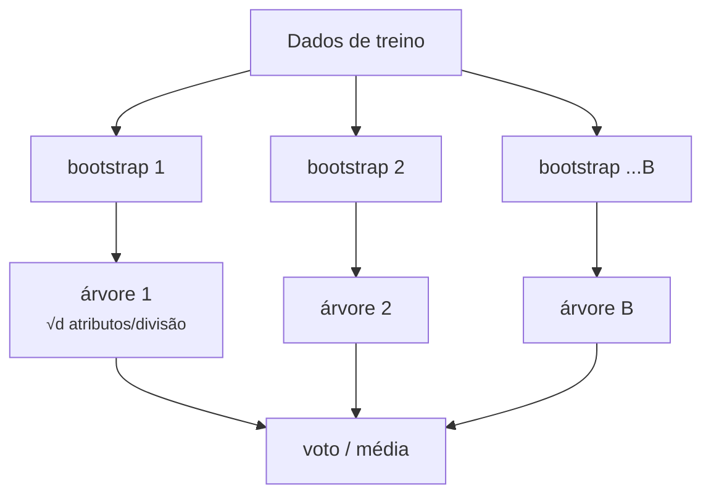
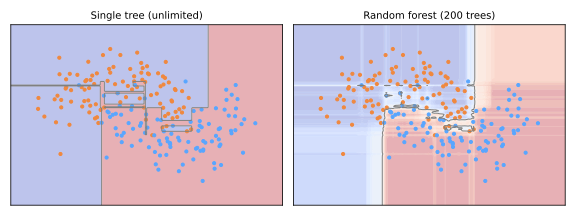

# Random Forest

As [árvores de decisão](../decision-trees/index.md) são acuradas nos dados de treino mas instáveis — **alta variância**. A percepção de Leo Breiman (2001): não lute contra a variância de uma árvore; **faça a média de muitas árvores diversas** e deixe seus erros se cancelarem. O resultado é um dos algoritmos mais confiáveis de todo o ML — um padrão quase imbatível para dados tabulares, com praticamente nenhum ajuste.

## A estatística da média

Faça a média de \(B\) estimadores, cada um com variância \(\sigma^2\) e correlação par a par \(\rho\). A variância do ensemble é

\[
\operatorname{Var}\big(\bar{f}\big) = \rho \sigma^2 + \frac{1 - \rho}{B}\, \sigma^2
\]

O segundo termo some conforme \(B\) cresce — mas o primeiro não. **Fazer a média de árvores idênticas não conquista nada** (\(\rho = 1\)); todo o jogo é tornar as árvores *acuradas mas descorrelacionadas*. As random forests injetam aleatoriedade duas vezes:

### 1. Bagging (bootstrap aggregating)

Cada árvore treina em uma **amostra bootstrap**: \(n\) linhas sorteadas *com reposição* do conjunto de treino. Cada amostra deixa de fora cerca de \(1 - (1 - 1/n)^n \approx 1/e \approx 37\%\) das linhas, então cada árvore vê um conjunto de dados perturbado diferente.

### 2. Subamostragem de atributos

Em **cada divisão**, apenas um subconjunto aleatório de atributos é elegível (tipicamente \(\sqrt{d}\) para classificação, \(d/3\) para regressão). Sem isso, todas as árvores começariam com o mesmo atributo dominante e permaneceriam altamente correlacionadas; restringir os candidatos força árvores diferentes a descobrir estruturas diferentes — este é o passo que transforma o bagging em uma *random forest*.

Previsão: **voto majoritário** (classificação) ou **média** (regressão) sobre todas as árvores.





A árvore única esculpe ilhas de ruído com confiança dura 0/1; o voto médio da floresta gera uma fronteira suave, de aparência calibrada, que ignora pontos de ruído individuais — a variância visivelmente diluída pela média.

## Avaliação out-of-bag: validação de graça

As ~37% de linhas que uma árvore nunca viu são suas amostras **out-of-bag (OOB)**. Preveja cada linha usando apenas as árvores que não treinaram nela, e você obtém uma estimativa honesta de generalização **sem uma divisão de validação** — conceitualmente uma [validação cruzada](../validation/index.md#validacao-cruzada) embutida:

```python
from sklearn.ensemble import RandomForestClassifier

rf = RandomForestClassifier(
    n_estimators=300,        # mais = melhor, estabiliza; nunca sobreajusta via B
    max_features='sqrt',     # o botão de descorrelação
    min_samples_leaf=1,      # controle de profundidade da árvore se necessário
    oob_score=True,
    n_jobs=-1,               # as árvores treinam em paralelo
    random_state=0,
)
rf.fit(X_train, y_train)
rf.oob_score_                # ≈ estimativa honesta de acurácia, sem gastar divisão
```

Fatos-chave sobre \(B\) (`n_estimators`): adicionar árvores **não pode sobreajustar** — apenas estabiliza a média (o termo \((1-\rho)\sigma^2/B\) encolhe). O desempenho estabiliza num platô; o único custo de mais árvores é o processamento. O sobreajuste, quando ocorre, vem de as *árvores individuais* serem profundas demais em dados ruidosos demais — controle com `min_samples_leaf` ou `max_depth`.

## Importância de atributos

Duas medidas padrão:

- **Baseada em impureza** (`rf.feature_importances_`): redução total de impureza contribuída por cada atributo em todas as árvores. Rápida, mas **enviesada em favor de atributos de alta cardinalidade** (mais limiares possíveis = mais chances de parecer útil) e calculada em dados de treino;
- **Importância por permutação**: embaralhe a coluna de um atributo em dados de *validação* e meça a queda no escore. Mais lenta, agnóstica ao modelo e mais confiável — a ponte para a [Explicabilidade](../explainability/index.md).

```python
from sklearn.inspection import permutation_importance
imp = permutation_importance(rf, X_val, y_val, n_repeats=10, random_state=0)
```

## Perfil prático

| | |
|---|---|
| **Pontos fortes** | acurácia excelente com configurações padrão; robusto a outliers/ruído; sem escalonamento; lida com altas dimensões e interações; estimativa OOB; treino paralelo; difícil de usar errado |
| **Fraquezas** | mais lento/pesado que uma árvore; perde a legibilidade da árvore única; não consegue extrapolar (herda as folhas da árvore); costuma ser superado por [gradient boosting](../gradient-boosting/index.md) ajustado em benchmarks tabulares |
| **Recorra a ele quando** | você quer uma baseline tabular forte em uma linha; atributos e amostras estão bagunçados; o tempo de ajuste é escasso |

!!! note "Bagging vs boosting"
    O bagging constrói árvores **independentemente, em paralelo**, e faz a média para cortar **variância**. O boosting — próxima aula — as constrói **sequencialmente**, cada uma corrigindo suas antecessoras, atacando o **viés**. Mesmo bloco de construção, filosofias opostas.

## Material de aula

!!! example "Notebook da aula (em português)"
    Notebook prático usado em sala — **Aula 20 — Random Forest**:
    [:simple-googlecolab: abrir no Colab](https://colab.research.google.com/drive/1MdeOP1LRcw94fONnlaYDpkYz-CAZ463-){:target="_blank"}

---

## Quiz

<div id="quiz-random-forest"></div>
<script>
buildQuiz('random-forest', 'Random Forest', [
  {
    q: "As random forests melhoram sobre árvores de decisão únicas principalmente ao...",
    opts: [
      "crescer árvores mais profundas",
      "fazer a média de muitas árvores descorrelacionadas, cancelando sua variância individual",
      "usar uma medida de impureza melhor",
      "podar mais agressivamente"
    ],
    ans: 1,
    exp: "As árvores têm viés baixo mas variância alta. Fazer a média de B estimadores descorrelacionados divide a parte não correlacionada da variância por B — o ensemble é muito mais estável que qualquer membro."
  },
  {
    q: "Por que uma random forest restringe cada divisão a um subconjunto aleatório de atributos (max_features)?",
    opts: [
      "Apenas para acelerar o treino",
      "Para descorrelacionar as árvores: caso contrário toda árvore começaria com os mesmos atributos dominantes e a média ganharia pouco",
      "Para evitar valores faltantes",
      "Para garantir que cada atributo seja usado exatamente uma vez"
    ],
    ans: 1,
    exp: "A fórmula da variância ρσ² + (1−ρ)σ²/B mostra que a correlação ρ limita o benefício da média. A subamostragem de atributos força as árvores a explorar estruturas diferentes, reduzindo ρ — o truque que define a random forest em relação ao bagging puro."
  },
  {
    q: "Uma amostra bootstrap de n linhas sorteadas com reposição deixa de fora aproximadamente...",
    opts: [
      "10% das linhas",
      "37% das linhas (1/e)",
      "50% das linhas",
      "nenhuma linha — a reposição inclui tudo"
    ],
    ans: 1,
    exp: "P(linha nunca sorteada) = (1 − 1/n)ⁿ → e⁻¹ ≈ 0,368. Essas linhas out-of-bag são dados não vistos para aquela árvore, viabilizando a estimativa OOB gratuita de generalização."
  },
  {
    q: "O que acontece ao aumentar n_estimators de 100 para 10.000?",
    opts: [
      "A floresta sobreajusta cada vez mais",
      "O desempenho melhora e depois estabiliza; o ensemble nunca sobreajusta por adicionar árvores — só o custo de processamento cresce",
      "As árvores ficam individualmente mais profundas",
      "O escore OOB fica indisponível"
    ],
    ans: 1,
    exp: "Mais árvores apenas estabilizam a média (encolhendo o termo (1−ρ)σ²/B). O sobreajuste em florestas vem da profundidade das árvores individuais em dados ruidosos, não de B — controle-o com min_samples_leaf/max_depth."
  },
  {
    q: "O escore OOB é melhor descrito como...",
    opts: [
      "acurácia de treino",
      "uma estimativa honesta de generalização calculada prevendo cada linha apenas com as árvores que nunca a viram",
      "o escore em um arquivo de teste separado",
      "a profundidade média das árvores"
    ],
    ans: 1,
    exp: "Cada linha é out-of-bag para ~37% das árvores; usar apenas essas árvores para prevê-la imita a validação em dados não vistos — qualidade parecida com a da validação cruzada sem gastar uma divisão."
  },
  {
    q: "As importâncias de atributos baseadas em impureza devem ser lidas com cuidado porque...",
    opts: [
      "são calculadas por uma biblioteca externa",
      "são enviesadas em favor de atributos de alta cardinalidade e medidas em dados de treino — a importância por permutação em dados de validação é mais confiável",
      "só funcionam para florestas de regressão",
      "sempre somam zero"
    ],
    ans: 1,
    exp: "Atributos com muitos pontos de divisão possíveis têm mais oportunidades de reduzir a impureza por acaso, e a impureza no conjunto de treino nada diz sobre generalização. A importância por permutação em dados separados corrige ambos os problemas."
  }
]);
</script>
