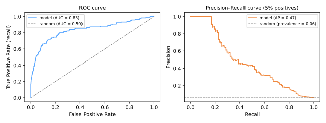
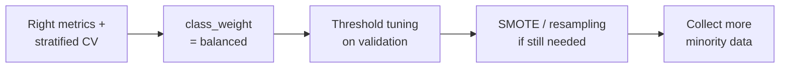

# ROC-AUC & Imbalanced Data

[Last lesson](../classification-metrics/index.md) ended on a key insight: a classifier outputs **scores**, and the label depends on a **threshold**. This lesson evaluates models across *all* thresholds — the ROC and precision–recall curves — and then tackles the setting where all of this matters most: **imbalanced datasets**, where the interesting class is rare.

## The ROC curve

Sweep the threshold from strict to permissive and plot, at each point:

\[
\text{TPR (recall)} = \frac{TP}{TP + FN}
\qquad\text{vs.}\qquad
\text{FPR} = \frac{FP}{FP + TN}
\]

- threshold ≈ 1: nothing flagged — bottom-left corner (0, 0);
- threshold ≈ 0: everything flagged — top-right corner (1, 1);
- in between: how much recall the model buys per unit of false alarm.

A **random scorer** moves along the diagonal (TPR = FPR); a perfect one hugs the top-left corner (100% recall with 0% false alarms).

### AUC

The **Area Under the ROC Curve** compresses the curve into one threshold-free number with a beautiful probabilistic meaning:

\[
\text{AUC} = P\big(\text{score}(x^+) > \text{score}(x^-)\big)
\]

— the probability that a random positive is ranked above a random negative. AUC 0.5 = coin flip, 1.0 = perfect ranking. It measures **ranking quality**: how well the model orders cases, independent of any threshold choice.



```python
from sklearn.metrics import roc_auc_score, RocCurveDisplay
roc_auc_score(y_test, model.predict_proba(X_test)[:, 1])   # needs scores, not labels!
```

### When ROC flatters: use precision–recall

FPR's denominator is the number of **negatives**. With 95% negatives, even a poor model keeps FPR small in absolute terms — the ROC curve looks great while the model's alarms are mostly false. The **precision–recall curve** (right panel) replaces FPR with precision, whose denominator is *the model's own alarms*, making it brutally honest on rare positives: its random-model baseline is the prevalence (here 0.05), not a diagonal.

**Rule of thumb:** balanced classes or costs on both classes → ROC-AUC; rare positive class and you care about the positives → PR curve and average precision (AP).

See the threshold trade-off live — slide it and watch every metric (and the ROC operating point) react at once:

<div id="sim-threshold"></div>

## Learning from imbalanced data

Metrics fixed, now the training side. With 1:1000 imbalance, most learners — which by default optimize accuracy-like objectives — converge to "predict the majority."

### 1. Get the evaluation right first

Stratified splits ([Validation](../validation/index.md#train-validation-test)), PR-AUC / macro-F1 / recall at fixed precision — *before* touching the data. Many "imbalance problems" are actually metric problems.

### 2. Class weights: make minority errors expensive

Most scikit-learn classifiers accept `class_weight`, multiplying each class's contribution to the loss by \(w_c \propto n / (k \cdot n_c)\):

```python
LogisticRegression(class_weight='balanced')
SVC(class_weight='balanced')
RandomForestClassifier(class_weight='balanced')
```

No data manipulation, no information loss — usually the **first thing to try**.

### 3. Resampling: change the data

- **Random undersampling** — drop majority examples. Fast; discards information; viable when data is abundant;
- **Random oversampling** — duplicate minority examples. Keeps all data; duplicates invite overfitting;
- **SMOTE** (Chawla et al., 2002) — *synthesize* new minority points by interpolating between a minority example and its minority [nearest neighbors](../knn/index.md): \(x_{\text{new}} = x_i + \lambda\,(x_{\text{nn}} - x_i)\), \(\lambda \sim U(0,1)\). Richer than duplication, but can manufacture points in noisy overlap regions — variants (Borderline-SMOTE, SMOTE-Tomek) mitigate.

```python
# pip install imbalanced-learn
from imblearn.over_sampling import SMOTE
from imblearn.pipeline import Pipeline as ImbPipeline

pipe = ImbPipeline([
    ('scaler', StandardScaler()),
    ('smote', SMOTE(random_state=0)),      # applied ONLY when fitting
    ('model', LogisticRegression()),
])
```

!!! danger "Resample inside the pipeline, after splitting"
    Oversampling **before** the train/test split copies (or interpolates) minority points into both sides — the model is tested on echoes of its own training data: [leakage](../validation/index.md#data-leakage) with inflated scores. `imblearn`'s pipeline applies resampling only to training folds and never to validation/test data.

### 4. Move the threshold

Often the cheapest fix: keep the model, pick the threshold that meets the business constraint ("recall ≥ 90%", "precision ≥ 80%", or minimal expected cost) using the PR curve on validation data — never on test.

### A sensible order of attack



## Class materials

!!! example "Class notebook (in Portuguese)"
    Hands-on notebook used in class — **Aula 15 — Curva ROC-AUC e Datasets Desbalanceados**:
    [:simple-googlecolab: open in Colab](https://colab.research.google.com/drive/1Ok3LS8GtgvyGOlgfLKe4BdpYuGdiUH1f){:target="_blank"}

---

## Quiz

<div id="quiz-roc-imbalanced"></div>
<script>
buildQuiz('roc-imbalanced', 'ROC-AUC & Imbalanced Data', [
  {
    q: "AUC = 0.85 means...",
    opts: [
      "the model is correct 85% of the time",
      "a randomly chosen positive receives a higher score than a randomly chosen negative with probability 0.85",
      "precision is 85% at the default threshold",
      "85% of thresholds are usable"
    ],
    ans: 1,
    exp: "AUC is a ranking metric: P(score(x⁺) > score(x⁻)). It says nothing directly about accuracy or precision at any specific threshold — those depend on where you cut."
  },
  {
    q: "Why can the ROC curve look excellent on a dataset with 0.5% positives while the model's alarms are mostly false?",
    opts: [
      "Because AUC is computed on the training set",
      "Because FPR divides by the huge number of negatives, so even many false positives barely move it; precision — which divides by the model's alarms — collapses instead",
      "Because recall is undefined for rare classes",
      "Because ROC requires balanced data to be computed"
    ],
    ans: 1,
    exp: "With 199,000 negatives, 1,990 false alarms is FPR = 1% (looks great) — but if there are only 1,000 true positives caught, precision is ~33%. The PR curve exposes this; ROC hides it."
  },
  {
    q: "The appropriate baseline for a precision–recall curve is...",
    opts: [
      "the diagonal from (0,0) to (1,1)",
      "a horizontal line at the prevalence of the positive class",
      "precision = 1 everywhere",
      "there is no baseline for PR curves"
    ],
    ans: 1,
    exp: "A random scorer's precision equals the positive rate regardless of recall. On a 5%-positive problem the baseline is 0.05 — which is why decent-looking PR curves are much harder to achieve than decent ROC curves."
  },
  {
    q: "What does class_weight='balanced' do?",
    opts: [
      "Duplicates minority-class rows",
      "Reweights the loss so errors on the minority class cost proportionally more, without changing the data",
      "Deletes majority-class rows",
      "Changes the decision threshold to the prevalence"
    ],
    ans: 1,
    exp: "Weights w_c ∝ n/(k·n_c) scale each sample's loss contribution inversely to its class frequency. It is the least invasive lever — usually tried before any resampling."
  },
  {
    q: "How does SMOTE differ from random oversampling?",
    opts: [
      "SMOTE removes majority samples",
      "SMOTE creates synthetic minority points by interpolating between minority neighbors, instead of duplicating existing rows",
      "SMOTE only works for images",
      "SMOTE adjusts class weights"
    ],
    ans: 1,
    exp: "Duplication repeats identical points (overfit bait); SMOTE draws new points along segments between a minority sample and its minority k-nearest neighbors, enriching the minority region — with care needed in noisy overlaps."
  },
  {
    q: "A colleague applies SMOTE to the whole dataset, then splits train/test, and reports 0.98 recall. What is wrong?",
    opts: [
      "Nothing — that is the standard procedure",
      "Synthetic points interpolated from training rows also landed in the test set, so the model is evaluated on echoes of its own training data",
      "SMOTE cannot be combined with recall",
      "The split should have been 50/50"
    ],
    ans: 1,
    exp: "Resampling before splitting leaks: test points are interpolations of train points. Resample inside an imblearn Pipeline so it applies only to the training folds, and keep validation/test data natural."
  },
  {
    q: "The business requires recall ≥ 90% at the highest possible precision. The cheapest first lever is...",
    opts: [
      "retraining with a deeper model",
      "collecting more data",
      "tuning the decision threshold on validation data using the precision–recall curve",
      "switching the metric to accuracy"
    ],
    ans: 2,
    exp: "The model's scores already contain a whole family of classifiers — one per threshold. Choosing the threshold that satisfies the constraint costs nothing and often suffices before touching data or model."
  }
]);
</script>
