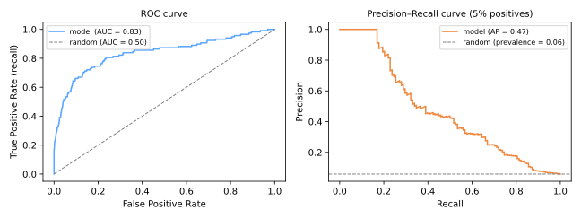

# ROC-AUC & Dados Desbalanceados

A [aula passada](../classification-metrics/index.md) terminou em uma constatação-chave: um classificador produz **escores**, e o rótulo depende de um **limiar**. Esta aula avalia modelos em *todos* os limiares — as curvas ROC e precisão–revocação — e então enfrenta o cenário onde tudo isso mais importa: **conjuntos de dados desbalanceados**, em que a classe interessante é rara.

## A curva ROC

Percorra o limiar do estrito ao permissivo e plote, em cada ponto:

\[
\text{TPR (revocação)} = \frac{TP}{TP + FN}
\qquad\text{vs.}\qquad
\text{FPR} = \frac{FP}{FP + TN}
\]

- limiar ≈ 1: nada sinalizado — canto inferior esquerdo (0, 0);
- limiar ≈ 0: tudo sinalizado — canto superior direito (1, 1);
- no meio: quanta revocação o modelo compra por unidade de alarme falso.

Um **escorador aleatório** se move ao longo da diagonal (TPR = FPR); um perfeito abraça o canto superior esquerdo (100% de revocação com 0% de alarmes falsos).

### AUC

A **Área Sob a Curva ROC** (AUC) comprime a curva em um único número livre de limiar, com um belo significado probabilístico:

\[
\text{AUC} = P\big(\text{escore}(x^+) > \text{escore}(x^-)\big)
\]

— a probabilidade de que um positivo aleatório seja ordenado acima de um negativo aleatório. AUC 0,5 = cara ou coroa, 1,0 = ordenação perfeita. Ela mede a **qualidade da ordenação**: quão bem o modelo ordena os casos, independentemente de qualquer escolha de limiar.



```python
from sklearn.metrics import roc_auc_score, RocCurveDisplay
roc_auc_score(y_test, model.predict_proba(X_test)[:, 1])   # precisa de escores, não rótulos!
```

### Quando a ROC lisonjeia: use precisão–revocação

O denominador da FPR é o número de **negativos**. Com 95% de negativos, mesmo um modelo ruim mantém a FPR pequena em termos absolutos — a curva ROC parece ótima enquanto os alarmes do modelo são majoritariamente falsos. A **curva precisão–revocação** (painel direito) substitui a FPR pela precisão, cujo denominador são *os próprios alarmes do modelo*, tornando-a brutalmente honesta sobre positivos raros: sua baseline de modelo aleatório é a prevalência (aqui 0,05), não uma diagonal.

**Regra de bolso:** classes balanceadas ou custos em ambas as classes → ROC-AUC; classe positiva rara e você se importa com os positivos → curva PR e precisão média (AP).

Veja o trade-off do limiar ao vivo — deslize-o e observe cada métrica (e o ponto de operação da ROC) reagir de uma vez:

<div id="sim-threshold"></div>

## Aprendendo com dados desbalanceados

Métricas resolvidas, agora o lado do treino. Com desbalanceamento de 1:1000, a maioria dos aprendizes — que por padrão otimizam objetivos parecidos com acurácia — converge para "preveja a maioria".

### 1. Acerte a avaliação primeiro

Divisões estratificadas ([Validação](../validation/index.md#treino-validacao-teste)), PR-AUC / macro-F1 / revocação a precisão fixa — *antes* de tocar nos dados. Muitos "problemas de desbalanceamento" são, na verdade, problemas de métrica.

### 2. Pesos de classe: torne os erros da minoria caros

A maioria dos classificadores do scikit-learn aceita `class_weight`, multiplicando a contribuição de cada classe à perda por \(w_c \propto n / (k \cdot n_c)\):

```python
LogisticRegression(class_weight='balanced')
SVC(class_weight='balanced')
RandomForestClassifier(class_weight='balanced')
```

Sem manipulação de dados, sem perda de informação — geralmente a **primeira coisa a tentar**.

### 3. Reamostragem: mude os dados

- **Subamostragem aleatória** — descartar exemplos da maioria. Rápido; descarta informação; viável quando os dados são abundantes;
- **Sobreamostragem aleatória** — duplicar exemplos da minoria. Mantém todos os dados; duplicatas convidam ao sobreajuste;
- **SMOTE** (Chawla et al., 2002) — *sintetizar* novos pontos da minoria interpolando entre um exemplo da minoria e seus [vizinhos mais próximos](../knn/index.md) da minoria: \(x_{\text{new}} = x_i + \lambda\,(x_{\text{nn}} - x_i)\), \(\lambda \sim U(0,1)\). Mais rico que a duplicação, mas pode fabricar pontos em regiões de sobreposição ruidosas — variantes (Borderline-SMOTE, SMOTE-Tomek) mitigam.

```python
# pip install imbalanced-learn
from imblearn.over_sampling import SMOTE
from imblearn.pipeline import Pipeline as ImbPipeline

pipe = ImbPipeline([
    ('scaler', StandardScaler()),
    ('smote', SMOTE(random_state=0)),      # aplicado SÓ no ajuste
    ('model', LogisticRegression()),
])
```

!!! danger "Reamostre dentro do pipeline, após a divisão"
    Sobreamostrar **antes** da divisão treino/teste copia (ou interpola) pontos da minoria para os dois lados — o modelo é testado em ecos dos próprios dados de treino: [vazamento](../validation/index.md#vazamento-de-dados) com escores inflados. O pipeline do `imblearn` aplica a reamostragem apenas aos folds de treino e nunca aos dados de validação/teste.

### 4. Mova o limiar

Muitas vezes a correção mais barata: mantenha o modelo, escolha o limiar que atende à restrição de negócio ("revocação ≥ 90%", "precisão ≥ 80%", ou custo esperado mínimo) usando a curva PR em dados de validação — nunca no teste.

### Uma ordem sensata de ataque


## Material de aula

!!! example "Notebook da aula (em português)"
    Notebook prático usado em sala — **Aula 15 — Curva ROC-AUC e Datasets Desbalanceados**:
    [:simple-googlecolab: abrir no Colab](https://colab.research.google.com/drive/1Ok3LS8GtgvyGOlgfLKe4BdpYuGdiUH1f){:target="_blank"}

---

## Quiz

<div id="quiz-roc-imbalanced"></div>
<script>
buildQuiz('roc-imbalanced', 'ROC-AUC & Dados Desbalanceados', [
  {
    q: "AUC = 0,85 significa...",
    opts: [
      "o modelo está correto 85% das vezes",
      "um positivo escolhido ao acaso recebe um escore maior que um negativo escolhido ao acaso com probabilidade 0,85",
      "a precisão é 85% no limiar padrão",
      "85% dos limiares são utilizáveis"
    ],
    ans: 1,
    exp: "A AUC é uma métrica de ordenação: P(escore(x⁺) > escore(x⁻)). Ela nada diz diretamente sobre acurácia ou precisão em um limiar específico — esses dependem de onde você corta."
  },
  {
    q: "Por que a curva ROC pode parecer excelente em um conjunto com 0,5% de positivos enquanto os alarmes do modelo são majoritariamente falsos?",
    opts: [
      "Porque a AUC é calculada no conjunto de treino",
      "Porque a FPR divide pelo enorme número de negativos, então mesmo muitos falsos positivos mal a movem; a precisão — que divide pelos alarmes do modelo — colapsa em vez disso",
      "Porque a revocação é indefinida para classes raras",
      "Porque a ROC exige dados balanceados para ser calculada"
    ],
    ans: 1,
    exp: "Com 199.000 negativos, 1.990 alarmes falsos são FPR = 1% (parece ótimo) — mas se há só 1.000 verdadeiros positivos pegos, a precisão é ~33%. A curva PR expõe isso; a ROC esconde."
  },
  {
    q: "A baseline apropriada para uma curva precisão–revocação é...",
    opts: [
      "a diagonal de (0,0) a (1,1)",
      "uma linha horizontal na prevalência da classe positiva",
      "precisão = 1 em toda parte",
      "não há baseline para curvas PR"
    ],
    ans: 1,
    exp: "A precisão de um escorador aleatório é igual à taxa de positivos, independentemente da revocação. Em um problema com 5% de positivos, a baseline é 0,05 — por isso curvas PR de bom aspecto são muito mais difíceis de alcançar que curvas ROC de bom aspecto."
  },
  {
    q: "O que class_weight='balanced' faz?",
    opts: [
      "Duplica as linhas da classe minoritária",
      "Repondera a perda para que os erros na classe minoritária custem proporcionalmente mais, sem alterar os dados",
      "Exclui as linhas da classe majoritária",
      "Muda o limiar de decisão para a prevalência"
    ],
    ans: 1,
    exp: "Os pesos w_c ∝ n/(k·n_c) escalam a contribuição de perda de cada amostra inversamente à frequência de sua classe. É a alavanca menos invasiva — geralmente tentada antes de qualquer reamostragem."
  },
  {
    q: "Como o SMOTE difere da sobreamostragem aleatória?",
    opts: [
      "O SMOTE remove amostras da maioria",
      "O SMOTE cria pontos sintéticos da minoria interpolando entre vizinhos da minoria, em vez de duplicar linhas existentes",
      "O SMOTE só funciona para imagens",
      "O SMOTE ajusta pesos de classe"
    ],
    ans: 1,
    exp: "A duplicação repete pontos idênticos (isca de sobreajuste); o SMOTE sorteia novos pontos ao longo de segmentos entre uma amostra da minoria e seus k-vizinhos mais próximos da minoria, enriquecendo a região minoritária — com cuidado necessário em sobreposições ruidosas."
  },
  {
    q: "Um colega aplica SMOTE ao conjunto de dados inteiro, depois divide treino/teste, e reporta 0,98 de revocação. O que há de errado?",
    opts: [
      "Nada — esse é o procedimento padrão",
      "Pontos sintéticos interpolados de linhas de treino também caíram no conjunto de teste, então o modelo é avaliado em ecos dos próprios dados de treino",
      "O SMOTE não pode ser combinado com revocação",
      "A divisão deveria ter sido 50/50"
    ],
    ans: 1,
    exp: "Reamostrar antes de dividir vaza: os pontos de teste são interpolações de pontos de treino. Reamostre dentro de um Pipeline do imblearn para que se aplique apenas aos folds de treino, e mantenha os dados de validação/teste naturais."
  },
  {
    q: "O negócio exige revocação ≥ 90% com a maior precisão possível. A alavanca inicial mais barata é...",
    opts: [
      "retreinar com um modelo mais profundo",
      "coletar mais dados",
      "ajustar o limiar de decisão em dados de validação usando a curva precisão–revocação",
      "trocar a métrica para acurácia"
    ],
    ans: 2,
    exp: "Os escores do modelo já contêm uma família inteira de classificadores — um por limiar. Escolher o limiar que satisfaz a restrição não custa nada e muitas vezes basta antes de tocar em dados ou modelo."
  }
]);
</script>
