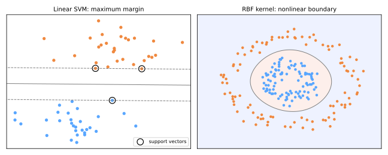

# Support Vector Machines

The SVM (Cortes & Vapnik, 1995) crowned the statistical learning era: a classifier derived from a clean geometric principle — **maximize the margin** — with rigorous theory behind it, and a trick that lets a linear method draw wildly nonlinear boundaries. Before deep learning, SVMs were the state of the art nearly everywhere; they remain excellent on small-to-medium, high-dimensional problems.

## Maximum margin

Many hyperplanes separate two separable classes; which is best? Vapnik's answer: the one **farthest from the closest points of both classes** — the widest "street." A wide margin means small perturbations of the data don't flip predictions: better generalization, provably.



For hyperplane \(w^\top x + b = 0\), scale \(w, b\) so the closest points satisfy \(\lvert w^\top x + b \rvert = 1\) (the dashed lines). The street width is \(2 / \lVert w \rVert\), so maximizing margin = minimizing \(\lVert w \rVert\):

\[
\min_{w, b} \; \frac{1}{2} \lVert w \rVert^2
\quad \text{s.t.} \quad
y_i (w^\top x_i + b) \geq 1 \;\; \forall i
\qquad (y_i \in \{-1, +1\})
\]

A convex quadratic program — one global optimum. The circled points touching the dashed lines are the **support vectors**: they alone determine the solution. Move or delete any other point and *nothing changes* — the model compresses the dataset down to its critical boundary cases.

## Soft margin: tolerating imperfection

Real data is not separable. Introduce slack \(\xi_i \geq 0\) (how far point \(i\) violates its margin) and charge for it:

\[
\min_{w, b, \xi} \; \frac{1}{2}\lVert w \rVert^2 + C \sum_{i=1}^{n} \xi_i
\quad \text{s.t.} \quad
y_i (w^\top x_i + b) \geq 1 - \xi_i
\]

\(C\) is the bias–variance knob, and it works like [logistic regression's C](../logistic-regression/index.md#regularization) (both are inverse regularization):

- **large \(C\)**: violations are expensive → narrow, strict margin → risk of overfitting;
- **small \(C\)**: violations are cheap → wide, tolerant margin → smoother, simpler boundary.

Equivalently: SVM minimizes **hinge loss** \(\max(0,\, 1 - y_i(w^\top x_i + b))\) plus an L2 penalty — same "loss + regularization" template as [Ridge](../gradient-descent-regularization/index.md#regularization), with a loss that ignores points comfortably beyond the margin.

## The kernel trick

The dual form of the optimization depends on the data **only through inner products** \(x_i^\top x_j\), and prediction likewise:

\[
f(x) = \operatorname{sign}\Big( \sum_{i \in \text{SV}} \alpha_i y_i \, \langle x_i, x \rangle + b \Big)
\]

So: map data to a higher-dimensional space \(\phi(x)\) where it *becomes* linearly separable — but never compute \(\phi\) explicitly. Just replace every inner product with a **kernel function**

\[
K(x_i, x_j) = \langle \phi(x_i), \phi(x_j) \rangle,
\]

computed directly in the original space. Linear machinery, nonlinear boundary, no exponential cost.

| Kernel | \(K(x, x')\) | Notes |
|--------|--------------|-------|
| linear | \(x^\top x'\) | baseline; best for high-dim sparse data (text) |
| polynomial | \((\gamma\, x^\top x' + r)^p\) | feature interactions up to degree \(p\) |
| **RBF (Gaussian)** | \(\exp(-\gamma \lVert x - x' \rVert^2)\) | default; implicit *infinite*-dimensional space |

For RBF, \(\gamma\) sets each support vector's radius of influence: **large \(\gamma\)** → tight islands around points (overfit); **small \(\gamma\)** → broad, smooth influence (underfit). \(C\) and \(\gamma\) are tuned together on a log grid ([GridSearchCV](../model-selection/index.md#grid-search-with-cross-validation)). The right panel of the figure shows RBF drawing a circular boundary no hyperplane could — in the implicit space, the circles *are* linearly separable.

```python
from sklearn.pipeline import make_pipeline
from sklearn.preprocessing import StandardScaler
from sklearn.svm import SVC

svm = make_pipeline(StandardScaler(),                    # SVMs are distance-based
                    SVC(kernel='rbf', C=1.0, gamma='scale'))
svm.fit(X_train, y_train)
```

## Training, in essence

Solvers optimize the dual (e.g. **SMO** — Sequential Minimal Optimization, Platt 1998 — which iteratively optimizes pairs of \(\alpha_i\)). A pseudocode sketch of the idea:

```text
initialize all α_i = 0
repeat until KKT conditions hold (within tolerance):
    pick a pair (α_i, α_j) violating the conditions      # heuristic choice
    optimize the objective over that pair analytically    # closed form for 2 vars
    clip to 0 ≤ α ≤ C, update b
points ending with α_i > 0 are the support vectors
```

Complexity is roughly \(O(n^2)\)–\(O(n^3)\) in samples — the reason SVMs shine at \(n \sim 10^3\)–\(10^5\) but yield to [gradient boosting](../gradient-boosting/index.md) and [neural networks](../neural-networks/index.md) on millions of rows. (For linear kernels, `LinearSVC`/`SGDClassifier` scale much further.)

## Practical profile

| | |
|---|---|
| **Strengths** | maximum-margin generalization; kernel flexibility; effective when features ≫ samples; solution depends only on support vectors |
| **Weaknesses** | scales poorly with n; two coupled hyperparameters (C, γ); no native probabilities (Platt scaling is a post-hoc fit); requires scaling |
| **Reach for it when** | small/medium datasets, high-dimensional data, nonlinear boundaries without deep learning |

## Class materials

!!! example "Class notebooks (in Portuguese)"
    Hands-on notebooks used in class:

    - **Aula 17 — Support Vector Machines**: [:simple-googlecolab: open in Colab](https://colab.research.google.com/drive/1QC7Jjl29GWTVJwkd3W1-9Uy1ujRp-L-B){:target="_blank"}
    - **Aula 18 — SVM Pseudocódigo** (implementation from scratch): [:simple-googlecolab: open in Colab](https://colab.research.google.com/drive/1CsiJHY0KbZkIr6dseWGEt1p4-LM0I2ti){:target="_blank"}

---

## Quiz

<div id="quiz-svm"></div>
<script>
buildQuiz('svm', 'Support Vector Machines', [
  {
    q: "Among all separating hyperplanes, the SVM chooses the one that...",
    opts: [
      "passes closest to the class centroids",
      "maximizes the margin — the distance to the nearest points of both classes",
      "minimizes the number of support vectors",
      "is orthogonal to the first principal component"
    ],
    ans: 1,
    exp: "The maximum-margin hyperplane is least sensitive to perturbations of the data, which statistical learning theory links to better generalization. Width = 2/||w||, so it minimizes ||w||."
  },
  {
    q: "What is special about the support vectors?",
    opts: [
      "They are the misclassified points",
      "They alone determine the decision boundary — every other training point could be deleted without changing the model",
      "They are the class centroids",
      "They are chosen randomly at initialization"
    ],
    ans: 1,
    exp: "Only points on or violating the margin get α > 0 in the dual solution. The rest contribute nothing — the SVM summarizes the dataset by its hardest boundary cases."
  },
  {
    q: "Increasing C in a soft-margin SVM...",
    opts: [
      "makes margin violations cheaper, widening the margin",
      "makes violations more expensive, narrowing the margin and increasing overfitting risk",
      "increases the number of kernels",
      "only affects the RBF kernel"
    ],
    ans: 1,
    exp: "C multiplies the slack penalty. Large C = strict (complex, low bias, high variance); small C = tolerant (smoother, higher bias). It is an inverse regularization strength, like logistic regression's C."
  },
  {
    q: "The kernel trick works because...",
    opts: [
      "it explicitly computes coordinates in the high-dimensional space",
      "the SVM's optimization and prediction touch the data only through inner products, which a kernel evaluates in the implicit space at original-space cost",
      "it reduces the number of features",
      "it converts the problem to a decision tree"
    ],
    ans: 1,
    exp: "K(x, x') = ⟨φ(x), φ(x')⟩ replaces every inner product. For RBF, φ maps to an infinite-dimensional space — impossible to compute explicitly, trivial through the kernel."
  },
  {
    q: "An RBF-SVM shows tiny decision islands around individual training points. The typical fix is...",
    opts: [
      "increase gamma",
      "decrease gamma (and/or decrease C) — each support vector's influence is too localized",
      "remove the support vectors",
      "switch to a polynomial kernel of higher degree"
    ],
    ans: 1,
    exp: "γ controls the Gaussian width: large γ = narrow influence = memorization islands (overfit). Smaller γ smooths the boundary. C and γ are tuned jointly on a log grid."
  },
  {
    q: "For a dataset with 50 million rows and 30 features, a kernel SVM is usually a poor first choice because...",
    opts: [
      "SVMs cannot handle 30 features",
      "kernel SVM training scales roughly quadratically-to-cubically with the number of samples",
      "the margin is undefined for large datasets",
      "support vectors require GPUs"
    ],
    ans: 1,
    exp: "The dual problem grows with n² kernel evaluations. At that scale, linear models via SGD, gradient boosting, or neural networks are the practical choices; kernel SVMs excel at moderate n."
  }
]);
</script>
