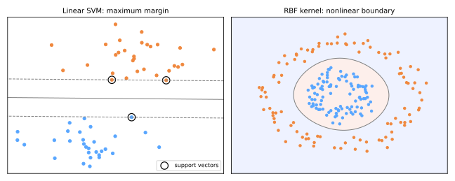

# Máquinas de Vetores de Suporte

A SVM (Cortes & Vapnik, 1995) coroou a era do aprendizado estatístico: um classificador derivado de um princípio geométrico limpo — **maximizar a margem** — com teoria rigorosa por trás, e um truque que permite a um método linear traçar fronteiras extremamente não lineares. Antes do deep learning, as SVMs eram o estado da arte em quase toda parte; elas continuam excelentes em problemas de porte pequeno a médio e de alta dimensão.

## Margem máxima

Muitos hiperplanos separam duas classes separáveis; qual é o melhor? A resposta de Vapnik: aquele **mais distante dos pontos mais próximos de ambas as classes** — a "rua" mais larga. Uma margem larga significa que pequenas perturbações dos dados não invertem as previsões: melhor generalização, comprovadamente.



Para o hiperplano \(w^\top x + b = 0\), escalone \(w, b\) de modo que os pontos mais próximos satisfaçam \(\lvert w^\top x + b \rvert = 1\) (as linhas tracejadas). A largura da rua é \(2 / \lVert w \rVert\), então maximizar a margem = minimizar \(\lVert w \rVert\):

\[
\min_{w, b} \; \frac{1}{2} \lVert w \rVert^2
\quad \text{sujeito a} \quad
y_i (w^\top x_i + b) \geq 1 \;\; \forall i
\qquad (y_i \in \{-1, +1\})
\]

Um programa quadrático convexo — um único ótimo global. Os pontos circulados que tocam as linhas tracejadas são os **vetores de suporte**: só eles determinam a solução. Mova ou remova qualquer outro ponto e *nada muda* — o modelo comprime o conjunto de dados aos seus casos-limite críticos.

## Margem suave: tolerando a imperfeição

Dados reais não são separáveis. Introduza a folga \(\xi_i \geq 0\) (o quanto o ponto \(i\) viola sua margem) e cobre por ela:

\[
\min_{w, b, \xi} \; \frac{1}{2}\lVert w \rVert^2 + C \sum_{i=1}^{n} \xi_i
\quad \text{sujeito a} \quad
y_i (w^\top x_i + b) \geq 1 - \xi_i
\]

O \(C\) é o botão de viés–variância, e funciona como o [C da regressão logística](../logistic-regression/index.md#regularizacao) (ambos são regularização inversa):

- **\(C\) grande**: violações são caras → margem estreita e estrita → risco de sobreajuste;
- **\(C\) pequeno**: violações são baratas → margem larga e tolerante → fronteira mais suave e simples.

Equivalentemente: a SVM minimiza a **hinge loss** \(\max(0,\, 1 - y_i(w^\top x_i + b))\) mais uma penalidade L2 — o mesmo template "perda + regularização" do [Ridge](../gradient-descent-regularization/index.md#regularizacao), com uma perda que ignora pontos confortavelmente além da margem.

## O kernel trick

A forma dual da otimização depende dos dados **apenas por meio de produtos internos** \(x_i^\top x_j\), e a previsão também:

\[
f(x) = \operatorname{sign}\Big( \sum_{i \in \text{SV}} \alpha_i y_i \, \langle x_i, x \rangle + b \Big)
\]

Então: mapeie os dados para um espaço de dimensão mais alta \(\phi(x)\) onde eles *se tornam* linearmente separáveis — mas nunca calcule \(\phi\) explicitamente. Basta substituir todo produto interno por uma **função de kernel**

\[
K(x_i, x_j) = \langle \phi(x_i), \phi(x_j) \rangle,
\]

calculada diretamente no espaço original. Maquinaria linear, fronteira não linear, sem custo exponencial.

| Kernel | \(K(x, x')\) | Notas |
|--------|--------------|-------|
| linear | \(x^\top x'\) | baseline; melhor para dados esparsos de alta dimensão (texto) |
| polinomial | \((\gamma\, x^\top x' + r)^p\) | interações de atributos até o grau \(p\) |
| **RBF (gaussiano)** | \(\exp(-\gamma \lVert x - x' \rVert^2)\) | padrão; espaço implícito de dimensão *infinita* |

Para o RBF, o \(\gamma\) define o raio de influência de cada vetor de suporte: **\(\gamma\) grande** → ilhas apertadas em torno dos pontos (sobreajuste); **\(\gamma\) pequeno** → influência ampla e suave (subajuste). O \(C\) e o \(\gamma\) são ajustados juntos em uma grade logarítmica ([GridSearchCV](../model-selection/index.md#busca-em-grade-com-validacao-cruzada)). O painel direito da figura mostra o RBF traçando uma fronteira circular que nenhum hiperplano conseguiria — no espaço implícito, os círculos *são* linearmente separáveis.

```python
from sklearn.pipeline import make_pipeline
from sklearn.preprocessing import StandardScaler
from sklearn.svm import SVC

svm = make_pipeline(StandardScaler(),                    # SVMs são baseadas em distância
                    SVC(kernel='rbf', C=1.0, gamma='scale'))
svm.fit(X_train, y_train)
```

## O treino, em essência

Os solvers otimizam o dual (ex.: **SMO** — Sequential Minimal Optimization, Platt 1998 — que otimiza iterativamente pares de \(\alpha_i\)). Um esboço em pseudocódigo da ideia:

```text
inicialize todos os α_i = 0
repita até as condições KKT valerem (dentro da tolerância):
    escolha um par (α_i, α_j) que viole as condições      # escolha heurística
    otimize o objetivo sobre esse par analiticamente       # forma fechada para 2 variáveis
    limite a 0 ≤ α ≤ C, atualize b
os pontos que terminam com α_i > 0 são os vetores de suporte
```

A complexidade é aproximadamente \(O(n^2)\)–\(O(n^3)\) em amostras — a razão de as SVMs brilharem em \(n \sim 10^3\)–\(10^5\) mas cederem ao [gradient boosting](../gradient-boosting/index.md) e às [redes neurais](../neural-networks/index.md) em milhões de linhas. (Para kernels lineares, `LinearSVC`/`SGDClassifier` escalam muito mais.)

## Perfil prático

| | |
|---|---|
| **Pontos fortes** | generalização por margem máxima; flexibilidade de kernels; eficaz quando atributos ≫ amostras; a solução depende apenas dos vetores de suporte |
| **Fraquezas** | escala mal com n; dois hiperparâmetros acoplados (C, γ); sem probabilidades nativas (o escalonamento de Platt é um ajuste posterior); requer escalonamento |
| **Recorra a ela quando** | conjuntos pequenos/médios, dados de alta dimensão, fronteiras não lineares sem deep learning |

## Material de aula

!!! example "Notebooks da aula (em português)"
    Notebooks práticos usados em sala:

    - **Aula 17 — Support Vector Machines**: [:simple-googlecolab: abrir no Colab](https://colab.research.google.com/drive/1QC7Jjl29GWTVJwkd3W1-9Uy1ujRp-L-B){:target="_blank"}
    - **Aula 18 — SVM Pseudocódigo** (implementação do zero): [:simple-googlecolab: abrir no Colab](https://colab.research.google.com/drive/1CsiJHY0KbZkIr6dseWGEt1p4-LM0I2ti){:target="_blank"}

### Vídeos

- :simple-youtube: [SVM — Support Vector Machines: Fundamentos e prática](https://www.youtube.com/watch?v=b8nP9g0p8X4){:target="_blank"} — em português
- :simple-youtube: [16. Learning: Support Vector Machines](https://www.youtube.com/watch?v=_PwhiWxHK8o){:target="_blank"} — MIT OpenCourseWare, Patrick Winston

### Leitura complementar

- [Wikipedia — Quadratic programming](https://en.wikipedia.org/wiki/Quadratic_programming){:target="_blank"}
- [Wikipedia — Sequential minimal optimization (SMO)](https://en.wikipedia.org/wiki/Sequential_minimal_optimization){:target="_blank"}

---

## Quiz

<div id="quiz-svm"></div>
<script>
buildQuiz('svm', 'Máquinas de Vetores de Suporte', [
  {
    q: "Entre todos os hiperplanos separadores, a SVM escolhe aquele que...",
    opts: [
      "passa mais perto dos centroides das classes",
      "maximiza a margem — a distância aos pontos mais próximos de ambas as classes",
      "minimiza o número de vetores de suporte",
      "é ortogonal ao primeiro componente principal"
    ],
    ans: 1,
    exp: "O hiperplano de margem máxima é o menos sensível a perturbações dos dados, o que a teoria do aprendizado estatístico liga a uma melhor generalização. Largura = 2/||w||, então ele minimiza ||w||."
  },
  {
    q: "O que há de especial nos vetores de suporte?",
    opts: [
      "São os pontos classificados incorretamente",
      "Só eles determinam a fronteira de decisão — qualquer outro ponto de treino poderia ser removido sem mudar o modelo",
      "São os centroides das classes",
      "São escolhidos aleatoriamente na inicialização"
    ],
    ans: 1,
    exp: "Apenas os pontos sobre ou violando a margem obtêm α > 0 na solução dual. O resto não contribui em nada — a SVM resume o conjunto de dados por seus casos-limite mais difíceis."
  },
  {
    q: "Aumentar o C em uma SVM de margem suave...",
    opts: [
      "torna as violações de margem mais baratas, alargando a margem",
      "torna as violações mais caras, estreitando a margem e aumentando o risco de sobreajuste",
      "aumenta o número de kernels",
      "só afeta o kernel RBF"
    ],
    ans: 1,
    exp: "O C multiplica a penalidade de folga. C grande = estrito (complexo, viés baixo, variância alta); C pequeno = tolerante (mais suave, viés maior). É uma força de regularização inversa, como o C da regressão logística."
  },
  {
    q: "O kernel trick funciona porque...",
    opts: [
      "ele calcula explicitamente as coordenadas no espaço de alta dimensão",
      "a otimização e a previsão da SVM tocam os dados apenas por meio de produtos internos, que um kernel avalia no espaço implícito com custo do espaço original",
      "ele reduz o número de atributos",
      "ele converte o problema em uma árvore de decisão"
    ],
    ans: 1,
    exp: "K(x, x') = ⟨φ(x), φ(x')⟩ substitui todo produto interno. Para o RBF, φ mapeia para um espaço de dimensão infinita — impossível de calcular explicitamente, trivial por meio do kernel."
  },
  {
    q: "Uma SVM-RBF mostra ilhas de decisão minúsculas em torno de pontos de treino individuais. A correção típica é...",
    opts: [
      "aumentar o gamma",
      "diminuir o gamma (e/ou diminuir o C) — a influência de cada vetor de suporte está localizada demais",
      "remover os vetores de suporte",
      "trocar por um kernel polinomial de grau mais alto"
    ],
    ans: 1,
    exp: "O γ controla a largura da gaussiana: γ grande = influência estreita = ilhas de memorização (sobreajuste). γ menor suaviza a fronteira. C e γ são ajustados conjuntamente em uma grade logarítmica."
  },
  {
    q: "Para um conjunto de dados com 50 milhões de linhas e 30 atributos, uma SVM com kernel costuma ser uma má primeira escolha porque...",
    opts: [
      "SVMs não conseguem lidar com 30 atributos",
      "o treino de SVM com kernel escala aproximadamente de forma quadrática a cúbica com o número de amostras",
      "a margem é indefinida para conjuntos grandes",
      "os vetores de suporte exigem GPUs"
    ],
    ans: 1,
    exp: "O problema dual cresce com n² avaliações de kernel. Nessa escala, modelos lineares via SGD, gradient boosting ou redes neurais são as escolhas práticas; SVMs com kernel se destacam em n moderado."
  }
]);
</script>
