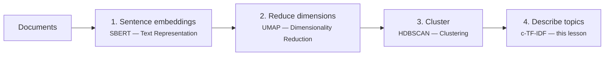

# Topic Modeling & BERTopic

**Topic modeling** answers a deceptively simple question: *given thousands of documents, what are they about?* It is unsupervised — no labels, no predefined categories — making it the text-world sibling of [clustering](../clustering/index.md). Applications: mining customer reviews and support tickets, organizing news archives, monitoring social media, exploring scientific literature.

This lesson introduces the classical approach (LDA) and then **BERTopic** — a modern pipeline assembled almost entirely from techniques you have already learned in this course.

## Classical topic modeling: LDA

**Latent Dirichlet Allocation** (Blei, Ng & Jordan, 2003) is a probabilistic generative model built on bag-of-words counts. It assumes each document was "written" by a random process:

1. each **topic** is a probability distribution over the vocabulary (topic "sports": high probability for *game, team, score...*);
2. each **document** is a mixture of topics (70% sports, 30% finance);
3. every word in a document is generated by first sampling a topic from the document's mixture, then sampling a word from that topic.

Fitting LDA inverts the process: given only the observed words, infer the topic–word distributions and the document–topic mixtures.

```python
from sklearn.feature_extraction.text import CountVectorizer
from sklearn.decomposition import LatentDirichletAllocation

X = CountVectorizer(max_df=0.9, min_df=5, stop_words='english').fit_transform(docs)
lda = LatentDirichletAllocation(n_components=10, random_state=0).fit(X)
```

LDA served the field for two decades, but it inherits every [limitation of bag-of-words](../text-representation/index.md#the-limits-of-sparse-representations):

- word order and context are ignored; synonyms are unrelated dimensions;
- the number of topics \(k\) must be fixed in advance;
- short texts (tweets, ticket titles) give very sparse counts — LDA struggles;
- topics are often hard to interpret without heavy preprocessing (stop-word lists, stemming, tuning).

## BERTopic: topic modeling on embeddings

**BERTopic** (Grootendorst, 2022) replaces the generative story with a geometric one: *embed documents so that semantic similarity is spatial proximity, then find the dense regions*. The pipeline is a composition of the last three lessons:



**Step 1 — Embed.** Each document becomes a dense vector via a [sentence-transformer](../text-representation/index.md#sentence-embeddings-contextual-and-whole-document). Documents about *refunds* and *money back* land close together even with disjoint vocabulary — the decisive advantage over LDA.

**Step 2 — Reduce.** Embeddings have 384–768 dimensions; density-based clustering suffers there (the [curse of dimensionality](../dimensionality-reduction/index.md#choosing-a-method)). [UMAP](../dimensionality-reduction/index.md#umap-mcinnes-healy-melville-2018) compresses to ~5 dimensions while preserving neighborhood structure.

**Step 3 — Cluster.** [HDBSCAN](../clustering/index.md#dbscan-and-hdbscan-density-based-clustering) finds clusters of varying shape and density — and crucially, it **does not force every document into a topic**: documents that fit nowhere become outliers (topic −1) instead of polluting real topics. The number of topics **emerges from the data**; you never set \(k\).

**Step 4 — Describe.** Each cluster needs a human-readable label. BERTopic concatenates all documents of a cluster into one pseudo-document and applies **class-based TF-IDF**:

\[
\text{c-TF-IDF}(t, c) = \underbrace{\text{tf}(t, c)}_{\text{freq. of } t \text{ in class } c} \times \log\!\Big(1 + \frac{A}{\text{tf}(t)}\Big)
\]

where \(A\) is the average number of words per class and \(\text{tf}(t)\) is the frequency of \(t\) across **all** classes. It is the [TF-IDF you know](../text-representation/index.md#tf-idf) applied at the *cluster* level: words frequent in this topic but rare in others rank highest — those become the topic's keywords.

!!! abstract "Why this design is worth studying"
    BERTopic is a case study in **composition**: four classical components, each replaceable (swap SBERT for any embedder, HDBSCAN for k-means, c-TF-IDF for another labeler), assembled into a state-of-the-art system. Understanding the parts — which you now do — means you can tune, debug, and extend the whole.

## A basic worked example

BERTopic is not in this site's build environment (embedding models are heavyweight), so run this locally or in Colab — a companion notebook is provided below.

```python
# pip install bertopic
from bertopic import BERTopic
from sklearn.datasets import fetch_20newsgroups

docs = fetch_20newsgroups(subset='all', remove=('headers', 'footers', 'quotes')).data

topic_model = BERTopic(language='english', verbose=True)
topics, probs = topic_model.fit_transform(docs)

topic_model.get_topic_info().head(10)
```

Typical output — topics discovered with no supervision, no preset \(k\):

```text
Topic  Count  Name
-1     6789   -1_the_of_to_and          ← outliers (no topic)
 0      589   0_game_team_hockey_play
 1      541   1_god_jesus_bible_faith
 2      480   2_car_engine_dealer_miles
 3      432   3_key_encryption_chip_clipper
 ...
```

Inspecting and using the model:

```python
topic_model.get_topic(0)                     # top c-TF-IDF words of topic 0
topic_model.find_topics("space exploration") # search topics semantically
topic_model.transform(["My car needs new brakes"])  # assign topics to new docs

# Built-in interactive visualizations (Plotly)
topic_model.visualize_topics()      # inter-topic distance map
topic_model.visualize_barchart()    # top words per topic
topic_model.visualize_heatmap()     # topic similarity matrix
```

### Practical tips

- **Reduce outliers**: a large topic −1 is normal; `topic_model.reduce_outliers(docs, topics)` reassigns them to the nearest topic if desired.
- **Control topic granularity** with HDBSCAN's `min_cluster_size` (via `min_topic_size`): larger → fewer, broader topics. Or merge after fitting: `topic_model.reduce_topics(docs, nr_topics=20)`.
- **Better keywords**: pass a `CountVectorizer(stop_words='english', ngram_range=(1,2))` to improve c-TF-IDF labels without touching the clustering.
- **Reproducibility**: UMAP is stochastic — set `umap_model=UMAP(random_state=42)` for repeatable topics.
- **Portuguese / multilingual corpora**: `BERTopic(language='multilingual')` selects a multilingual sentence-transformer — it works well on Brazilian Portuguese text.

## LDA vs BERTopic

| | LDA (2003) | BERTopic (2022) |
|---|---|---|
| Representation | bag-of-words counts | contextual sentence embeddings |
| Synonyms/context | invisible | captured by the embedder |
| Number of topics | fixed in advance (k) | emerges from density (HDBSCAN) |
| Outliers | forced into topics | explicit topic −1 |
| Short texts | weak (sparse counts) | strong |
| Interpretability | topic–word probabilities | c-TF-IDF keywords + visualizations |
| Cost | cheap, CPU | embedding step needs a model (GPU helps) |

## Companion notebook

Download the notebook and run it in Colab or locally (`pip install bertopic`):

[:octicons-download-24: bertopic_example.ipynb](bertopic_example.ipynb)

---

## Quiz

<div id="quiz-topic-modeling-bertopic"></div>
<script>
buildQuiz('topic-modeling-bertopic', 'Topic Modeling & BERTopic', [
  {
    q: "In LDA's generative story, a document is modeled as...",
    opts: [
      "a single topic chosen at random",
      "a mixture of topics, where each word is drawn from one of the document's topics",
      "a dense embedding vector",
      "a sequence of n-grams"
    ],
    ans: 1,
    exp: "LDA assumes each document has its own topic mixture (e.g., 70% sports, 30% finance) and each word is generated by sampling a topic from the mixture, then a word from that topic's distribution over the vocabulary."
  },
  {
    q: "What is the correct order of the BERTopic pipeline?",
    opts: [
      "TF-IDF → k-means → PCA → labels",
      "Sentence embeddings → UMAP → HDBSCAN → c-TF-IDF",
      "HDBSCAN → embeddings → UMAP → LDA",
      "Bag-of-words → UMAP → DBSCAN → word2vec"
    ],
    ans: 1,
    exp: "Embed documents (SBERT), reduce dimensions (UMAP), cluster densities (HDBSCAN), then describe each cluster with class-based TF-IDF keywords — each step a technique from earlier lessons."
  },
  {
    q: "Why does BERTopic reduce embedding dimensionality with UMAP before clustering?",
    opts: [
      "To make the topics easier to name",
      "Because HDBSCAN is density-based and densities become uninformative in very high dimensions (curse of dimensionality)",
      "Because embeddings contain missing values",
      "To remove stop words"
    ],
    ans: 1,
    exp: "In 384+ dimensions distances concentrate and dense regions blur. UMAP compresses to ~5 dimensions while preserving neighborhoods, giving HDBSCAN meaningful density structure to find."
  },
  {
    q: "Documents assigned to topic -1 by BERTopic are...",
    opts: [
      "the most representative documents of each topic",
      "outliers that HDBSCAN placed in no dense region — not forced into any topic",
      "documents in foreign languages",
      "duplicated documents"
    ],
    ans: 1,
    exp: "HDBSCAN labels sparse-region points as noise. This keeps topics clean — a key difference from LDA and k-means, which force every document somewhere. They can be reassigned later with reduce_outliers."
  },
  {
    q: "What does c-TF-IDF compute, compared to ordinary TF-IDF?",
    opts: [
      "Word importance per document, exactly like TF-IDF",
      "Word importance per cluster: terms frequent in one topic's concatenated documents but rare across other topics",
      "The probability of each topic",
      "The cosine similarity between clusters"
    ],
    ans: 1,
    exp: "All documents of a cluster are merged into one pseudo-document; TF-IDF is then applied at the class level. Words that distinguish the cluster from the rest become its keywords/label."
  },
  {
    q: "Two support tickets — 'I want my money back' and 'please process my refund' — share almost no words. Why does BERTopic group them while LDA tends not to?",
    opts: [
      "BERTopic uses bigger dictionaries",
      "BERTopic's sentence embeddings place semantically similar texts close together regardless of shared vocabulary; LDA relies on word co-occurrence counts",
      "LDA cannot process short documents at all",
      "BERTopic translates the documents first"
    ],
    ans: 1,
    exp: "LDA sees disjoint bag-of-words vectors — no shared evidence. The embedding model, trained on vast text, maps both sentences to nearby vectors because they mean the same thing; UMAP+HDBSCAN then find them in the same dense region."
  },
  {
    q: "You get 250 tiny, fragmented topics on your corpus. The most direct fix is...",
    opts: [
      "switching to LDA",
      "increasing min_topic_size (HDBSCAN's minimum cluster size) or reducing topics after fitting",
      "removing UMAP from the pipeline",
      "lowering the number of embedding dimensions to 1"
    ],
    ans: 1,
    exp: "Topic granularity is controlled by HDBSCAN's min_cluster_size: larger values require more documents per dense region, yielding fewer, broader topics. reduce_topics(docs, nr_topics=...) merges after the fact."
  }
]);
</script>
