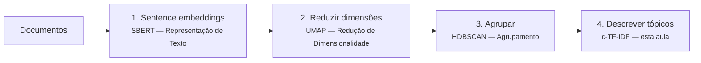

# Modelagem de Tópicos & BERTopic

A **modelagem de tópicos** responde a uma pergunta enganosamente simples: *dados milhares de documentos, sobre o que eles falam?* É não supervisionada — sem rótulos, sem categorias predefinidas — o que a torna a irmã, no mundo do texto, do [agrupamento](../clustering/index.md). Aplicações: minerar avaliações de clientes e tíquetes de suporte, organizar arquivos de notícias, monitorar redes sociais, explorar a literatura científica.

Esta aula apresenta a abordagem clássica (LDA) e então o **BERTopic** — um pipeline moderno montado quase inteiramente a partir de técnicas que você já aprendeu neste curso.

## Modelagem de tópicos clássica: LDA

A **Latent Dirichlet Allocation** (Blei, Ng & Jordan, 2003) é um modelo generativo probabilístico construído sobre contagens de bag-of-words. Ela supõe que cada documento foi "escrito" por um processo aleatório:

1. cada **tópico** é uma distribuição de probabilidade sobre o vocabulário (o tópico "esportes": alta probabilidade para *jogo, time, placar...*);
2. cada **documento** é uma mistura de tópicos (70% esportes, 30% finanças);
3. cada palavra de um documento é gerada sorteando primeiro um tópico da mistura do documento e depois uma palavra desse tópico.

Ajustar a LDA inverte o processo: dadas apenas as palavras observadas, inferir as distribuições tópico–palavra e as misturas documento–tópico.

```python
from sklearn.feature_extraction.text import CountVectorizer
from sklearn.decomposition import LatentDirichletAllocation

X = CountVectorizer(max_df=0.9, min_df=5, stop_words='english').fit_transform(docs)
lda = LatentDirichletAllocation(n_components=10, random_state=0).fit(X)
```

A LDA serviu o campo por duas décadas, mas herda toda [limitação do bag-of-words](../text-representation/index.md#os-limites-das-representacoes-esparsas):

- ordem das palavras e contexto são ignorados; sinônimos são dimensões não relacionadas;
- o número de tópicos \(k\) precisa ser fixado de antemão;
- textos curtos (tweets, títulos de tíquetes) dão contagens muito esparsas — a LDA tem dificuldade;
- os tópicos costumam ser difíceis de interpretar sem muito pré-processamento (listas de stop words, stemming, ajuste).

## BERTopic: modelagem de tópicos sobre embeddings

O **BERTopic** (Grootendorst, 2022) substitui a história generativa por uma geométrica: *representar documentos de modo que a similaridade semântica seja proximidade espacial e então encontrar as regiões densas*. O pipeline é uma composição das três últimas aulas:



**Passo 1 — Representar (embed).** Cada documento vira um vetor denso via um [sentence-transformer](../text-representation/index.md#sentence-embeddings-contextuais-e-de-documento-inteiro). Documentos sobre *reembolsos* e *dinheiro de volta* ficam próximos mesmo com vocabulário disjunto — a vantagem decisiva sobre a LDA.

**Passo 2 — Reduzir.** Embeddings têm 384–768 dimensões; o agrupamento por densidade sofre nesse espaço (a [maldição da dimensionalidade](../dimensionality-reduction/index.md#escolhendo-um-metodo)). O [UMAP](../dimensionality-reduction/index.md#umap-mcinnes-healy-melville-2018) comprime para ~5 dimensões preservando a estrutura de vizinhança.

**Passo 3 — Agrupar.** O [HDBSCAN](../clustering/index.md#dbscan-e-hdbscan-agrupamento-por-densidade) encontra agrupamentos de forma e densidade variáveis — e, crucialmente, **não força todo documento para dentro de um tópico**: documentos que não se encaixam em lugar nenhum viram outliers (tópico −1) em vez de poluir tópicos reais. O número de tópicos **emerge dos dados**; você nunca define \(k\).

**Passo 4 — Descrever.** Cada agrupamento precisa de um rótulo legível por humanos. O BERTopic concatena todos os documentos de um agrupamento em um pseudodocumento e aplica o **TF-IDF baseado em classe**:

\[
\text{c-TF-IDF}(t, c) = \underbrace{\text{tf}(t, c)}_{\text{freq. de } t \text{ na classe } c} \times \log\!\Big(1 + \frac{A}{\text{tf}(t)}\Big)
\]

onde \(A\) é o número médio de palavras por classe e \(\text{tf}(t)\) é a frequência de \(t\) em **todas** as classes. É o [TF-IDF que você conhece](../text-representation/index.md#tf-idf) aplicado no nível do *agrupamento*: palavras frequentes neste tópico mas raras nos outros ficam no topo — essas se tornam as palavras-chave do tópico.

!!! abstract "Por que vale a pena estudar este design"
    O BERTopic é um estudo de caso em **composição**: quatro componentes clássicos, cada um substituível (troque o SBERT por qualquer embedder, o HDBSCAN por k-means, o c-TF-IDF por outro rotulador), montados em um sistema de ponta. Entender as partes — o que você agora faz — significa que você consegue ajustar, depurar e estender o todo.

## Um exemplo básico resolvido

O BERTopic não está no ambiente de build deste site (modelos de embedding são pesados), então rode isto localmente ou no Colab — um notebook complementar é fornecido abaixo.

```python
# pip install bertopic
from bertopic import BERTopic
from sklearn.datasets import fetch_20newsgroups

docs = fetch_20newsgroups(subset='all', remove=('headers', 'footers', 'quotes')).data

topic_model = BERTopic(language='english', verbose=True)
topics, probs = topic_model.fit_transform(docs)

topic_model.get_topic_info().head(10)
```

Saída típica — tópicos descobertos sem supervisão, sem \(k\) predefinido:

```text
Topic  Count  Name
-1     6789   -1_the_of_to_and          ← outliers (sem tópico)
 0      589   0_game_team_hockey_play
 1      541   1_god_jesus_bible_faith
 2      480   2_car_engine_dealer_miles
 3      432   3_key_encryption_chip_clipper
 ...
```

Inspecionando e usando o modelo:

```python
topic_model.get_topic(0)                     # principais palavras c-TF-IDF do tópico 0
topic_model.find_topics("space exploration") # buscar tópicos semanticamente
topic_model.transform(["My car needs new brakes"])  # atribuir tópicos a novos docs

# Visualizações interativas embutidas (Plotly)
topic_model.visualize_topics()      # mapa de distância entre tópicos
topic_model.visualize_barchart()    # principais palavras por tópico
topic_model.visualize_heatmap()     # matriz de similaridade de tópicos
```

### Dicas práticas

- **Reduzir outliers**: um tópico −1 grande é normal; `topic_model.reduce_outliers(docs, topics)` os reatribui ao tópico mais próximo, se desejado.
- **Controlar a granularidade dos tópicos** com o `min_cluster_size` do HDBSCAN (via `min_topic_size`): maior → menos tópicos, mais amplos. Ou funda após o ajuste: `topic_model.reduce_topics(docs, nr_topics=20)`.
- **Palavras-chave melhores**: passe um `CountVectorizer(stop_words='english', ngram_range=(1,2))` para melhorar os rótulos c-TF-IDF sem tocar no agrupamento.
- **Reprodutibilidade**: o UMAP é estocástico — defina `umap_model=UMAP(random_state=42)` para tópicos repetíveis.
- **Corpora em português / multilíngues**: `BERTopic(language='multilingual')` seleciona um sentence-transformer multilíngue — funciona bem em texto em português do Brasil.

## LDA vs BERTopic

| | LDA (2003) | BERTopic (2022) |
|---|---|---|
| Representação | contagens de bag-of-words | sentence embeddings contextuais |
| Sinônimos/contexto | invisíveis | capturados pelo embedder |
| Número de tópicos | fixado de antemão (k) | emerge da densidade (HDBSCAN) |
| Outliers | forçados para tópicos | tópico −1 explícito |
| Textos curtos | fraco (contagens esparsas) | forte |
| Interpretabilidade | probabilidades tópico–palavra | palavras-chave c-TF-IDF + visualizações |
| Custo | barato, CPU | o passo de embedding precisa de um modelo (GPU ajuda) |

## Notebook complementar

Baixe o notebook e rode no Colab ou localmente (`pip install bertopic`):

[:octicons-download-24: bertopic_example.ipynb](/ML/2026.2/classes/topic-modeling-bertopic/bertopic_example.ipynb)

---

## Quiz

<div id="quiz-topic-modeling-bertopic"></div>
<script>
buildQuiz('topic-modeling-bertopic', 'Modelagem de Tópicos & BERTopic', [
  {
    q: "Na história generativa da LDA, um documento é modelado como...",
    opts: [
      "um único tópico escolhido ao acaso",
      "uma mistura de tópicos, onde cada palavra é sorteada de um dos tópicos do documento",
      "um vetor de embedding denso",
      "uma sequência de n-gramas"
    ],
    ans: 1,
    exp: "A LDA supõe que cada documento tem sua própria mistura de tópicos (ex.: 70% esportes, 30% finanças) e cada palavra é gerada sorteando um tópico da mistura e depois uma palavra da distribuição desse tópico sobre o vocabulário."
  },
  {
    q: "Qual é a ordem correta do pipeline do BERTopic?",
    opts: [
      "TF-IDF → k-means → PCA → rótulos",
      "Sentence embeddings → UMAP → HDBSCAN → c-TF-IDF",
      "HDBSCAN → embeddings → UMAP → LDA",
      "Bag-of-words → UMAP → DBSCAN → word2vec"
    ],
    ans: 1,
    exp: "Representar documentos (SBERT), reduzir dimensões (UMAP), agrupar por densidade (HDBSCAN) e então descrever cada agrupamento com palavras-chave de TF-IDF baseado em classe — cada passo é uma técnica de aulas anteriores."
  },
  {
    q: "Por que o BERTopic reduz a dimensionalidade dos embeddings com UMAP antes de agrupar?",
    opts: [
      "Para facilitar a nomeação dos tópicos",
      "Porque o HDBSCAN é baseado em densidade e as densidades ficam não informativas em dimensões muito altas (maldição da dimensionalidade)",
      "Porque os embeddings contêm valores faltantes",
      "Para remover stop words"
    ],
    ans: 1,
    exp: "Em 384+ dimensões as distâncias se concentram e as regiões densas se borram. O UMAP comprime para ~5 dimensões preservando vizinhanças, dando ao HDBSCAN uma estrutura de densidade significativa para encontrar."
  },
  {
    q: "Documentos atribuídos ao tópico -1 pelo BERTopic são...",
    opts: [
      "os documentos mais representativos de cada tópico",
      "outliers que o HDBSCAN não colocou em nenhuma região densa — não forçados a nenhum tópico",
      "documentos em línguas estrangeiras",
      "documentos duplicados"
    ],
    ans: 1,
    exp: "O HDBSCAN rotula pontos de região esparsa como ruído. Isso mantém os tópicos limpos — uma diferença central em relação à LDA e ao k-means, que forçam todo documento para algum lugar. Eles podem ser reatribuídos depois com reduce_outliers."
  },
  {
    q: "O que o c-TF-IDF calcula, em comparação com o TF-IDF comum?",
    opts: [
      "Importância da palavra por documento, exatamente como o TF-IDF",
      "Importância da palavra por agrupamento: termos frequentes nos documentos concatenados de um tópico mas raros nos demais tópicos",
      "A probabilidade de cada tópico",
      "A similaridade de cosseno entre agrupamentos"
    ],
    ans: 1,
    exp: "Todos os documentos de um agrupamento são fundidos em um pseudodocumento; o TF-IDF é então aplicado no nível da classe. As palavras que distinguem o agrupamento do resto se tornam suas palavras-chave/rótulo."
  },
  {
    q: "Dois tíquetes de suporte — 'quero meu dinheiro de volta' e 'por favor processem meu reembolso' — quase não compartilham palavras. Por que o BERTopic os agrupa enquanto a LDA tende a não agrupar?",
    opts: [
      "O BERTopic usa dicionários maiores",
      "Os sentence embeddings do BERTopic colocam textos semanticamente similares próximos independentemente do vocabulário compartilhado; a LDA depende de contagens de coocorrência de palavras",
      "A LDA não consegue processar documentos curtos",
      "O BERTopic traduz os documentos primeiro"
    ],
    ans: 1,
    exp: "A LDA vê vetores bag-of-words disjuntos — sem evidência compartilhada. O modelo de embedding, treinado em vastos textos, mapeia ambas as frases para vetores próximos porque significam o mesmo; UMAP+HDBSCAN então as encontram na mesma região densa."
  },
  {
    q: "Você obtém 250 tópicos minúsculos e fragmentados no seu corpus. A correção mais direta é...",
    opts: [
      "mudar para LDA",
      "aumentar o min_topic_size (tamanho mínimo de agrupamento do HDBSCAN) ou reduzir tópicos após o ajuste",
      "remover o UMAP do pipeline",
      "reduzir o número de dimensões de embedding para 1"
    ],
    ans: 1,
    exp: "A granularidade dos tópicos é controlada pelo min_cluster_size do HDBSCAN: valores maiores exigem mais documentos por região densa, gerando menos tópicos e mais amplos. reduce_topics(docs, nr_topics=...) funde após o fato."
  }
]);
</script>
