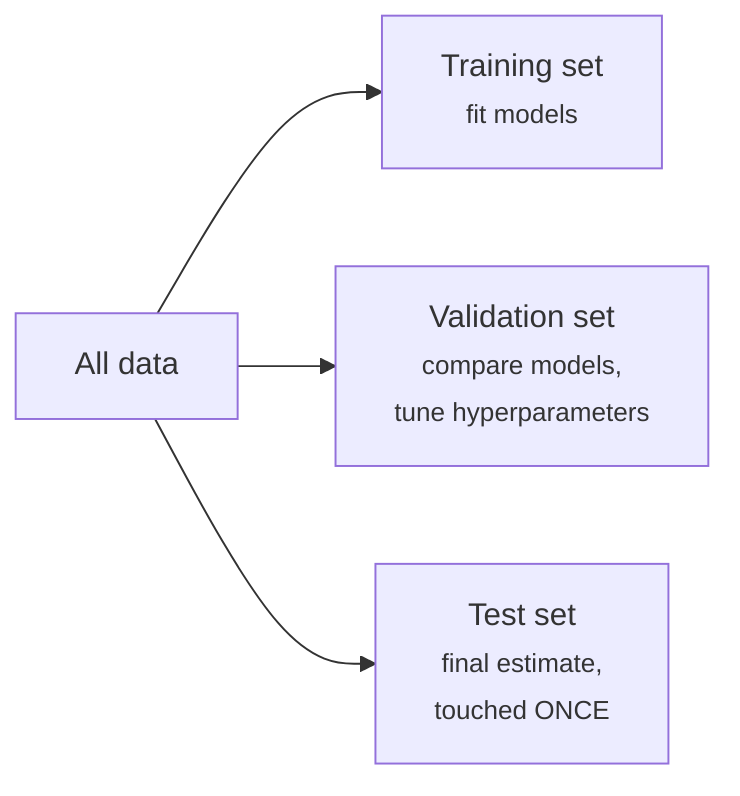
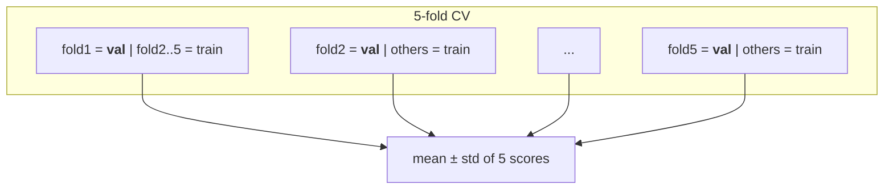

# Validation & Data Leakage

The [golden rule](../ml-landscape/index.md#generalization-the-central-problem) — never evaluate on training data — sounds trivial. This lesson turns it into engineering practice: how to split data, how to validate honestly with limited data, and how to spot **data leakage**, the failure mode responsible for most "too good to be true" results in real projects and competitions.

## Train / validation / test



- **Training set** — the model learns its parameters here;
- **Validation set** — used to choose between models and hyperparameter values. Because you make *decisions* on it, performance on it becomes optimistically biased over time;
- **Test set** — simulates the future. Used **once**, at the very end. If you iterate against the test set, it silently becomes a validation set and you no longer have an honest estimate.

```python
from sklearn.model_selection import train_test_split

X_temp, X_test, y_temp, y_test = train_test_split(X, y, test_size=0.2, random_state=42,
                                                  stratify=y)   # keep class ratios
X_train, X_val, y_train, y_val = train_test_split(X_temp, y_temp, test_size=0.25,
                                                  random_state=42, stratify=y_temp)
```

`stratify=y` preserves class proportions in every split — important for imbalanced classification (see [ROC-AUC & Imbalanced Data](../roc-imbalanced/index.md)).

## Cross-validation

A single validation split wastes data and gives a noisy estimate — with small datasets, the luck of the split can dominate. **k-fold cross-validation** (typically \(k = 5\) or \(10\)) fixes both:

1. partition the training data into \(k\) folds;
2. for each fold: train on the other \(k-1\), evaluate on it;
3. report the mean (and standard deviation!) of the \(k\) scores.



```python
from sklearn.model_selection import cross_val_score, StratifiedKFold

cv = StratifiedKFold(n_splits=5, shuffle=True, random_state=42)
scores = cross_val_score(pipe, X_train, y_train, cv=cv, scoring='f1')
print(f"{scores.mean():.3f} ± {scores.std():.3f}")
```

Every observation serves as validation exactly once; the spread of scores tells you how much to trust the mean. Variants: **stratified** k-fold (classification default), **group** k-fold (all rows of one patient/customer stay in the same fold), **TimeSeriesSplit** (train on past, validate on future — never shuffle time).

The test set stays outside the whole procedure: cross-validation *replaces the validation set*, not the test set.

## Data leakage

**Leakage = information from outside the training fold sneaking into training.** The model looks brilliant in evaluation and collapses in production, where the leaked information does not exist yet. The classic patterns:

### 1. Preprocessing before splitting

Fitting a scaler, imputer, or feature selector on **all** data before the split leaks test-set statistics into training. You met this in [Preprocessing](../preprocessing/index.md); the cure is structural — put every fitted step inside a [Pipeline](../pipelines/index.md) so it is re-fit within each fold.

### 2. Features that know the future

A column recorded *after* the prediction moment: predicting hospital readmission using `number_of_followup_visits`; predicting churn using `account_closed_date is null`. Flawless in the historical table, nonexistent at prediction time. **Ask of every feature: "is this value available at the moment the prediction must be made?"**

### 3. Duplicate or near-duplicate rows

The same record (or trivially perturbed copies) landing in both train and test — common after data augmentation or joins. The model is graded on questions it memorized.

### 4. Group leakage

Multiple rows per entity (several images per patient, several orders per customer) split randomly: the model recognizes the *patient*, not the *disease*. Use `GroupKFold` keyed on the entity.

### 5. Temporal leakage

Random shuffling of time-stamped data trains the model on the future to predict the past. Always split chronologically; validate with `TimeSeriesSplit`.

!!! danger "The smell test"
    If results look too good — 99% accuracy on a hard problem, a feature with implausible importance, a huge gap between offline and production metrics — **suspect leakage first**, not genius. Check the top features in an [explainability](../explainability/index.md) report: leaked features usually dominate it.

## A leak-free experiment, end to end

```python
from sklearn.model_selection import cross_val_score, train_test_split
from sklearn.pipeline import Pipeline

X_train, X_test, y_train, y_test = train_test_split(X, y, test_size=0.2,
                                                    stratify=y, random_state=42)

pipe = Pipeline([...preprocessing..., ('model', ...)])       # all fitted steps inside

scores = cross_val_score(pipe, X_train, y_train, cv=5)       # model development
# ... iterate on features/models/hyperparameters using CV scores only ...

pipe.fit(X_train, y_train)                                   # final fit
final_score = pipe.score(X_test, y_test)                     # test touched ONCE
```

---

## Quiz

<div id="quiz-validation"></div>
<script>
buildQuiz('validation', 'Validation & Data Leakage', [
  {
    q: "Why does the test set lose its value if you repeatedly tune your model based on test performance?",
    opts: [
      "The test set becomes too small",
      "Your choices adapt to the test set, so its score becomes optimistically biased — it now works as a validation set",
      "scikit-learn caches the results",
      "The test set labels change"
    ],
    ans: 1,
    exp: "Every decision made by peeking at a dataset fits that dataset a little. After many iterations the 'test' score reflects your tuning, not future performance. Model selection belongs to the validation set / CV."
  },
  {
    q: "What is the main advantage of 5-fold cross-validation over a single train/validation split?",
    opts: [
      "It is 5 times faster",
      "Every observation is used for validation once, giving a more stable estimate plus a standard deviation to gauge its uncertainty",
      "It eliminates the need for a test set",
      "It prevents all forms of leakage automatically"
    ],
    ans: 1,
    exp: "CV averages k estimates computed on disjoint validation folds — less at the mercy of one lucky/unlucky split — and its std shows how noisy the estimate is. A final test set is still needed."
  },
  {
    q: "You standardize the full dataset, then split into train and test. What went wrong?",
    opts: [
      "Nothing — scaling is deterministic",
      "The scaler's mean and std were computed using test rows, leaking test-set information into the training representation",
      "Standardization must come after one-hot encoding",
      "The random seed was not set"
    ],
    ans: 1,
    exp: "Preprocessing statistics are learned parameters. Computing them on data that includes the test set gives training a peek at the test distribution. Fit the scaler on train only — ideally inside a Pipeline."
  },
  {
    q: "A model predicting hospital readmission gets suspiciously high scores. Its top feature is number_of_followup_visits. The problem is...",
    opts: [
      "the feature is categorical",
      "temporal/target leakage: follow-up visits are recorded after the prediction moment, so the feature 'knows the future'",
      "the feature has missing values",
      "the model is underfitting"
    ],
    ans: 1,
    exp: "At the moment of prediction (discharge), follow-up visits have not happened yet. The feature exists only in the historical table. Every feature must pass the question: is it available when the prediction is made?"
  },
  {
    q: "You have 10 chest X-rays per patient and split them randomly into train/test. Accuracy is stellar but fails on new hospitals. Why?",
    opts: [
      "X-rays cannot be used in ML",
      "Group leakage: images of the same patient appear in both sets, so the model learned to recognize patients rather than pathology",
      "The model needed more epochs",
      "Random splits require stratification by age"
    ],
    ans: 1,
    exp: "Rows belonging to the same entity are strongly correlated. Splitting them across train/test grades the model on near-memorized examples. GroupKFold keyed on patient ID keeps each patient entirely in one fold."
  },
  {
    q: "For a demand-forecasting problem with 3 years of daily data, the correct validation scheme is...",
    opts: [
      "standard shuffled 5-fold CV",
      "leave-one-out CV",
      "chronological splits (e.g., TimeSeriesSplit): always train on the past, validate on the future",
      "random 50/50 split repeated twice"
    ],
    ans: 2,
    exp: "Shuffling lets the model train on days that come after the validation days — the production setting never looks like that. Time-ordered validation reproduces the real task: predict forward."
  }
]);
</script>
