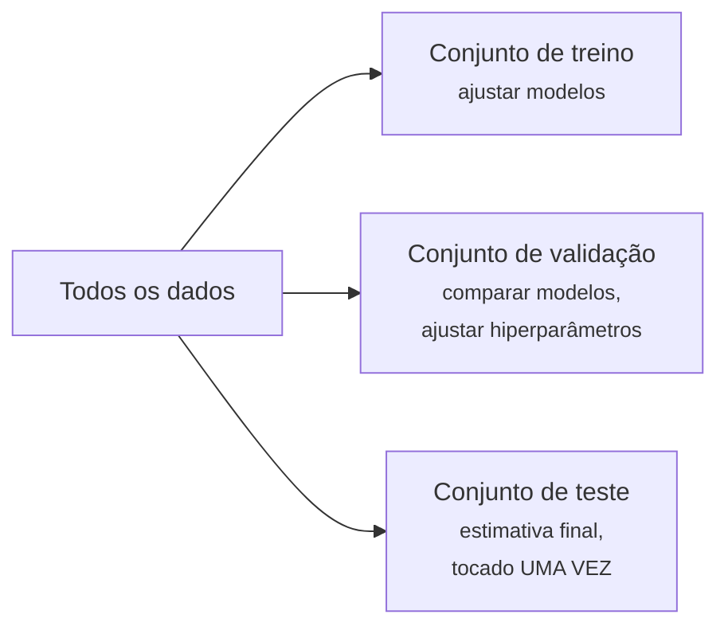
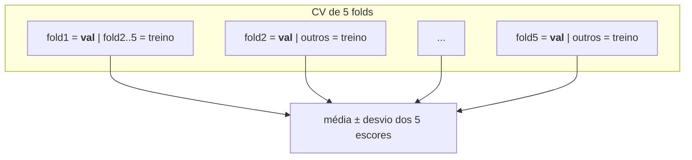

# Validação & Vazamento de Dados

A [regra de ouro](../ml-landscape/index.md#generalizacao-o-problema-central) — nunca avaliar em dados de treino — parece trivial. Esta aula a transforma em prática de engenharia: como dividir os dados, como validar honestamente com dados limitados e como detectar o **vazamento de dados** (*data leakage*), o modo de falha responsável pela maioria dos resultados "bons demais para ser verdade" em projetos e competições reais.

## Treino / validação / teste



- **Conjunto de treino** — o modelo aprende seus parâmetros aqui;
- **Conjunto de validação** — usado para escolher entre modelos e valores de hiperparâmetros. Como você toma *decisões* nele, o desempenho nele se torna otimisticamente enviesado com o tempo;
- **Conjunto de teste** — simula o futuro. Usado **uma vez**, no fim de tudo. Se você itera contra o conjunto de teste, ele silenciosamente vira um conjunto de validação e você deixa de ter uma estimativa honesta.

```python
from sklearn.model_selection import train_test_split

X_temp, X_test, y_temp, y_test = train_test_split(X, y, test_size=0.2, random_state=42,
                                                  stratify=y)   # manter as proporções de classe
X_train, X_val, y_train, y_val = train_test_split(X_temp, y_temp, test_size=0.25,
                                                  random_state=42, stratify=y_temp)
```

`stratify=y` preserva as proporções de classe em cada divisão — importante para classificação desbalanceada (ver [ROC-AUC & Dados Desbalanceados](../roc-imbalanced/index.md)).

## Validação cruzada

Uma única divisão de validação desperdiça dados e dá uma estimativa ruidosa — com conjuntos pequenos, a sorte da divisão pode dominar. A **validação cruzada k-fold** (tipicamente \(k = 5\) ou \(10\)) resolve ambos:

1. particione os dados de treino em \(k\) folds;
2. para cada fold: treine nos outros \(k-1\), avalie nele;
3. reporte a média (e o desvio padrão!) dos \(k\) escores.



```python
from sklearn.model_selection import cross_val_score, StratifiedKFold

cv = StratifiedKFold(n_splits=5, shuffle=True, random_state=42)
scores = cross_val_score(pipe, X_train, y_train, cv=cv, scoring='f1')
print(f"{scores.mean():.3f} ± {scores.std():.3f}")
```

Toda observação serve de validação exatamente uma vez; a dispersão dos escores diz o quanto confiar na média.

### Escolhendo um esquema de CV

| Método | Quando usar | Vantagens | Cuidado com |
|--------|-------------|-----------|-------------|
| **K-Fold** | dados gerais (o padrão) | simples, eficiente | não preserva as proporções de classe |
| **Stratified K-Fold** | classificação (especialmente desbalanceada) | mantém as proporções de classe em cada fold | um pouco mais lento |
| **Leave-One-Out (LOO)** | conjuntos muito pequenos (< 100–200 amostras) | usa quase todos os dados para treinar | muito lento (\(n\) folds), alta variância |
| **TimeSeriesSplit** | dados temporais / séries temporais | respeita a ordem cronológica (sem vazamento) | menos flexível |
| **Group K-Fold** | dados agrupados (pacientes, usuários, ...) | evita vazamento entre linhas relacionadas | exige uma coluna de grupo |

O conjunto de teste fica fora de todo o procedimento: a validação cruzada *substitui o conjunto de validação*, não o de teste.

### O pré-processamento precisa reiniciar em cada fold

Escalonamento, codificação, imputação e seleção de atributos precisam ser **reajustados do zero dentro de cada fold**. Se você faz `StandardScaler().fit_transform()` ou `SelectKBest().fit()` no conjunto inteiro *antes* do `cross_val_score`/`GridSearchCV`, as estatísticas do fold de validação vazam para o treino — um escore otimisticamente enviesado. Passar um [Pipeline](../pipelines/index.md) torna isso automático: em cada fold, todos os passos são ajustados apenas na porção de treino daquele fold e depois aplicados congelados à porção de validação. Cada fold recebe seu próprio scaler, seus próprios atributos selecionados e seu próprio modelo.

## Vazamento de dados

**Vazamento = informação de fora do fold de treino se infiltrando no treino.** O modelo parece brilhante na avaliação e desaba em produção, onde a informação vazada ainda não existe. Os padrões clássicos:

### 1. Pré-processamento antes da divisão

Ajustar um scaler, imputador ou seletor de atributos em **todos** os dados antes da divisão vaza estatísticas do conjunto de teste para o treino. Você viu isso em [Pré-processamento](../preprocessing/index.md); a cura é estrutural — coloque todo passo ajustado dentro de um [Pipeline](../pipelines/index.md) para que seja reajustado em cada fold.

### 2. Atributos que conhecem o futuro

Uma coluna registrada *depois* do momento da previsão: prever readmissão hospitalar usando `number_of_followup_visits`; prever churn usando `account_closed_date is null`. Impecável na tabela histórica, inexistente no momento da previsão. **Pergunte de todo atributo: "esse valor está disponível no momento em que a previsão precisa ser feita?"**

### 3. Linhas duplicadas ou quase duplicadas

O mesmo registro (ou cópias trivialmente perturbadas) caindo em treino e teste — comum após aumento de dados (data augmentation) ou junções. O modelo é avaliado em perguntas que memorizou.

### 4. Vazamento de grupo

Múltiplas linhas por entidade (várias imagens por paciente, vários pedidos por cliente) divididas aleatoriamente: o modelo reconhece o *paciente*, não a *doença*. Use `GroupKFold` chaveado pela entidade.

### 5. Vazamento temporal

Embaralhar aleatoriamente dados com marca de tempo treina o modelo no futuro para prever o passado. Sempre divida cronologicamente; valide com `TimeSeriesSplit`.

!!! danger "O teste do cheiro"
    Se os resultados parecem bons demais — 99% de acurácia num problema difícil, um atributo com importância implausível, uma enorme diferença entre métricas offline e de produção — **suspeite de vazamento primeiro**, não de genialidade. Confira os principais atributos em um relatório de [explicabilidade](../explainability/index.md): atributos vazados costumam dominá-lo.

## Um experimento sem vazamento, de ponta a ponta

O fluxo honesto completo, como praticado em aula no conjunto de câncer de mama — divisão hold-out, pipeline, CV estratificada *dentro* de uma busca em grade, um ajuste final, uma medição final:

```python
from sklearn.datasets import load_breast_cancer
from sklearn.model_selection import train_test_split, StratifiedKFold, GridSearchCV
from sklearn.pipeline import Pipeline
from sklearn.preprocessing import StandardScaler
from sklearn.ensemble import RandomForestClassifier
from sklearn.metrics import roc_auc_score

# 1. Divisão hold-out final (muito importante!)
X, y = load_breast_cancer(return_X_y=True)
X_train, X_test, y_train, y_test = train_test_split(
    X, y, test_size=0.15, random_state=42, stratify=y)

# 2. Pipeline: todo passo ajustado dentro, para que a CV o reajuste por fold
pipeline = Pipeline([
    ('scaler', StandardScaler()),
    ('clf', RandomForestClassifier(random_state=42)),
])

# 3. Desenvolvimento do modelo: busca em grade com CV estratificada só no TREINO
cv = StratifiedKFold(n_splits=5, shuffle=True, random_state=42)
param_grid = {
    'clf__n_estimators': [100, 200, 300],
    'clf__max_depth': [5, 10, 20],
}
grid = GridSearchCV(pipeline, param_grid, cv=cv, scoring='roc_auc', n_jobs=-1)
grid.fit(X_train, y_train)

# 4. O modelo de produção: melhor configuração reajustada em TODOS os dados de treino
final_model = grid.best_estimator_
final_model.fit(X_train, y_train)

# 5. Avaliação honesta — só agora, só uma vez
proba = final_model.predict_proba(X_test)[:, 1]
print("ROC AUC de teste:", roc_auc_score(y_test, proba))
```

## Exercícios

1. No **conjunto iris**, compare validação cruzada K-Fold, Stratified K-Fold e Leave-One-Out: reporte acurácia média ± desvio para cada e explique as diferenças.
2. Usando o **índice BOVESPA** (preços de `Close` via `yfinance`, ticker `^BVSP`, 2 anos): use `TimeSeriesSplit` para a validação cruzada e ajuste uma [regressão linear](../linear-regression/index.md) para prever o índice 20 dias à frente. Por que o K-Fold embaralhado seria desonesto aqui?
3. Pesquise o `SelectKBest`: por que a seleção de atributos também precisa viver *dentro* do pipeline?

## Material de aula

!!! example "Notebook da aula (em português)"
    Notebook prático usado em sala — **Aula 10 — Divisão de Dados, Data Leakage e Validação Cruzada**:
    [:simple-googlecolab: abrir no Colab](https://colab.research.google.com/drive/16e0cG5qMYpCXvRLmePyApECK7Y19IEVC){:target="_blank"}

---

## Quiz

<div id="quiz-validation"></div>
<script>
buildQuiz('validation', 'Validação & Vazamento de Dados', [
  {
    q: "Por que o conjunto de teste perde o valor se você ajusta repetidamente seu modelo com base no desempenho de teste?",
    opts: [
      "O conjunto de teste fica pequeno demais",
      "Suas escolhas se adaptam ao conjunto de teste, então seu escore fica otimisticamente enviesado — ele passa a funcionar como um conjunto de validação",
      "O scikit-learn faz cache dos resultados",
      "Os rótulos do conjunto de teste mudam"
    ],
    ans: 1,
    exp: "Toda decisão tomada espiando um conjunto de dados o ajusta um pouco. Depois de muitas iterações, o escore de 'teste' reflete seu ajuste, não o desempenho futuro. A seleção de modelos pertence ao conjunto de validação / CV."
  },
  {
    q: "Qual é a principal vantagem da validação cruzada de 5 folds sobre uma única divisão treino/validação?",
    opts: [
      "É 5 vezes mais rápida",
      "Toda observação é usada para validação uma vez, dando uma estimativa mais estável mais um desvio padrão para medir sua incerteza",
      "Elimina a necessidade de um conjunto de teste",
      "Previne automaticamente todas as formas de vazamento"
    ],
    ans: 1,
    exp: "A CV faz a média de k estimativas calculadas em folds de validação disjuntos — menos à mercê de uma divisão sortuda/azarada — e seu desvio mostra quão ruidosa é a estimativa. Um conjunto de teste final ainda é necessário."
  },
  {
    q: "Você padroniza o conjunto de dados inteiro e depois divide em treino e teste. O que deu errado?",
    opts: [
      "Nada — o escalonamento é determinístico",
      "A média e o desvio do scaler foram calculados usando linhas de teste, vazando informação do conjunto de teste para a representação de treino",
      "A padronização deve vir depois do one-hot encoding",
      "A semente aleatória não foi definida"
    ],
    ans: 1,
    exp: "As estatísticas de pré-processamento são parâmetros aprendidos. Calculá-las em dados que incluem o teste dá ao treino uma espiada na distribuição de teste. Ajuste o scaler só no treino — idealmente dentro de um Pipeline."
  },
  {
    q: "Um modelo que prevê readmissão hospitalar obtém escores suspeitosamente altos. Seu principal atributo é number_of_followup_visits. O problema é...",
    opts: [
      "o atributo é categórico",
      "vazamento temporal/do alvo: as visitas de acompanhamento são registradas depois do momento da previsão, então o atributo 'conhece o futuro'",
      "o atributo tem valores faltantes",
      "o modelo está subajustando"
    ],
    ans: 1,
    exp: "No momento da previsão (alta), as visitas de acompanhamento ainda não aconteceram. O atributo existe só na tabela histórica. Todo atributo deve passar pela pergunta: está disponível quando a previsão é feita?"
  },
  {
    q: "Você tem 10 raios-X de tórax por paciente e os divide aleatoriamente em treino/teste. A acurácia é estelar mas falha em novos hospitais. Por quê?",
    opts: [
      "Raios-X não podem ser usados em ML",
      "Vazamento de grupo: imagens do mesmo paciente aparecem em ambos os conjuntos, então o modelo aprendeu a reconhecer pacientes em vez da patologia",
      "O modelo precisava de mais épocas",
      "Divisões aleatórias exigem estratificação por idade"
    ],
    ans: 1,
    exp: "Linhas pertencentes à mesma entidade são fortemente correlacionadas. Dividi-las entre treino/teste avalia o modelo em exemplos quase memorizados. O GroupKFold chaveado pelo ID do paciente mantém cada paciente inteiramente em um fold."
  },
  {
    q: "Para um problema de previsão de demanda com 3 anos de dados diários, o esquema de validação correto é...",
    opts: [
      "CV de 5 folds embaralhada padrão",
      "CV leave-one-out",
      "divisões cronológicas (ex.: TimeSeriesSplit): sempre treinar no passado, validar no futuro",
      "divisão aleatória 50/50 repetida duas vezes"
    ],
    ans: 2,
    exp: "Embaralhar deixa o modelo treinar em dias que vêm depois dos dias de validação — o cenário de produção nunca é assim. A validação em ordem temporal reproduz a tarefa real: prever adiante."
  }
]);
</script>
