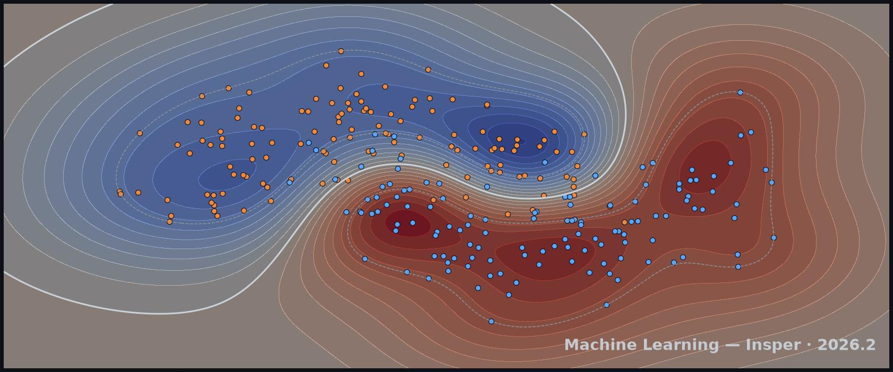

# Machine Learning

Welcome to the **Machine Learning** course at [Insper](https://www.insper.edu.br/).

!!! tip "Prerequisites"
    Comfort with Python, basic linear algebra (vectors, matrices), basic calculus (derivatives), and introductory probability and statistics.

## Semesters

-   __[{ .rounded-corners .width-full}](./2026.2/)__

    ---

